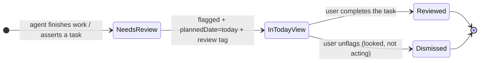

# Surface Agent Work for Review → Today View

## Overview

When an agent produces output the user should verify (REVIEW-01), or decides a task should exist that the user should
confirm belongs (REVIEW-02), the agent surfaces that item into the user's today view as a **review task**. OmniFocus is
canonical; this skill writes through the existing `omnifocus_write` funnel and applies a review tag.

This is the counterpart to `capture-live-blocker`: live capture is for a forward-looking blocker the agent wants to
_remember_; review surfacing is for work the agent wants the user to _check_. Both are distinct from Phase 5 session
archaeology.

## The review lifecycle (locked convention)

Surfacing rides on **native OmniFocus behavior**. There is no custom "mark reviewed" mechanism, no `agent-active` tag,
and no second permission layer.



Three rules, in order of importance:

1. **A review item is an OPEN, flagged task — never a completed one.** To put work in front of the user, the agent sets
   `flagged: true` + `plannedDate: <today>` and adds the review tag, leaving the task **open**. The task IS the review
   action. A completed task has already left Forecast/Flagged, so it surfaces nothing.
2. **Completion is the user's gesture — it means "I reviewed this."** The agent MUST NOT complete a task that is
   awaiting the user's review. If the agent closes its own work task, it vanishes from the today view and the review is
   lost. The user completes the review task when satisfied; that is how a review item clears.
3. **Surfacing rides on the flag + `plannedDate`, not the tag.** The native Forecast/Flagged perspectives are what put
   the task in today's view. The review tag is **pure classification** (output vs. capture) — it is not the lever that
   surfaces or clears the item. The user never has to touch the tag; they complete (or unflag) the task.

Agent involvement is already signaled by `agent-okay` and the `of-mcp:lineage` note stamp — no separate "an agent is
working on this" tag is needed.

## Which review tag

| Tag              | Meaning                                                         | User's verify question        |
| ---------------- | --------------------------------------------------------------- | ----------------------------- |
| `review-output`  | Verify **work the agent did** (wrote, drafted, produced output) | "Is this output correct?"     |
| `review-capture` | Verify a **task the agent decided should exist**                | "Does this task belong here?" |

Both are applied to an **open, flagged** task. The only difference is the tag string — the write is otherwise identical
(REVIEW-02: the distinction is carried entirely by tag name).

## Tool call reference

Surface a review item — one open, flagged task with the right review tag and today's `plannedDate`:

```jsonc
{
  "mutation": {
    "operation": "update", // or "create" if the review task does not exist yet
    "target": "task",
    "id": "<task id>",
    "changes": {
      "flagged": true,
      "plannedDate": "<YYYY-MM-DD today>", // surfaces in Forecast/Today — this is what makes it a review item
      "addTags": ["review-output"], // or ["review-capture"] — classification only
    },
  },
}
```

Do NOT complete the task. The user completes it after reviewing. Set `flagged`, `plannedDate`, and the tag in a single
update.

## Out of scope

- **Completing work awaiting review** — never. Completion is the user's "I reviewed this" gesture (rule 2).
- **An `agent-active` / in-progress tag** — not used. `agent-okay` + `of-mcp:lineage` already mark agent involvement.
- **A custom "reviewed" tag or clearing mechanism** — none. The user completes or unflags; the today view self-cleans.
- **`archaeology` / live capture** — different flows. `archaeology` is Phase 5 retrospective scan; `capture-live` is a
  forward-looking blocker the agent captures to remember (see `capture-live-blocker`). A review item is work to check.
- **Inventing a due date** — a review task is flagged with `plannedDate=today`, not given a `dueDate`. The agent has no
  authority to assert a deadline.

## Common mistakes

| Mistake                                             | Fix                                                                                                |
| --------------------------------------------------- | -------------------------------------------------------------------------------------------------- |
| Completing the task to signal "done, please review" | Leave it OPEN + flagged. Completion is the user's gesture; completing it removes it from the view. |
| Relying on the tag alone to surface the item        | The flag + `plannedDate` surface it; the tag only classifies. Set both.                            |
| Adding `agent-active` or a custom status tag        | Not used. `agent-okay` + lineage already signal agent involvement.                                 |
| Swapping or removing the tag to mark it reviewed    | Don't. The user completes the task to clear it; the tag stays as a classification record.          |
| Giving a review task a `dueDate`                    | Use `plannedDate=today` to surface it. Do not invent a deadline.                                   |

## Reporting tooling problems

If you hit a bug or limitation in this tooling, log it with the `omnifocus-feedback` skill (`/of-feedback`).
