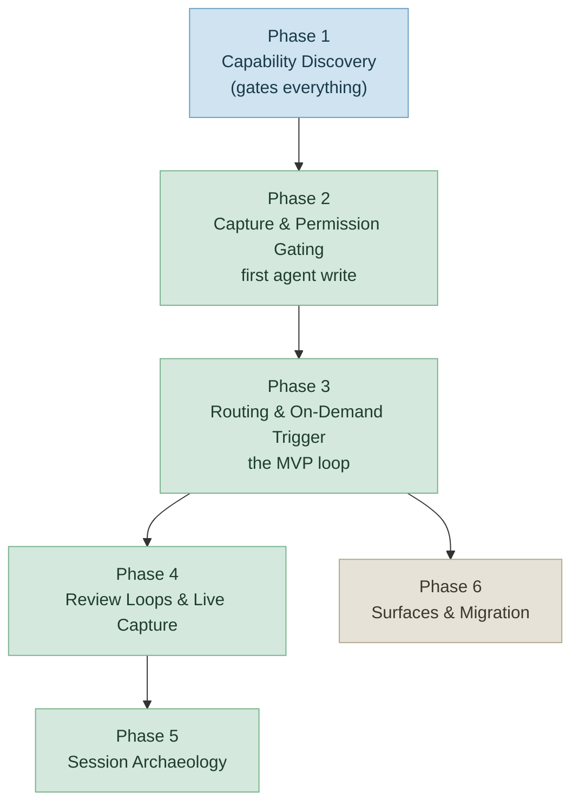

# Roadmap: OmniFocus MCP — JessOS Task Integration Layer

## Milestones

- ✅ **Hardening** — Phases 1–6 (shipped 2026-06-09, tag `jk/hardening`) — full archive:
  [`milestones/hardening-ROADMAP.md`](milestones/hardening-ROADMAP.md)

- 📋 **agent-workflow — Agent Workflow System** — Phases 1–6 (planning, started 2026-06-11)

## Visual TL;DR

## Phases

✅ Hardening (Phases 1–6) — SHIPPED 2026-06-09

- [x] **Phase 1: Role Model & Resolver** (3 plans) — a connection resolves to exactly one fail-safe role (OWNER | AGENT)
      before any dispatch.

- [x] **Phase 2: Operation Policy (Deny-Deletes & Gating)** (3 plans) — the agent cannot hard- or bulk-delete;
      structural destructive ops are gated at the single mutation funnel.

- [x] **Phase 3: RoleGate & Agent Read Paths** (4 plans) — role-aware advertisement + dispatch ship a usable
      least-privilege stdio agent with its core read surface.

- [x] **Phase 4: HTTP Edge Hardening** (4 plans) — bearer auth, loopback bind, DNS-rebinding protection, Serve-only;
      owner+agent token parity with stdio.

- [x] **Phase 5: Write-Verifier** (5 plans) — every agent mutation confirmed by an independent post-mutation read-back
      with a field-level diff and verification status.

- [x] **Phase 6: launchd Deployment & ADR** (4 plans) — least-privilege LaunchAgent, Automation-only grant, fail-fast
      probe, ADR-005 superseding ADR 001.

**Deferred (risk-accepted 2026-06-09):** Phase 4 Tailscale-Serve operational check; Phase 6 on-host spikes S4/S5/S6. See
`.planning/STATE.md` → Deferred Items and `milestones/hardening-MILESTONE-AUDIT.md`.

### 📋 agent-workflow — Agent Workflow System (Phases 1–6)

- [x] **Phase 1: OmniFocus Capability Discovery** — produce a capability-discovery report mapping OmniFocus native
      (completed 2026-06-12) behavior with a native-vs-build call per area; gates all workflow design.

- [x] **Phase 2: Capture & Permission Gating** — agent dumps items into the inbox under explicit permission gates, with
      (completed 2026-06-12) session lineage on every created task.

- [x] **Phase 3: Routing & On-Demand Trigger** — agent routes inbox items (match → infer → create → leave), runnable
      (completed 2026-06-14) on-demand via a manual trigger (the MVP path).

- [x] **Phase 4: Review Loops & Live Auto-Capture** — review tags surface agent work in a today view, distinguishing
      (completed 2026-06-16) output from capture; live sessions capture blockers in real time.

- [ ] **Phase 5: Session Archaeology** — summarize-then-approve scan of the last 7 days of Claude Code sessions;
      approved open loops become `archaeology`-tagged tasks.

- [ ] **Phase 6: Surfaces & Migration** — resolve and provision the JessOS custom perspective; one-time migration of
      vault checkboxes into OmniFocus.

## Phase Details

### Phase 1: OmniFocus Capability Discovery

**Goal**: Understand what OmniFocus does natively — tagging, filtering, custom fields, perspectives, the project/task
data model, native capture, and automation surfaces — before any workflow is designed, so no custom code is built for a
solved problem. **Depends on**: Nothing (first phase, gates everything else) **Requirements**: DISC-01, DISC-02
**Success Criteria** (what must be TRUE):

1. A capability-discovery report exists in the repo documenting OmniFocus native behavior across all six named areas:
   tagging/filtering/custom fields, perspectives, the project/task data model (sequencing + dependencies, sequential vs.
   parallel), native capture (inbox, templates), and automation surfaces (OmniAutomation / URL schemes / plug-ins).

2. For each capability area, the report records an explicit native-vs-build decision — where OmniFocus handles it
   natively vs. where the MCP integration genuinely adds value.

3. The report's decisions are concrete enough to constrain later phases (each downstream phase can cite a discovery
   finding for build-vs-reuse). **Plans**: 4 plans Plans: **Wave 1**

- [x] 01-01-PLAN.md — Report scaffold + probe harness warmup

**Wave 2** _(blocked on Wave 1 completion)_

- [x] 01-02-PLAN.md — TAG, FILTER, FIELD, MODEL area findings + 4 gate-claim probes

**Wave 3** _(blocked on Wave 2 completion)_

- [x] 01-03-PLAN.md — PERSP, CAPTURE, AUTO area findings + D-08 fit matrix + 2 PERSP probes

**Wave 4** _(blocked on Wave 3 completion)_

- [x] 01-04-PLAN.md — Consistency audit, human sign-off, VALIDATION.md finalization

### Phase 2: Capture & Permission Gating

**Goal**: The agent can dump a messy item straight into the OmniFocus inbox, but only under explicit permission gates,
and every task it creates carries its originating Claude Code session ID. **Depends on**: Phase 1 (discovery decides
native capture vs. custom) **Requirements**: CAP-01, PERM-01, PERM-02, LINE-01 **Success Criteria** (what must be TRUE):

1. User (or agent on the user's behalf) can dump an item into the inbox without choosing a project, tags, or dates.
2. In an async/background run, the agent acts only on tasks tagged `agent-okay`; untagged tasks are left untouched.
3. In a sync/live session, the agent prompts before creating a task and offers an "allow all this session" option
   (mirroring the existing Jira-creation flow).

4. Every agent-created task stores its originating Claude Code session ID in the task notes. **Plans**: 4 plans

**Wave 1** _(test scaffolds — no production code)_

- [x] 02-01-PLAN.md — Wave 0 test scaffolds (lineage-stamp, agent-okay-predicate, parseMode, policy-gate)

**Wave 2** _(blocked on Wave 1 completion)_

- [x] 02-02-PLAN.md — Mode type + parseMode() + policy create→gate + allowAllThisSession grant state

**Wave 3** _(blocked on Wave 2 completion)_

- [x] 02-03-PLAN.md — composeLineageStamp() + LineageSchema dual-schema + gate verdict dispatch + stamp wiring

**Wave 4** _(blocked on Wave 3 completion)_

- [x] 02-04-PLAN.md — agentOkayPredicate() + end-to-end capture verification checkpoint

> **Why gating lands here:** permission gating is a cross-cutting safety concern, but there is no agent _write_ before
> this phase to protect. Capture (CAP-01) is the first surface where the agent mutates the store, so the gates (PERM-01,
> PERM-02) and lineage stamping (LINE-01) are co-located with it rather than spun into a standalone phase. This honors
> the constraint that gating must land _before or with_ the first write phase — it lands _with_ it.

### Phase 3: Routing & On-Demand Trigger

**Goal**: The agent routes inbox items to the right home — match an existing project, else infer from the vault, else
create a project, else leave in the inbox — and the whole loop is runnable on demand via a manual trigger. **Depends
on**: Phase 2 (capture + gating exist; routing acts on captured items) **Requirements**: ROUTE-01, ROUTE-02, ROUTE-03,
ROUTE-04, TRIG-01 **Success Criteria** (what must be TRUE):

1. Given an inbox item matching an existing project, the agent files the task under that project.
2. When no project matches, the agent checks the vault for a signal and, when one exists, creates the project and files
   the task under it.

3. When no project can be inferred, the agent leaves the item in the inbox rather than guessing.
4. The routing workflow can be invoked on demand by a manual trigger — proving gating + routing before any scheduler.
   **Plans**: 2 plans

**Wave 1** _(both plans are independent — run in parallel)_

- [x] 03-01-PLAN.md — Server-side prep: add routing-unplaced to FUNCTIONAL_TAG_ALLOWLIST + routing write integration
      tests
- [x] 03-02-PLAN.md — On-demand routing skill: route-inbox-to-projects SKILL.md (match → infer → leave two-pass
      procedure)

### Phase 4: Review Loops & Live Auto-Capture

**Goal**: Agent activity surfaces in the user's today view through review tags that distinguish work the agent did from
tasks the agent decided should exist, and live sessions can capture concrete blockers in real time. **Depends on**:
Phase 3 (routing + tagging foundations exist) **Requirements**: REVIEW-01, REVIEW-02, LIVE-01 **Success Criteria** (what
must be TRUE):

1. Agent-created or completed work carries a review tag and surfaces in the user's today view.
2. Review flags distinguish review-output (verify work the agent did) from review-capture (verify a task the agent
   decided should exist).

3. During a live session, the agent captures a concrete blocker or open question as an OmniFocus task in real time (with
   permission), without the `archaeology` tag. **Plans**: 2 plans

Plans:

- [x] 04-01-PLAN.md — Server slice: extend FUNCTIONAL_TAG_ALLOWLIST (review-output / review-capture / capture-live) +
      allowlist unit test + review-tag round-trip integration spec (active review-capture, completed review-output)
- [x] 04-02-PLAN.md — Skills slice: standalone capture-live-blocker SKILL.md + live-capture integration case (inbox +
      lineage + capture-live + auto-stamped agent-okay, no archaeology)

### Phase 5: Session Archaeology

**Goal**: A summarize-then-approve scan recovers buried open loops from recent Claude Code sessions before they die at
context-window boundaries, turning approved loops into well-placed, tagged tasks. **Depends on**: Phase 3 (routing
places loops in the right project) and Phase 4 (review/tagging conventions) **Requirements**: ARCH-01, ARCH-02, ARCH-03
**Success Criteria** (what must be TRUE):

1. The agent scans the last 7 days of active (non-archived) Claude Code sessions for unresolved open loops.
2. The first pass summarizes per session (what it was about + whether open loops exist) and waits for the user to
   approve which sessions to extract from — it never bulk auto-creates tasks.

3. Approved open loops become OmniFocus tasks in the correct project (inbox only as fallback), tagged `archaeology`.
   **Plans**: 3 plans

**Wave 1** _(both plans independent — run in parallel; no file overlap)_

- [x] 05-01-PLAN.md — Server slice: add `archaeology` to FUNCTIONAL_TAG_ALLOWLIST + allowlist test + lineage round-trip
      / dedup-skip spec (active+completed union)
- [ ] 05-02-PLAN.md — Transcript pre-filter probe (`probes/archaeology-prefilter.js`) + fixture JSONL + noise-strip /
      isSidechain / 7-day-window spec

**Wave 2** _(blocked on Wave 1 completion)_

- [ ] 05-03-PLAN.md — `session-archaeology` SKILL.md: scan → dedup → detect (D-03 rubric) → ONE merged gate → place
      (inline routing ladder, archaeology + lineage)

### Phase 6: Surfaces & Migration

**Goal**: The JessOS today-view surfaces are resolvable and repairable through the tool, and existing Obsidian vault
checkboxes are migrated once into OmniFocus now that writes are verified-trustworthy. **Depends on**: Phase 3 (routing
exists to place migrated items); independent of Phases 4–5 **Requirements**: READAS-01, PROV-01, MIG-01 **Success
Criteria** (what must be TRUE):

1. User can resolve a named custom perspective's contents (not just list its name) through the read tool.
2. The agent can provision or repair the JessOS custom perspective via OmniJS `Perspective.Custom` (OmniFocus Pro).
3. Existing Obsidian vault checkboxes are migrated into OmniFocus once, as a verified-trustworthy one-time move.
   **Plans**: TBD **UI hint**: yes

## Progress

| Phase                               | Plans Complete | Status      | Completed  |
| ----------------------------------- | -------------- | ----------- | ---------- |
| 1. OmniFocus Capability Discovery   | 4/4            | Complete    | 2026-06-12 |
| 2. Capture & Permission Gating      | 4/4            | Complete    | 2026-06-12 |
| 3. Routing & On-Demand Trigger      | 2/2            | Complete    | 2026-06-15 |
| 4. Review Loops & Live Auto-Capture | 2/2            | Complete    | 2026-06-16 |
| 5. Session Archaeology              | 1/3            | In Progress |            |
| 6. Surfaces & Migration             | 0/?            | Not started | -          |

| Milestone      | Phases | Plans | Status   | Completed  |
| -------------- | ------ | ----- | -------- | ---------- |
| Hardening      | 1–6    | 23    | Complete | 2026-06-09 |
| agent-workflow | 1–6    | TBD   | Planning | -          |
