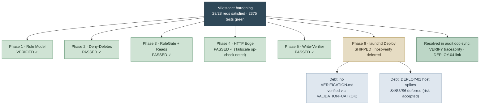

# Milestone Audit — `hardening`

**OmniFocus MCP — JessOS Task Integration Layer** Audited 2026-06-09 · Status: **TECH DEBT** (no blockers; accumulated
bookkeeping + consciously-deferred host verification)

This milestone layered a least-privilege agent role, deny-deletes, a RoleGate, HTTP edge hardening, per-mutation
write-verification, and a launchd deployment onto the kip-d/omnifocus-mcp fork — strictly bottom-up. Every layer is
implemented and its tests pass. What remains is documentation drift and operator-deferred on-host verification, not
unfinished work.

## TL;DR

## Requirements Coverage (28 total)

3-source cross-reference: phase VERIFICATION.md · SUMMARY frontmatter · REQUIREMENTS.md traceability.

| Group              | REQ-IDs              | Phase | Verification                                                                                                   | Final Status                          |
| ------------------ | -------------------- | ----- | -------------------------------------------------------------------------------------------------------------- | ------------------------------------- |
| Role & Identity    | ROLE-01/02/03        | 1     | VERIFICATION: verified (5/5)                                                                                   | **Satisfied**                         |
| Operation Policy   | POLICY-01…07         | 2     | VERIFICATION: passed (4/4)                                                                                     | **Satisfied**                         |
| Role Gate          | GATE-01/02/03        | 3     | VERIFICATION: passed (6/6); SUMMARY frontmatter lists all                                                      | **Satisfied**                         |
| Read & Surfacing   | READ-01/02/03        | 3     | VERIFICATION: passed; SUMMARY frontmatter lists all                                                            | **Satisfied**                         |
| HTTP Edge          | HTTP-01…05           | 4     | VERIFICATION: human_needed (9/9 code-verified); HTTP-04 is an operational Tailscale-Serve check, risk-accepted | **Satisfied** (op-verification noted) |
| Write Verification | VERIFY-01/02/03      | 5     | VERIFICATION: passed (7/7), coverage table marks all SATISFIED; traceability corrected to Complete (doc-sync)  | **Satisfied**                         |
| Deployment         | DEPLOY-02, DEPLOY-03 | 6     | plist least-priv (source-checkable) + fail-fast probe (unit-tested, green)                                     | **Satisfied**                         |
| Deployment         | DEPLOY-04            | 6     | ADR-005 supersedes ADR 001; vault ADR 001 carries reverse `superseded_by` link — bidirectional, confirmed      | **Satisfied**                         |
| Deployment         | DEPLOY-01            | 6     | Software complete; on-host end-to-end write (spikes S4/S6) **deferred, risk-accepted**                         | **Partial** (accepted debt)           |

**FAIL gate:** no requirement is `unsatisfied`, `orphaned`, or failed verification. All 28 appear in a phase
verification/validation artifact. → gate does not force `gaps_found`.

## Phases

| Phase                     | Verification Artifact             | Status                           | Notes                                                                                                         |
| ------------------------- | --------------------------------- | -------------------------------- | ------------------------------------------------------------------------------------------------------------- |
| 1 — Role Model & Resolver | 01-VERIFICATION.md                | ✓ verified                       | Human live-startup check resolved 2026-06-03                                                                  |
| 2 — Operation Policy      | 02-VERIFICATION.md                | ✓ passed                         | —                                                                                                             |
| 3 — RoleGate & Reads      | 03-VERIFICATION.md                | ✓ passed                         | Flagged READ checkbox drift (since fixed); 3 non-blocking cleanup warnings (WR-01/02/03)                      |
| 4 — HTTP Edge             | 04-VERIFICATION.md                | ✓ human_needed                   | 9/9 code-verified; HTTP-04 Tailscale-Serve is an operational on-host check, risk-accepted                     |
| 5 — Write-Verifier        | 05-VERIFICATION.md                | ✓ passed                         | 7/7; live OmniFocus integration GREEN with `verification_status: verified`                                    |
| 6 — launchd Deployment    | **none** (VALIDATION + HUMAN-UAT) | ⚡ shipped, host-verify deferred | TCC not unit-testable; S0–S3 passed clean; S4/S5/S6 deferred (risk-accepted). ADR back-ref confirmed present. |

## Cross-Phase Integration

The `gsd-integration-checker` subagent is not installed in this project, so integration was checked inline from phase
verification evidence plus a fresh build:

- **Build:** `tsc` exits 0, clean.
- **Unit suite:** 117 files, **2375/2375 pass** (8.3s) — exercises role resolver → mutation funnel → policy guard →
  RoleGate → write-verifier wiring together.
- **Funnel invariant:** Phase 5 VERIFICATION traces all 5 `verifier.verify` call sites at the single mutation funnel
  (`executeValidated()`), confirming the Phase 2 deny-delete enforcement and Phase 5 verification share the one funnel
  as designed.
- **Role derivation:** Phase 4 HTTP role-from-bearer-token reuses the Phase 1 role model (owner-token→owner,
  agent-token→agent) with parity to stdio — verified in 04-VERIFICATION (9/9).
- **Live write path:** Phase 5 integration test confirms an end-to-end agent write + independent read-back round-trip on
  real OmniFocus.

No broken cross-phase flows found. The one unproven flow is the **launchd-hosted** write round-trip (Phase 6 spike S6) —
the code path is the same green stdio path, but its behavior _under `launchctl` with the TCC Automation grant_ is
host-verification-deferred.

## Nyquist Coverage

| Phase | VALIDATION.md      | nyquist_compliant | Classification |
| ----- | ------------------ | ----------------- | -------------- |
| 1     | exists (validated) | true              | COMPLIANT      |
| 2     | **missing**        | —                 | MISSING        |
| 3     | exists (draft)     | false             | PARTIAL        |
| 4     | exists (draft)     | false             | PARTIAL        |
| 5     | exists (draft)     | false             | PARTIAL        |
| 6     | exists (draft)     | false             | PARTIAL        |

Overall: **PARTIAL**. The VALIDATION.md frontmatter was never flipped to `nyquist_compliant: true` at phase close for
Phases 3–6, and Phase 2 has none. The underlying tests pass regardless — this is validation-bookkeeping, not coverage
loss. Discovery only; no auto-validation triggered. Run `/gsd-validate-phase {N}` per phase if you want the contract
reconciled.

## Verdict

All 28 requirements are substantively delivered and the full suite is green. The milestone is **functionally complete**.
The 2026-06-09 doc-sync pass closed the two bookkeeping items (VERIFY-01/02/03 traceability; DEPLOY-04 confirmed
bidirectional, not partial). What remains is a single thread of operator-deferred, risk-accepted on-host verification
for Phase 6 (DEPLOY-01 spikes S4/S5/S6) plus the noted absence of a formal Phase 6 VERIFICATION.md. Neither blocks
shipping; both are consciously carried into the archive.

---

_Audited 2026-06-09 · `/gsd-audit-milestone` · doc-sync pass applied 2026-06-09_
