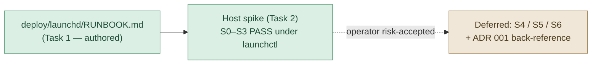

# Phase 06 Plan 04: launchd Deployment Runbook + Host Spike Summary

**Deployment runbook for Developer-ID node pinning, first-grant seeding, install, and in-place upgrade survival; host
spike S0–S3 verified clean under `launchctl`, with S4/S5/S6 and the ADR 001 vault back-reference deferred as recorded
verification debt.**

## TL;DR

## Tasks

| Task | Name                                     | Status                                    | Commit                       |
| ---- | ---------------------------------------- | ----------------------------------------- | ---------------------------- |
| 1    | Author the deployment runbook            | ✅ Complete                               | `2e16556`                    |
| 2    | Run TCC host spike S0–S6 under launchctl | ◑ Partial — S0–S3 PASS, S4/S5/S6 deferred | `89ea594` (results recorded) |
| 3    | ADR 001 back-reference in JessOS vault   | ⏸ Deferred — file not located in vault    | —                            |

## What Was Built

### Task 1: `deploy/launchd/RUNBOOK.md`

A deployment runbook covering, in order: pin a Developer-ID node to `~/.local/libexec/of-mcp-node` and verify its
identity-based designated requirement via `codesign -d -r-`; seed the first-run Automation grant interactively (launchd
has no consent UI); set tokens + `make install`; survive a node upgrade by re-copying the Developer-ID binary in place +
`launchctl kickstart`; and the permission-denial behavior (loud `-1743` to `server.err`, no restart loop under
`KeepAlive=Crashed-only`). Includes a Mermaid TL;DR of the install/upgrade flow and a Spike Results table. Cross-links
ADR-005.

### Task 2: Host spike (operator-run)

| Step                                          | Result     |
| --------------------------------------------- | ---------- |
| S0 — identity-based DR on pinned node         | ✅ PASS    |
| S1 — one-time grant seed prompt               | ✅ PASS    |
| S2 — TCC.db row inspection (optional)         | not run    |
| S3 — `make install` clean start, no `-1743`   | ✅ PASS    |
| S4 — in-place Developer-ID overwrite survival | ⏸ deferred |
| S5 — no restart loop on denial                | ⏸ deferred |
| S6 — write create + read-back under launchctl | ⏸ deferred |

Results recorded in the runbook's Spike Results section.

## Deviations from Plan

The plan's Tasks 2 and 3 are `gate="blocking"` human checkpoints. The operator executed S0–S3 (clean) and made an
explicit risk-accepted decision to defer S4, S5, S6, and the ADR 001 vault back-reference. These are recorded as
deferred verification debt, not failures. The plan's `must_haves` for S4 PASS, S5, and S6 PASS therefore remain
**unverified on-host**; the supporting mechanism (identity-based DR proven by S0) makes survival expected but not yet
demonstrated end-to-end.

## Verification Debt (carried forward)

| Item                   | Requirement                     | Why deferred                                                    |
| ---------------------- | ------------------------------- | --------------------------------------------------------------- |
| S4 — upgrade survival  | DEPLOY-01 (verified clause)     | To confirm on first real node upgrade                           |
| S5 — no restart loop   | DEPLOY-01                       | Risk-accepted; mechanism documented                             |
| S6 — write round-trip  | DEPLOY-01 (success criterion 1) | Not exercised on-host                                           |
| ADR 001 back-reference | DEPLOY-04 supersede mechanics   | ADR 001 not located in vault; ADR-005 carries forward reference |

These surface in `/gsd-progress` and `/gsd-audit-uat`.

## Requirements

| Req       | Status                                                                                               |
| --------- | ---------------------------------------------------------------------------------------------------- |
| DEPLOY-01 | Artifacts complete (probe, pinned-path plist, runbook); **verified** clause partial — S4/S6 deferred |
| DEPLOY-04 | ADR-005 supersede forward reference complete; reciprocal vault back-reference deferred               |

## Self-Check: PASSED (with documented debt)

- `deploy/launchd/RUNBOOK.md` — exists, contains Developer-ID + of-mcp-node, no `brew --prefix` copy source, Mermaid
  TL;DR, Spike Results table
- Commit `2e16556` — Task 1 (runbook); `89ea594` — recorded spike results
- Tasks 2/3 deferred items recorded as verification debt, not silently dropped
