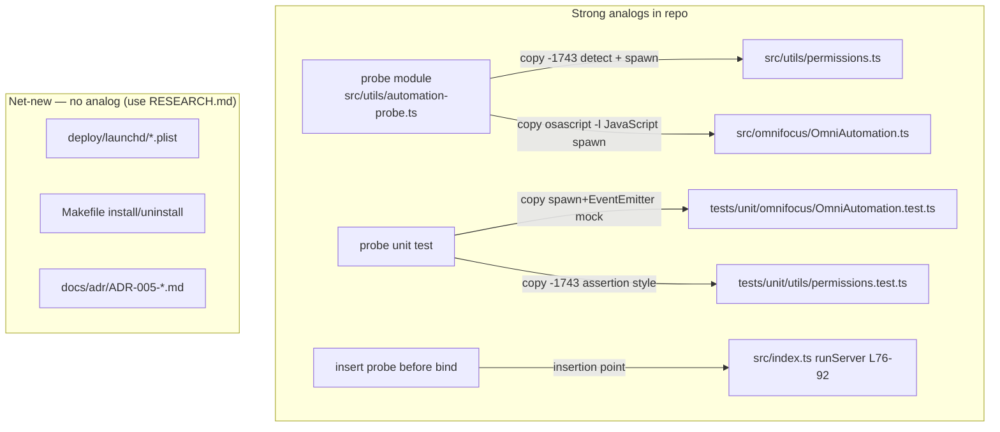

# Phase 6: launchd-deployment-adr - Pattern Map

**Mapped:** 2026-06-09 **Files analyzed:** 5 (1 module, 1 test, 1 plist, 1 Makefile, 1 ADR) **Analogs found:** 2 strong
(probe module, probe test) / 5

## TL;DR



The two highest-value mappings are real and concrete: the **probe module** copies its `-1743` detection from
`permissions.ts` and its `osascript -l JavaScript` spawn shape from `OmniAutomation.ts`; the **probe test** copies the
`vi.mock('node:child_process')` + `EventEmitter` mock-process pattern from `OmniAutomation.test.ts`. The plist,
Makefile, and ADR are net-new with no in-repo precedent — the planner takes those verbatim from 06-RESEARCH.md.

## File Classification

| New/Modified File                                    | Role                    | Data Flow                            | Closest Analog                                                                                                     | Match Quality                                     |
| ---------------------------------------------------- | ----------------------- | ------------------------------------ | ------------------------------------------------------------------------------------------------------------------ | ------------------------------------------------- |
| `src/utils/automation-probe.ts` (new)                | utility / startup guard | request-response (spawn → exit code) | `src/utils/permissions.ts` + `src/omnifocus/OmniAutomation.ts`                                                     | role + data-flow match (split across two analogs) |
| `src/index.ts` (modified — insert probe before bind) | entrypoint              | startup sequence                     | n/a — modify existing `runServer()`                                                                                | exact (same file)                                 |
| `tests/unit/utils/automation-probe.test.ts` (new)    | test                    | mocked spawn                         | `tests/unit/omnifocus/OmniAutomation.test.ts` (spawn mock) + `tests/unit/utils/permissions.test.ts` (assert style) | exact mock pattern                                |
| `deploy/launchd/com.kip-d.omnifocus-mcp.plist` (new) | config template         | n/a                                  | **none**                                                                                                           | net-new                                           |
| `Makefile` (new, repo root)                          | build/install           | n/a                                  | **none**                                                                                                           | net-new                                           |
| `docs/adr/ADR-005-deployment-posture.md` (new)       | doc / ADR               | n/a                                  | **none** (first in-repo ADR)                                                                                       | net-new                                           |

## Pattern Assignments

### `src/utils/automation-probe.ts` (utility, request-response) — PRIMARY MAPPING

Two analogs combine: `permissions.ts` owns the **denial detection** and module/logger shape; `OmniAutomation.ts` owns
the **spawn invocation shape** the probe must mirror so it exercises the same grant path (D-03).

**Analog A — `src/utils/permissions.ts`**

Imports + logger convention (lines 1-4): `.js` ESM extensions, `createLogger` factory.

```typescript
import { execFile } from 'child_process';
import { createLogger } from './logger.js';

const logger = createLogger('PermissionChecker');
```

> Note: the probe should import `spawn` from `node:child_process` (the `OmniAutomation.ts` convention) rather than
> `execFile`, because D-04 needs an explicit `proc.kill('SIGKILL')` handle for the 5s timeout. Keep the
> `createLogger('AutomationProbe')` pattern.

Denial-detection strings to REUSE (lines 49-54) — the host-verified `-1743` / `not allowed` match. The probe's exit-1
branch keys off the same strings:

```typescript
if (msg.includes('-1743') || msg.includes('not allowed')) {
  resolve({
    hasPermission: false,
    error: 'Not authorized to send Apple events to OmniFocus',
    instructions: this.getPermissionInstructions(),
  });
}
```

Remediation-message convention to mirror (lines 102-110) — but the probe writes to `process.stderr` (launchd routes it
to `StandardErrorPath`), not a returned `instructions` string:

```typescript
private getPermissionInstructions(): string {
  return `To grant permissions:
...
   - Open System Settings → Privacy & Security → Automation
   - Find the app using this MCP server (Claude Desktop, Terminal, etc.)
   - Enable the checkbox next to OmniFocus
...`;
}
```

**Analog B — `src/omnifocus/OmniAutomation.ts`** (the spawn path D-03 must reuse)

Spawn shape to COPY (lines 151, 160-178) — deferred `import('node:child_process')` so tests mock reliably,
`spawn('osascript', ['-l', 'JavaScript', ...])`, stderr accumulation, `proc.on('error')` + `proc.on('close', code)`:

```typescript
const { spawn } = await import('node:child_process');
// ...
const proc = spawn('osascript', ['-l', 'JavaScript'], {
  timeout: this.timeout,
});
let stderr = '';
proc.stderr.on('data', (data: Buffer) => {
  stderr += data.toString();
});
proc.on('error', (error) => {
  /* reject */
});
proc.on('close', (code) => {
  if (code !== 0) {
    /* reject with stderr + code */
  }
});
```

> Probe difference vs analog: add `'-e', 'Application("OmniFocus").name()'` to the args (the JXA literal from D-03), and
> add `const timer = setTimeout(() => proc.kill('SIGKILL'), 5000)` + `clearTimeout(timer)` in the close/error handlers
> (D-04). On `signal === 'SIGKILL'` → `process.exit(2)`; on `-1743`/non-zero → `process.exit(1)`; clean → return.

The canonical probe body is already drafted in **06-RESEARCH.md, Pattern 1 (lines 102-139)** — derived from these two
analogs. Planner should treat that excerpt as the target implementation and the two analogs above as the in-repo
conventions it must match (ESM `.js` imports, `createLogger`, deferred `child_process` import).

---

### `src/index.ts` — insert probe before transport bind (entrypoint, modified)

**No analog needed — modify the existing file.** Insertion point is `runServer()`.

Current non-blocking checker block to **precede or replace** (lines 76-92) — this is Pitfall 4: it only `logger.warn`s,
never exits:

```typescript
// Perform initial permission check (blocking — awaited before the transport connects)
const permissionChecker = PermissionChecker.getInstance();
startupTimer.mark('initEnd');
try {
  const result = await permissionChecker.checkPermissions();
  if (!result.hasPermission) {
    logger.warn('OmniFocus permissions not granted. Tools will provide instructions when used.');
    // ...
  }
} catch (error) {
  logger.error('Failed to check permissions:', error);
}
```

Transport-bind site the probe must run BEFORE (lines 146-153) — both `runHttpServer` (the launchd HTTP daemon per D-08)
and `runStdioServer` branch from here:

```typescript
if (cliConfig.httpMode) {
  await runHttpServer(cacheManager, cliConfig);
} else {
  const identity = resolveStdioIdentity();
  const role = parseRole();
  await runStdioServer(cacheManager, identity, role);
}
```

The stdio transport actually binds at `await stdioServer.connect(transport)` (line 241).
**`await probeAutomationOrExit()` belongs immediately after the cache-warm block (line 142,
`startupTimer.mark('warmEnd')`) and before the `cliConfig.httpMode` branch** — guarding both transports. Import added to
the top import block (alongside line 9's `PermissionChecker` import).

---

### `tests/unit/utils/automation-probe.test.ts` (test, mocked spawn)

Two analogs: **`OmniAutomation.test.ts`** for the `spawn` + `EventEmitter` mock-process machinery (the probe uses
`spawn`, not `execFile`), and **`permissions.test.ts`** for the `-1743` assertion style.

**Analog A — `tests/unit/omnifocus/OmniAutomation.test.ts`** — COPY this mock setup (lines 1-35):

```typescript
import { describe, it, expect, vi, beforeEach, afterEach } from 'vitest';
import { spawn } from 'node:child_process';
import { EventEmitter } from 'node:events';

vi.mock('node:child_process', () => ({ spawn: vi.fn() }));

beforeEach(() => {
  mockProcess = Object.assign(new EventEmitter(), {
    stdin: { write: vi.fn(), end: vi.fn() },
    stdout: new EventEmitter(),
    stderr: new EventEmitter(),
  });
  vi.mocked(spawn).mockReturnValue(mockProcess as any);
});
afterEach(() => {
  vi.clearAllMocks();
});
```

Drive-the-process pattern to COPY (lines 73-100) — `setImmediate` to let spawn settle, then emit on
`stderr`/`stdout`/`close`:

```typescript
const executePromise = /* call probe */;
await new Promise((resolve) => setImmediate(resolve));
mockProcess.stderr.emit('data', 'execution error: Not authorized ... (-1743)');
mockProcess.emit('close', 1);
```

> Probe-test additions: stub `process.exit` (`vi.spyOn(process, 'exit').mockImplementation(...)`) and
> `process.stderr.write` to assert exit codes 1/2 and remediation strings. For the timeout case use
> `vi.useFakeTimers()` + emit `'close'` with `signal === 'SIGKILL'` (the test map in 06-RESEARCH.md calls for fake
> timers).

**Analog B — `tests/unit/utils/permissions.test.ts`** — assertion style for the `-1743` denial path (lines 45-51):

```typescript
it('maps -1743 to permission denied with instructions', async () => {
  resolveWith(new Error('-1743 Not allowed to send Apple events'));
  const res = await PermissionChecker.getInstance().checkPermissions();
  expect(res.hasPermission).toBe(false);
  expect(res.instructions).toMatch(/Automation/);
});
```

> For the probe: assert `process.exit` called with `1` and `process.stderr.write` matched `/Automation/` remediation.
> The three required cases (exit 1 on `-1743`, exit 2 on timeout, clean → no exit) are in 06-RESEARCH.md → "Phase
> requirements → test map".

---

### `deploy/launchd/com.kip-d.omnifocus-mcp.plist` (config template) — NET-NEW

No existing `.plist` and no in-repo config-template directory convention exists. Directory choice (`deploy/launchd/` vs
`.config/launchd/`) is Claude's discretion (CONTEXT D-09 / Discretion). Take the full key set from **06-RESEARCH.md →
"launchd Lifecycle — verified key semantics"** and CONTEXT D-08/D-09: `Label=com.kip-d.omnifocus-mcp`,
`ProgramArguments[0]`=`~/.local/libexec/of-mcp-node`, `RunAtLoad=true`, `KeepAlive={Crashed=true}`,
`ThrottleInterval=10`, `ProcessType=Background`, `StandardOutPath`/`StandardErrorPath` under
`~/Library/Logs/omnifocus-mcp/`, `EnvironmentVariables` with token **placeholders** (never commit real
`MCP_AGENT_TOKEN`/`MCP_OWNER_TOKEN`), `SessionCreate` unset, no FDA/entitlement keys.

### `Makefile` (repo root) — NET-NEW

No Makefile exists in the repo root. Net-new. `install` / `uninstall` targets from **06-RESEARCH.md → Pattern 2**:
substitute the pinned node path into the plist template, `mkdir -p ~/Library/Logs/omnifocus-mcp`,
`launchctl bootstrap gui/$(id -u) ~/Library/LaunchAgents/com.kip-d.omnifocus-mcp.plist`; uninstall =
`launchctl bootout gui/$(id -u)/com.kip-d.omnifocus-mcp` + remove the installed plist. Optional `verify` target is
Claude's discretion (CONTEXT Discretion).

### `docs/adr/ADR-005-deployment-posture.md` (ADR) — NET-NEW

`docs/adr/` does not exist — this is the **first in-repo ADR** (CONTEXT D-05). Net-new. Nygard sections (Title / Status
/ Context / Decision / Consequences) per **06-RESEARCH.md → "Nygard ADR format"**.
`Status: Accepted — Supersedes ADR 001`. Records the TCC responsible-process + csreq finding,
Developer-ID-vs-brew-ad-hoc node decision, Tailscale Serve, and the Cloudflare/Funnel declines (carried from Phase 4,
not re-decided). Apply `neurodivergent-visual-org` per user rule — a substantive narrative doc warrants a Mermaid TL;DR.

## Shared Patterns

### Fail-closed startup assertion

**Source:** `src/index.ts` `assertSandboxGuardAtStartup()` (line 60), and the existing permission block (lines 76-92).
**Apply to:** the probe — same "assert loudly at startup, refuse to start otherwise" shape, but with `process.exit(1|2)`
instead of a warning.

```typescript
assertSandboxGuardAtStartup(); // hard-fails before any I/O — the model the probe extends
```

### ESM `.js` import + createLogger

**Source:** `src/utils/permissions.ts` lines 1-4. **Apply to:** `automation-probe.ts` —
`import { createLogger } from './logger.js';` with `.js` extensions on relative imports.

### Deferred `child_process` import for testability

**Source:** `src/omnifocus/OmniAutomation.ts` line 151 (`const { spawn } = await import('node:child_process');`).
**Apply to:** the probe, so `vi.mock('node:child_process')` in the test intercepts reliably (matching the
`OmniAutomation.test.ts` mock).

## No Analog Found

| File                                           | Role            | Reason                                                                              |
| ---------------------------------------------- | --------------- | ----------------------------------------------------------------------------------- |
| `deploy/launchd/com.kip-d.omnifocus-mcp.plist` | config template | No `.plist` or config-template directory in repo; key set comes from 06-RESEARCH.md |
| `Makefile`                                     | build/install   | No Makefile in repo root                                                            |
| `docs/adr/ADR-005-deployment-posture.md`       | ADR             | `docs/adr/` does not exist; first in-repo ADR                                       |

## Metadata

**Analog search scope:** `src/utils/`, `src/omnifocus/`, `src/index.ts`, `tests/unit/utils/`, `tests/unit/omnifocus/`,
repo root, `docs/`, `deploy/`, `.config/` **Files scanned:** ~10 (read: permissions.ts, OmniAutomation.ts, index.ts,
permissions.test.ts, OmniAutomation.test.ts) **Pattern extraction date:** 2026-06-09
