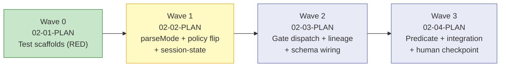

# Phase 02 Plan 01: Wave 0 Test Scaffolds Summary

Wave 0 acceptance contracts for Phase 2 (Capture & Permission Gating). Six test locations define the acceptance shape
for every new behavior before production code lands. All tests run RED.

## TL;DR

## What Was Built

Six test locations in RED state, covering all Phase 2 requirements:

| File                                                      | Status         | Covers                                                                |
| --------------------------------------------------------- | -------------- | --------------------------------------------------------------------- |
| `tests/unit/contracts/ast/lineage-stamp.test.ts`          | NEW — RED      | LINE-01: stamp append, idempotency, undefined-note, overrides         |
| `tests/unit/auth/agent-ok-predicate.test.ts`              | NEW — RED      | PERM-01: predicate structure, AST compile, OmniJS emit, negative case |
| `tests/unit/auth/role-resolver.test.ts`                   | EXTENDED — RED | D-05: parseMode 8-row it.each matrix                                  |
| `tests/unit/auth/operation-policy.test.ts`                | EXTENDED — RED | D-01: agent/create/task → gate (was allow)                            |
| `tests/unit/tools/unified/OmniFocusWriteTool.test.ts`     | EXTENDED — RED | PERM-02: POLICY_GATE_CAPTURE_CONFIRM + session-grant bypass           |
| `tests/unit/tools/unified/verifier/WriteVerifier.test.ts` | EXTENDED — RED | LINE-01: stamped note round-trip, Pitfall 4 guard                     |

## RED State Evidence

`npm run test:unit` exits non-zero: **6 test files failing, 14 tests failing**.

Failure modes:

- `lineage-stamp.test.ts`: `Cannot find module 'src/contracts/ast/lineage.js'` (import error — file does not exist)
- `WriteVerifier.test.ts`: `Cannot find module 'src/contracts/ast/lineage.js'` (same — whole file RED)
- `agent-ok-predicate.test.ts`: `agentOkayPredicate is not a function` (export not yet in filters.ts)
- `role-resolver.test.ts` parseMode block: `parseMode is not a function` (export not yet in role-resolver.ts)
- `operation-policy.test.ts` create row: expected `gate`, received `allow` (policy not yet flipped)
- `OmniFocusWriteTool.test.ts` PERM-02 block: `result.error.code` is not `POLICY_GATE_CAPTURE_CONFIRM` (gate dispatch
  not yet wired)

## Commits

| Hash       | Message                                                                                     |
| ---------- | ------------------------------------------------------------------------------------------- |
| `6132561c` | test(02-01): add Wave 0 scaffold — lineage-stamp + agent-ok-predicate (RED)                 |
| `48058475` | test(02-01): extend role-resolver, operation-policy, and WriteTool with Phase 2 cases (RED) |
| `fd7745dd` | test(02-01): extend WriteVerifier.test.ts with LINE-01 lineage stamp round-trip (RED)       |

## Deviations from Plan

None — plan executed exactly as written.

## Known Stubs

None — this plan creates test files only. No production code was touched.

## Threat Flags

None — Wave 0 introduces no new trust surfaces (test-only code).

## Self-Check: PASSED

Files exist:

- `tests/unit/contracts/ast/lineage-stamp.test.ts` — FOUND
- `tests/unit/auth/agent-ok-predicate.test.ts` — FOUND
- `tests/unit/auth/role-resolver.test.ts` — FOUND (extended)
- `tests/unit/auth/operation-policy.test.ts` — FOUND (extended)
- `tests/unit/tools/unified/OmniFocusWriteTool.test.ts` — FOUND (extended)
- `tests/unit/tools/unified/verifier/WriteVerifier.test.ts` — FOUND (extended)

Commits exist:

- `6132561c` — FOUND
- `48058475` — FOUND
- `fd7745dd` — FOUND
