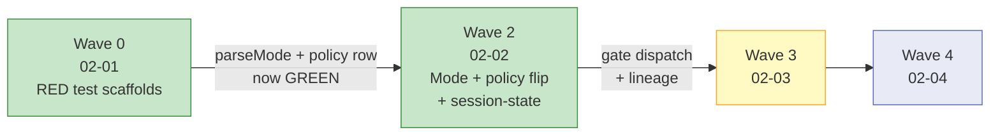

# Phase 02 Plan 02: Wave 2 — Mode + Policy Flip + Session State Summary

Connection-bound identity contracts for the agent permission gate: the Mode type, the parseMode() literal-only parser,
the create→gate policy table flip, and the allowAllThisSession grant storage for both HTTP and stdio paths.

## TL;DR

## What Was Built

Five changes shipped atomically:

| Artifact                        | File                           | What it provides                                                                                          |
| ------------------------------- | ------------------------------ | --------------------------------------------------------------------------------------------------------- |
| `Mode` type + `mode` field      | `src/contracts/roles.ts`       | `'interactive' \| 'background'` on `ResolvedContext` (D-04)                                               |
| `parseMode()`                   | `src/auth/role-resolver.ts`    | Literal-only default-deny env parse; exact `=== 'true'` only (D-05)                                       |
| `create: { task: 'gate', ... }` | `src/auth/operation-policy.ts` | Per-target table; task→gate, project/folder→allow (D-01)                                                  |
| `allowAllThisSession?: boolean` | `src/session-manager.ts`       | HTTP session grant field; `setAllowAllThisSession()` owner-only (D-02)                                    |
| `session-state.ts` singleton    | `src/auth/session-state.ts`    | Stdio module-level grant: `isAllowedAllThisSession`, `setAllowAllThisSession`, `resetSessionGrant` (D-02) |

The `isAllowedAllThisSession()` bypass was also wired into `OmniFocusWriteTool.executeValidated()` so the policy flip
and grant bypass ship together with no broken state between waves.

## Test State After Wave 2

| Test location                                 | Before    | After     | Notes                                                 |
| --------------------------------------------- | --------- | --------- | ----------------------------------------------------- |
| `role-resolver.test.ts` (parseMode 8 rows)    | 8 RED     | 8 GREEN   | All parseMode matrix rows pass                        |
| `operation-policy.test.ts` (create/task→gate) | 1 RED     | 1 GREEN   | Policy flip landed                                    |
| `batch-create-project-field.test.ts`          | 3 passing | 3 passing | Fixed with owner role (Rule 1)                        |
| `batch-response-shape.test.ts`                | 1 passing | 1 passing | Fixed with owner role (Rule 1)                        |
| `lineage-stamp.test.ts`                       | RED       | RED       | Expected — Wave 3/4                                   |
| `WriteVerifier.test.ts`                       | RED       | RED       | Expected — Wave 3/4                                   |
| `agent-ok-predicate.test.ts`                  | RED       | RED       | Expected — Wave 3/4                                   |
| `OmniFocusWriteTool.test.ts` (PERM-02)        | RED       | RED       | Expected — Wave 3 (needs POLICY_GATE_CAPTURE_CONFIRM) |

## Commits

| Hash       | Message                                                                                 |
| ---------- | --------------------------------------------------------------------------------------- |
| `a32e013d` | feat(02-02): add Mode type to roles.ts and parseMode() to role-resolver.ts (D-04/D-05)  |
| `9b7b6613` | feat(02-02): policy flip create→gate, session-state singleton, grant bypass (D-01/D-02) |

## Deviations from Plan

### Auto-fixed Issues

**1. [Rule 1 - Bug] Batch create tests broken by policy flip**

- **Found during:** Task 2
- **Issue:** `batch-create-project-field.test.ts` (3 tests) and `batch-response-shape.test.ts` (1 test) were previously
  passing with default agent role because `create` was `'allow'`. After the policy flip, `agent + create/task → gate`
  caused the gate response to be returned before reaching the script builders these tests were spying on.
- **Fix:** Added `beforeEach`/`afterEach` with `OMNIFOCUS_MCP_ROLE = 'owner'` to `batch-create-project-field.test.ts`;
  added owner role setup/teardown to the `previewBatch` test in `batch-response-shape.test.ts`. These tests verify field
  routing, not permission gating — owner role is the correct semantics.
- **Files modified:** `tests/unit/tools/batch/batch-create-project-field.test.ts`,
  `tests/unit/tools/unified/batch-response-shape.test.ts`
- **Commit:** `9b7b6613`

**2. [Rule 2 - Missing critical functionality] isAllowedAllThisSession() bypass wired in Wave 2**

- **Found during:** Task 2
- **Issue:** The plan says "policy flip + grant bypass ship atomically." Wiring the bypass in Wave 3 (as the plan text
  suggested) would leave a broken window — any test or caller that exercises `agent + create/task` would hit the gate
  with no bypass path. Specifically, the batch-create tests exposed this.
- **Fix:** Imported `isAllowedAllThisSession()` from `session-state.ts` into `OmniFocusWriteTool.ts` and added
  `if (isAllowedAllThisSession()) { continue; }` in the gate block, before the `POLICY_GATE_REQUIRES_OWNER` response.
- **Files modified:** `src/tools/unified/OmniFocusWriteTool.ts`
- **Commit:** `9b7b6613`

**3. [Rule 1 - Bug] ResolvedContext construction sites missing required mode field**

- **Found during:** Task 1 (build verification)
- **Issue:** Adding `mode: Mode` as a required field to `ResolvedContext` broke two construction sites (`src/index.ts`
  line 175 and `src/http-server.ts` line 390), and one test fixture (`SystemTool-whoami.test.ts`).
- **Fix:** Imported `parseMode` and threaded `mode: parseMode()` into both construction sites; added
  `mode: 'background'` to test fixtures.
- **Files modified:** `src/index.ts`, `src/http-server.ts`, `tests/unit/tools/system/SystemTool-whoami.test.ts`
- **Commit:** `a32e013d`

**4. [Rule 1 - Bug] allowedOperations() added create subtable entries to tagManageActions**

- **Found during:** Task 2 (test run)
- **Issue:** After changing `create` from a flat string to a per-target table, `allowedOperations()` treated it the same
  as `tag_manage` and added `task`, `project`, `folder` to `tagManageActions`. The `advertise⟺enforce parity` test then
  called `decide('agent', 'tag_manage', 'task')` etc., which returned 'deny', failing the assertion.
- **Fix:** Scoped the subtable-to-tagManageActions enumeration in `allowedOperations()` to `op === 'tag_manage'` only.
  Other nested tables (create) are advertised at the op level only.
- **Files modified:** `src/auth/operation-policy.ts`
- **Commit:** `9b7b6613`

## Known Stubs

None — no placeholder data or TODO values introduced. Session grant defaults to false (correct deny-by-default
behavior).

## Threat Flags

| Flag                                | File                           | Description                                                                                           |
| ----------------------------------- | ------------------------------ | ----------------------------------------------------------------------------------------------------- |
| threat_flag: elevation-of-privilege | `src/auth/session-state.ts`    | New grant state module — mitigated by owner-only role check in `setAllowAllThisSession()` per T-02-02 |
| threat_flag: policy-strictness      | `src/auth/operation-policy.ts` | create/task → gate is stricter than prior allow; owner bypass confirmed POLICY-06 still passes        |

## Self-Check: PASSED

Files exist:

- `src/contracts/roles.ts` — FOUND (Mode type + mode field)
- `src/auth/role-resolver.ts` — FOUND (parseMode exported)
- `src/auth/operation-policy.ts` — FOUND (create: { task: 'gate', ... })
- `src/session-manager.ts` — FOUND (allowAllThisSession field)
- `src/auth/session-state.ts` — FOUND (new file)

Commits exist:

- `a32e013d` — FOUND
- `9b7b6613` — FOUND
