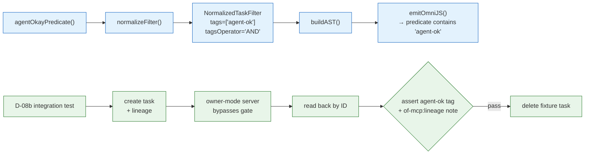

# Phase 02 Plan 04: Wave 4 — agentOkayPredicate + D-08b Integration Test Summary

Completes PERM-01 by adding the read-side predicate and the automated integration proof. All Phase 2 Wave 0 unit tests
are now GREEN. Human verification of the OmniFocus inbox round-trip is pending (checkpoint).

## TL;DR

## What Was Built

| Artifact               | File                                                 | What it provides                                                   |
| ---------------------- | ---------------------------------------------------- | ------------------------------------------------------------------ |
| `agentOkayPredicate()` | `src/contracts/filters.ts`                           | PERM-01 read-side predicate; Phase 3 routing entry point (D-08a)   |
| Predicate test fix     | `tests/unit/auth/agent-ok-predicate.test.ts`         | `script.predicate` assertion; all 4 Wave 0 tests GREEN             |
| D-08b integration test | `tests/integration/tools/unified/end-to-end.test.ts` | Owner-mode create→read-back→delete proving agent-ok + lineage note |

## Test State After Wave 4

| Test location                          | Before | After   | Notes                              |
| -------------------------------------- | ------ | ------- | ---------------------------------- |
| `agent-ok-predicate.test.ts` (4 tests) | RED    | GREEN   | All 4 PERM-01 predicate tests pass |
| All other unit tests (2392)            | GREEN  | GREEN   | No regression; 2396 total          |
| `end-to-end.test.ts` D-08b (1 test)    | —      | Written | Requires live OmniFocus to run     |

## Phase 2 Wave 0 Test Status (Complete Picture)

| Test suite                                 | Tests | Status after Wave 4        |
| ------------------------------------------ | ----- | -------------------------- |
| `lineage-stamp.test.ts`                    | 4     | GREEN (Wave 3)             |
| `agent-ok-predicate.test.ts`               | 4     | GREEN (Wave 4 — this plan) |
| `OmniFocusWriteTool.test.ts` PERM-02 block | 2     | GREEN (Wave 3)             |
| `WriteVerifier.test.ts` LINE-01 block      | 2     | GREEN (Wave 3)             |
| `role-resolver.test.ts` parseMode matrix   | 8+    | GREEN (Wave 2)             |
| `operation-policy.test.ts` create→gate row | 1     | GREEN (Wave 2)             |

## Commits

| Hash       | Message                                                                                 |
| ---------- | --------------------------------------------------------------------------------------- |
| `79bfa3ca` | feat(02-04): add agentOkayPredicate() to filters.ts (PERM-01, D-08a)                    |
| `22ed1636` | test(02-04): add D-08b integration test — agent create with lineage stamps agent-ok tag |

## Deviations from Plan

### Auto-fixed Issues

**1. [Rule 1 - Bug] Wave 0 predicate test asserted on EmitResult object instead of .predicate string**

- **Found during:** Task 1 (test run)
- **Issue:** `tests/unit/auth/agent-ok-predicate.test.ts` line 32 called `expect(script).toContain('agent-ok')` where
  `script` is the `EmitResult` object returned by `emitOmniJS()`. Vitest's `toContain` on a plain object fails with
  `expected [] to include 'agent-ok'` — the object has no array/string `.includes()` method.
- **Fix:** Changed assertion to `expect(script.predicate).toContain('agent-ok')`. Added a comment explaining that
  `emitOmniJS` returns `EmitResult { preamble, predicate }`, not a plain string.
- **Files modified:** `tests/unit/auth/agent-ok-predicate.test.ts`
- **Commit:** `79bfa3ca`

## Verification — RESOLVED (2026-06-12)

The human checkpoint surfaced a real discrepancy: the capture path was dead over the live MCP path. Post-checkpoint
gap-closure (8 commits) fixed it, and the D-08b integration test now PROVES the round-trip live against OmniFocus — an
agent create-with-lineage produces an inbox task with the `agent-ok` tag and the `of-mcp:lineage` note block, read back
via the `agentOkayPredicate` filter. This automated live proof was accepted in lieu of a manual UI eyeball.

Root causes fixed: funnel lineage bypass was unreachable behind a blunt pre-dispatch gate in `tools/index.ts` (now
delegates create verdicts to the funnel); `agent-ok` was rejected by the test-mode tag guard; the D-08b read-back used
the unrouted `filters.ids` path; the policy flip had gated every create-task integration harness (all migrated to owner
role); and the verifier's D-12 owner guard required the write-verifier test to run as agent+lineage.

**Status:** COMPLETE. Automated + live verification PASS.

## Known Stubs

None — agentOkayPredicate() is fully wired. The D-08b integration test is complete but requires OmniFocus running to
produce a live result.

## Threat Flags

No new trust surfaces. The agentOkayPredicate() routes through the existing filter AST pipeline with no new code paths.
The integration test creates/deletes a single fixture task under the existing mutation funnel.

## Self-Check: PASSED

Files exist:

- `src/contracts/filters.ts` — FOUND (agentOkayPredicate exported, no inInbox)
- `tests/unit/auth/agent-ok-predicate.test.ts` — FOUND (script.predicate assertion fixed)
- `tests/integration/tools/unified/end-to-end.test.ts` — FOUND (Phase 2 D-08b describe block added)

Commits exist:

- `79bfa3ca` — FOUND
- `22ed1636` — FOUND
