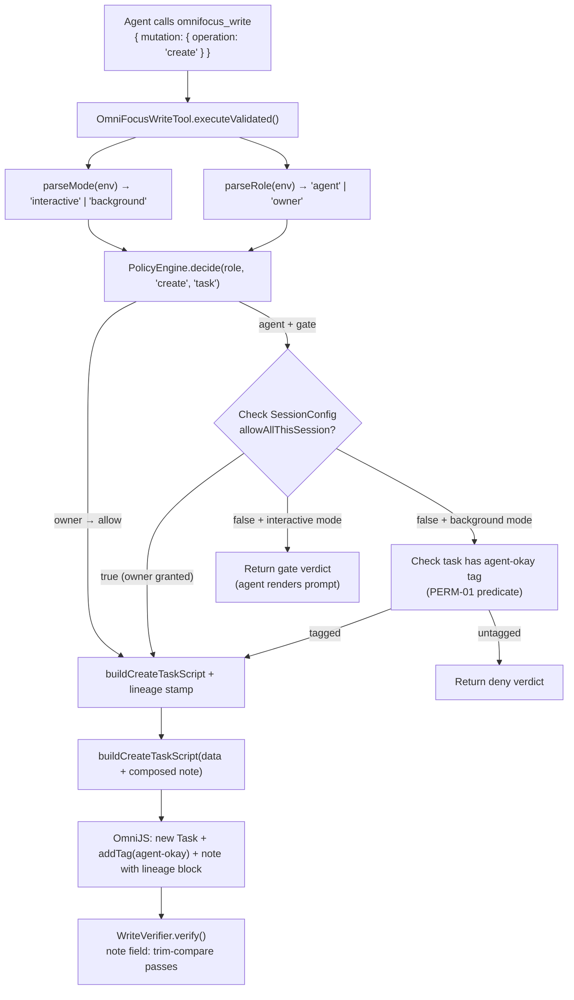

# Phase 2: Capture & Permission Gating - Research

**Researched:** 2026-06-12 **Domain:** OmniFocus MCP permission architecture / lineage stamping / agent-mode gating
**Confidence:** HIGH

---

<user_constraints>

## User Constraints (from CONTEXT.md)

### Locked Decisions

**Gate enforcement locus (PERM-02)**

- D-01: Hybrid — server owns the verdict + grant; the agent renders the prompt. Agent create-task runs through the
  existing single mutation funnel; `PolicyEngine.decide()` returns a `gate` outcome for `agent` + create-task; the
  server checks a per-session "allow all this session" grant and either allows or returns the structured `gate` verdict
  that the agent-side skill surfaces conversationally (mirroring the Jira-creation flow).
- D-02: The "allow all this session" grant lives in `SessionConfig` (per-principal session state), set only by an
  owner-authenticated call.
- D-03 (decisive constraint): MCP `elicitation/create` is NOT used. It only works when the client declared the
  `elicitation` capability at init — a background/async run has no one to prompt. The funnel owns the verdict in both
  modes.

**Sync vs async mode signal (PERM-01 / PERM-02)**

- D-04: Mode is connection-bound, derived at the identity seam from `OMNIFOCUS_MCP_INTERACTIVE` env marker, resolved in
  `src/auth/role-resolver.ts`. Interactive stdio launch sets the marker; launchd/n8n runs leave it unset.
- D-05: Literal-only, default-deny parse (mirrors `parseRole`): only the exact literal resolves to `interactive`;
  undefined/empty/typo/garbage → `background`. Agent cannot self-elevate.

**`agent-okay` scope in Phase 2 (PERM-01)**

- D-06: Phase 2 builds the read-side `agent-okay` predicate + capture-time stamping; defers routing-time action gating
  to Phase 3. Predicate is a thin composition over existing `tags` + `inInbox` filters.
- D-07: Phase 2 owns the write-side stamp and read-side predicate; Phase 3 owns consuming that predicate.
- D-08: Success criterion proven by (a) unit test asserting predicate compiles to filter returning only
  `agent-okay`-tagged tasks, plus (b) capture-path test asserting newly-created items are stamped. NOT a routing demo.

**Lineage stamp format & source (LINE-01)**

- D-09: Format — fenced HTML-comment block with JSON payload, appended after any user note text (blank-line separated).
  Canonical form:

  ```
  <existing user note text, untouched>

  <!-- of-mcp:lineage
  {"v":1,"agent":"claude-code","session":"<uuid>","created_at":"<iso8601>"}
  -->
  ```

- D-10: Compose the stamp server-side in `src/contracts/ast/mutation-script-builder.ts`. On note update, strip any
  existing `of-mcp:lineage` block before re-appending.
- D-11: Agent supplies session ID as a write-call parameter. Add optional `lineage: { sessionId, agent?, createdAt? }`
  to write tool's Zod schema AND hand-crafted `inputSchema` override (dual-schema rule).

### Claude's Discretion

- Exact field names/casing inside the JSON payload (keep `v`/`session`/`agent`/`created_at` intent stable).
- The exact env-marker literal value (e.g. `interactive` vs `live`).
- Where in `PolicyEngine`/funnel the create `gate` rule is expressed and the precise owner-auth call shape.
- Whether the agent-origin tag and the `agent-okay` gate tag are the same tag or two tags — resolve during planning
  against PERM-01 and Phase 3 routing needs.

### Deferred Ideas (OUT OF SCOPE)

- Routing-time action gating (Phase 3, ROUTE-\*)
- n8n 15-min polling under background mode (TRIG-02)
- Owner-only per-call `background` downgrade hint (optional, Phase 2 not required) </user_constraints>

<phase_requirements>

## Phase Requirements

| ID      | Description                                                                                           | Research Support                                                                                                                                                                                 |
| ------- | ----------------------------------------------------------------------------------------------------- | ------------------------------------------------------------------------------------------------------------------------------------------------------------------------------------------------ |
| CAP-01  | User can dump a messy item straight into the OmniFocus inbox without deciding project, tags, or dates | DISC-CAPTURE-01 verified: `new Task(name, inbox)` round-trips with note; existing `buildCreateTaskScript` + `omnifocus_write create` is the reuse path (no project = inbox)                      |
| PERM-01 | In async/background runs, agent acts only on tasks tagged `agent-okay`; untagged tasks untouched      | `tags` + `inInbox` filters exist in `filters.ts`/`builder.ts`; predicate composes at unit layer; capture-time tag stamp via OmniJS `addTag` bridge                                               |
| PERM-02 | In sync/live sessions, agent prompts before creating; offers "allow all this session" option          | `SessionConfig` is the forge-resistant home for the grant; `decide()` returns `gate` today for tag destructive ops — same plumbing for create-task gate in interactive mode                      |
| LINE-01 | Every agent-created task stores its originating Claude Code session ID in the task notes              | `note` field round-trips verified (DISC-CAPTURE-01); `note` comparator in `field-comparator.ts` uses trim-compare (stamp survives verification); dual-schema extension to `lineage` param needed |

</phase_requirements>

---

## Summary

Phase 2 extends the existing hardening-milestone MCP server — already shipping a policy engine, role resolver, single
mutation funnel, and write verifier — to add the first agent WRITE surface: inbox capture under permission gates, with a
session-lineage stamp on every agent-created task.

All four requirements (CAP-01, PERM-01, PERM-02, LINE-01) reuse or extend existing seams rather than building new
mechanisms. The codebase verification confirms every load-bearing claim in CONTEXT.md is grounded in live code with
correct signatures. One structural gap was found: `SessionConfig` does not yet have an `allowAllThisSession` boolean
field — the D-02 grant home exists as a type but the field must be added. One policy table gap: `create` already returns
`allow` for the AGENT role in `AGENT_POLICY`, meaning D-01's "gate outcome for agent + create-task" requires changing
`create: 'allow'` to `create: 'gate'` in the policy table, which will be the most visible behavior change in the phase.

**Primary recommendation:** Start with the policy table change (create → gate for AGENT), then add the mode marker to
`ResolvedContext` + role resolver, then the session grant field + owner API, then the `agent-okay` predicate, then the
lineage stamp. Each step is independently testable at the unit layer.

---

## Architectural Responsibility Map

| Capability                           | Primary Tier                            | Secondary Tier              | Rationale                                                                            |
| ------------------------------------ | --------------------------------------- | --------------------------- | ------------------------------------------------------------------------------------ |
| Inbox capture (CAP-01)               | API/Backend (MCP server)                | OmniFocus (persistence)     | Existing `omnifocus_write create` + `buildCreateTaskScript` path; no-project = inbox |
| Permission gate verdict (PERM-01/02) | API/Backend (PolicyEngine + funnel)     | —                           | Server-side enforcement invariant; agent-side only renders prompt UX                 |
| Interactive mode detection (D-04)    | API/Backend (role-resolver.ts)          | —                           | Connection-bound; resolved at identity seam, same as `parseRole`                     |
| "Allow all session" grant (D-02)     | API/Backend (SessionManager)            | —                           | Per-principal forge-resistant state; only owner-auth call may set it                 |
| `agent-okay` predicate (D-06)        | API/Backend (filter codegen)            | —                           | Composes over existing `tags`/`inInbox` filter AST nodes                             |
| Agent-origin tag stamp (D-06)        | API/Backend (mutation-script-builder)   | OmniFocus (tag auto-create) | OmniJS `addTag` bridge; tag find-or-create on write                                  |
| Lineage stamp composition (D-10)     | API/Backend (mutation-script-builder)   | —                           | Server-side note composition before script emit; not agent-supplied text             |
| Lineage stamp verification (D-10)    | API/Backend (WriteVerifier)             | —                           | `note` field already handled by `field-comparator.ts` trim-compare                   |
| PERM-02 prompt UX                    | Agent-side (Claude Code skill/behavior) | —                           | Server returns structured `gate` verdict; agent renders conversational confirm       |

---

## Standard Stack

### Core (all already in project)

| Library    | Version         | Purpose                                  | Why Standard                                                   |
| ---------- | --------------- | ---------------------------------------- | -------------------------------------------------------------- |
| `zod`      | project version | Schema validation + dual-schema contract | Already in use; `WriteSchema` / `CreateDataSchema` extend this |
| `vitest`   | project version | Unit + integration testing               | Project standard (`npm run test:unit`)                         |
| TypeScript | project version | Type safety for new interfaces           | Project standard                                               |

No new external packages are required for Phase 2. All capabilities are extensions of existing modules.

### No New Package Installation Required

This phase extends:

- `src/contracts/roles.ts` — add `mode: 'interactive' | 'background'` to `ResolvedContext`
- `src/auth/role-resolver.ts` — add `parseMode()` following `parseRole` pattern
- `src/auth/operation-policy.ts` — change `create: 'allow'` → `create: 'gate'` in `AGENT_POLICY`
- `src/session-manager.ts` — add `allowAllThisSession?: boolean` to `SessionConfig`
- `src/contracts/ast/mutation-script-builder.ts` — compose lineage stamp into `note`
- `src/contracts/filters.ts` (or new file) — export `agentOkayPredicate()` helper
- `src/tools/unified/schemas/write-schema.ts` — add `lineage` Zod schema
- `src/tools/unified/OmniFocusWriteTool.ts` — update `inputSchema` override + gate verdict handling

---

## Package Legitimacy Audit

No new external packages are installed in this phase. All code extends existing modules.

**Packages removed due to slopcheck [SLOP] verdict:** none **Packages flagged as suspicious [SUS]:** none

---

## Architecture Patterns

### System Architecture Diagram



### Recommended Project Structure Extensions

```
src/
├── auth/
│   ├── operation-policy.ts      # Change create: 'allow' → 'gate' in AGENT_POLICY
│   └── role-resolver.ts         # Add parseMode() + env var OMNIFOCUS_MCP_INTERACTIVE
├── contracts/
│   ├── roles.ts                 # Add mode: 'interactive'|'background' to ResolvedContext
│   ├── filters.ts               # Add agentOkayPredicate() composing tags + inInbox
│   └── ast/
│       └── mutation-script-builder.ts  # Add composeLineageStamp() + addAgentTag()
├── session-manager.ts           # Add allowAllThisSession?: boolean to SessionConfig
└── tools/
    └── unified/
        ├── schemas/
        │   └── write-schema.ts  # Add LineageSchema + lineage field to CreateDataSchema
        └── OmniFocusWriteTool.ts  # Update inputSchema override + gate verdict dispatch
```

### Pattern 1: Mode Marker Resolution (mirrors parseRole)

**What:** Add `parseMode()` to `src/auth/role-resolver.ts` using the exact same literal-only, default-deny pattern as
`parseRole`. Return `'interactive'` only on exact match `OMNIFOCUS_MCP_INTERACTIVE === 'true'`; return `'background'`
for every other value (undefined, empty, typo, garbage).

**When to use:** Called at the same identity seam as `parseRole()` — at startup in `index.ts` to populate
`ResolvedContext`, and in `OmniFocusWriteTool.executeValidated()` when evaluating the gate verdict.

```typescript
// Source: mirrors src/auth/role-resolver.ts parseRole() pattern [VERIFIED: codebase]
export function parseMode(env: Record<string, string | undefined> = process.env): 'interactive' | 'background' {
  return env.OMNIFOCUS_MCP_INTERACTIVE === 'true' ? 'interactive' : 'background';
}
```

**Key constraint:** Mode binds to the connection, not to the call. `parseMode()` reads `process.env`, not a call
argument, preventing self-elevation.

### Pattern 2: Gate Verdict Return (mirrors existing tag_manage gate)

**What:** The existing funnel already handles `gate` outcome for `tag_manage/delete` and `tag_manage/merge` by returning
a structured `createErrorResponseV2(..., 'POLICY_GATE_REQUIRES_OWNER', ...)`. The new create-task gate in interactive
mode needs a distinct response code so the agent can branch its UX.

**When to use:** `decide(role, 'create', 'task')` returns `'gate'` for the AGENT role after the policy table change. The
funnel checks `SessionConfig.allowAllThisSession` first; if false and mode is `interactive`, return a new
`POLICY_GATE_CAPTURE_CONFIRM` verdict. If false and mode is `background`, return `POLICY_DENY` (background cannot
prompt).

**Existing gate response structure** [VERIFIED: codebase]:

```typescript
// src/tools/unified/OmniFocusWriteTool.ts:439 — existing gate response pattern
if (outcome === 'gate') {
  return createErrorResponseV2(
    'omnifocus_write',
    'POLICY_GATE_REQUIRES_OWNER', // ← new code for capture: 'POLICY_GATE_CAPTURE_CONFIRM'
    'This structural operation requires owner approval before execution.',
    'Re-run from an owner connection ...',
    { dryRun: true, preview: { wouldAffect: { operation, target } }, ownerCommand: { mutation: args.mutation } },
    new OperationTimerV2().toMetadata(),
  );
}
```

### Pattern 3: Lineage Stamp Composition

**What:** Server-side composition of the lineage block into the final `note` string in `buildCreateTaskScript`. The
stamp is appended after user note text with a blank-line separator. On update, strip any existing `of-mcp:lineage` block
before re-appending.

**When to use:** Any `create` or `update` operation that includes a `lineage` param in the write call data.

```typescript
// Source: D-09 canonical form [CITED: 02-CONTEXT.md]
const LINEAGE_RE = /\n\n<!-- of-mcp:lineage\n.*?\n-->/s;

export function composeLineageStamp(
  userNote: string | undefined,
  lineage: { sessionId: string; agent?: string; createdAt?: string },
): string {
  const base = (userNote ?? '').replace(LINEAGE_RE, '').trimEnd();
  const payload = JSON.stringify({
    v: 1,
    agent: lineage.agent ?? 'claude-code',
    session: lineage.sessionId,
    created_at: lineage.createdAt ?? new Date().toISOString(),
  });
  const stamp = `\n\n<!-- of-mcp:lineage\n${payload}\n-->`;
  return base + stamp;
}
```

**Verifier compatibility:** `field-comparator.ts:175` already trims before comparing the `note` field. The lineage block
is part of the composed `note`, so `intentObj.note` (the composed string) must match `readBackObj.note`. The planner
must ensure `extractIntent()` in `intent-extractor.ts` sees the already-composed `note` string (including the stamp),
not the raw user note. [VERIFIED: codebase — `TASK_CREATE_FIELDS` at line 84 includes `'note'`]

### Pattern 4: agent-okay Predicate Composition

**What:** A thin composition over existing `TaskFilter` fields:
`{ tags: ['agent-okay'], tagsOperator: 'AND', inInbox: true }` (or just `tags` if Phase 3 routing needs non-inbox
`agent-okay` tasks too — see Open Questions). Uses the existing `normalizeFilter()` + `buildFilteredTasksScript()`
pipeline with zero new filter AST nodes.

**Unit testability:** Because the predicate is expressed as a `TaskFilter` object, it never requires a live OmniFocus
connection to verify correctness. The filter-coverage test infrastructure at
`tests/unit/contracts/filter-coverage.test.ts` already validates that every `TaskFilter` field maps to a known AST node.
[VERIFIED: codebase]

### Anti-Patterns to Avoid

- **Per-call mode parameter:** A `mode` param in the write call args would allow the agent to self-elevate to
  interactive mode from a background connection. Mode MUST come from the environment at connection time, not from args.
  [CITED: D-05, 02-CONTEXT.md]
- **elicitation/create for the interactive prompt:** `elicitation/create` requires the client to declare `elicitation`
  capability at init. Background/automation clients never declare it. The server would emit a JSON-RPC method call with
  no receiver in async runs. [VERIFIED: MCP spec, modelcontextprotocol/modelcontextprotocol]
- **Agent-supplied note stamp (uncompiled):** If the agent constructs the lineage block as a string and passes it as the
  `note` field value, the write verifier compares `intentObj.note` against the read-back. If the agent got the format
  slightly wrong, the verifier produces a false mismatch. Server-side composition guarantees the verifier's intent
  snapshot matches the write. [CITED: D-10, 02-CONTEXT.md]
- **Modifying `TaskCreateData` directly:** Adding `lineage` to `TaskCreateData` in `mutations.ts` would expand the
  contract consumed by many callers. Prefer passing `lineage` through the write schema compilation layer and composing
  the stamp before handing off to `buildCreateTaskScript`. The `TaskCreateData.note` field already accepts the final
  composed string.
- **Calling `parseRole()` multiple times per request:** The funnel already calls `parseRole()` on every tool execution.
  Phase 2 adds `parseMode()` — both should be called once and their results threaded through, not called again deep in
  the call stack. [VERIFIED: codebase — current `parseRole()` is called separately at multiple call sites; the mode seam
  should follow the same pattern for simplicity]

---

## Claim Verification Log

This section documents the six specific load-bearing claims from CONTEXT.md verified against the live codebase.

### Claim 1 (D-01/D-03): PolicyOutcome `gate` + decide() seam

**Status: VERIFIED with one critical GAP.**

`PolicyOutcome` in `src/contracts/roles.ts:40` is `'allow' | 'deny' | 'gate'`. [VERIFIED: codebase]

`decide(role, operation, target?)` in `src/auth/operation-policy.ts:189` is pure, synchronous, no side effects.
Signature: `(role: Role, operation: string, target?: string) => PolicyOutcome`. [VERIFIED: codebase]

**CRITICAL GAP — policy table change required:** `AGENT_POLICY` at line 49 currently has `create: 'allow'`. D-01
requires the funnel to return `gate` for `agent` + `create`. This means the planner MUST change `create: 'allow'` to
`create: 'gate'` in `AGENT_POLICY`. This is a behavior-breaking change for the agent role — all existing agent create
calls will hit the gate until the session grant or background-mode bypass is in place. The planner should treat this
table change as the first task and the session-grant bypass as its immediate dependent. [VERIFIED: codebase]

The funnel in `OmniFocusWriteTool.executeValidated()` at line 395 already handles the `gate` outcome and returns
`createErrorResponseV2` with `POLICY_GATE_REQUIRES_OWNER`. A new `POLICY_GATE_CAPTURE_CONFIRM` code (or the existing
code + different `data` shape) is needed to distinguish "needs owner" from "needs interactive confirm." [VERIFIED:
codebase]

### Claim 2 (D-02): SessionConfig as forge-resistant grant home

**Status: VERIFIED with structural GAP.**

`SessionConfig` interface exists in `src/session-manager.ts:17` with `sessionId`, `transport`, `server`, `createdAt`,
`lastActivity`, `principal`. It is stored in `SessionManager.sessions: Map<string, SessionConfig>` — a live in-memory
structure keyed by session ID. [VERIFIED: codebase]

**GAP:** `SessionConfig` does NOT currently have an `allowAllThisSession` boolean field. The D-02 grant requires adding
this field and an owner-authenticated call that sets it. The `getSession(sessionId)` method returns the mutable
`SessionConfig` object, so a new `setAllowAllThisSession(sessionId: string)` method (or direct field mutation after
principal verification) is feasible. [VERIFIED: codebase — no existing grant field]

**Important note:** `SessionManager` is an HTTP-session concept — it manages multi-session HTTP transport state. In
stdio mode (the current default), there is no `SessionManager` instance; the server is a single-session process. The
planner must determine how `allowAllThisSession` is stored for the stdio path (likely a module-level flag or a new
`StdioSessionState` singleton). This is a key open question.

### Claim 3 (D-04/D-05): role-resolver seam and parseRole pattern

**Status: FULLY VERIFIED.**

`src/auth/role-resolver.ts` contains `parseRole(env?)` at line 43: returns `'owner'` if and only if
`env.OMNIFOCUS_MCP_ROLE === 'owner'` (exact equality). No `.toLowerCase()`, no `.trim()`, no `|| 'owner'` fallback —
explicit anti-patterns documented in the file header. [VERIFIED: codebase]

`resolveStdioIdentity(env?)` at line 56 builds `ResolvedIdentity` from `OMNIFOCUS_MCP_ROLE`. The new `parseMode()`
follows this identical literal-only pattern for `OMNIFOCUS_MCP_INTERACTIVE`. [VERIFIED: codebase]

`ResolvedContext` in `src/contracts/roles.ts:81` currently has `identity: ResolvedIdentity` and `role: Role`. Adding
`mode: 'interactive' | 'background'` is a clean extension of this interface — the planner should update `roles.ts`
first, then `role-resolver.ts`, then all callsites of `ResolvedContext`. [VERIFIED: codebase]

### Claim 4 (D-06/D-07/D-08): agent-okay predicate composition

**Status: FULLY VERIFIED.**

`TaskFilter` in `src/contracts/filters.ts:113` has `inInbox?: boolean` and `tags?: string[]` /
`tagsOperator?: TagOperator`. [VERIFIED: codebase]

`builder.ts` AST: `inInbox` at line 112 maps to `comparison('task.inInbox', '==', f.inInbox)`. Tags at line 132 map to
`buildTagsNode(f.tags, f.tagsOperator)`. [VERIFIED: codebase]

The predicate `{ tags: ['agent-okay'], tagsOperator: 'AND' }` (and optionally `inInbox: true`) compiles entirely at the
codegen layer — no live OmniFocus needed. Unit tests in `tests/unit/contracts/` can assert filter compilation without
hitting the live app. [VERIFIED: codebase]

**Discretion note on single vs. two tags:** The capture-time write stamps the `agent-okay` tag (origin marker). If
PERM-01 reads tasks by the same `agent-okay` tag, origin and gate are the same tag. Phase 3's routing gate will consume
this predicate. Recommend the same tag for both — one tag, two purposes. This reduces the OmniJS script complexity and
is consistent with how DISC-TAG-03 describes agent tags as conventions. [ASSUMED — final call deferred to planner per
D-08's Claude's Discretion]

### Claim 5 (D-09/D-10/D-11): lineage stamp in mutation-script-builder + verifier round-trip

**Status: FULLY VERIFIED.**

`buildCreateTaskScript(data: TaskCreateData)` in `src/contracts/ast/mutation-script-builder.ts:569` accepts `data.note`
and embeds it via `note: taskData.note || ''` at line 609. The function is async. [VERIFIED: codebase]

`extractIntent()` in `intent-extractor.ts:110` for `create/task` picks from
`TASK_CREATE_FIELDS = ['name', 'note', 'flagged', 'estimatedMinutes', 'tags', 'sequential']` at line 84 — `note` is
included. [VERIFIED: codebase]

`compareField('note', ...)` in `field-comparator.ts:175` applies `.trim()` to both intent and read-back before comparing
— trim-equal semantics. A lineage block appended at the end of the note will compare correctly as long as the same
composed string is in the intent snapshot. [VERIFIED: codebase]

**D-11 dual-schema requirement:** `TaskCreateData` in `mutations.ts:142` does NOT yet have a `lineage` field. Adding
`lineage` requires:

1. New `LineageInput` interface / Zod schema (optional fields: `sessionId` required, `agent?` optional, `createdAt?`
   optional)
2. Add `lineage?: LineageInput` to `CreateDataSchema` in `write-schema.ts`
3. Add `lineage` object to `inputSchema` override in `OmniFocusWriteTool.ts` (dual-schema rule)
4. `buildTaskDataObject` exhaustiveness guard at line 2356 will cause a compile error when `TaskCreateData` gains
   `lineage` — the planner must handle this (either add `lineage: true` to the guard or process it before passing to
   `buildTaskDataObject`). [VERIFIED: codebase — exhaustiveness guard is a compile-time safety net]

**Note composition placement:** `composeLineageStamp()` should be called in the `MutationCompiler` or in
`OmniFocusWriteTool.executeValidated()` before calling `buildCreateTaskScript`, setting `data.note` to the composed
string. This way `extractIntent()` sees the already-composed note and the verifier's intent snapshot matches the write.
Do NOT compose inside `buildCreateTaskScript` itself — the verifier extracts intent from the compiled op's `data.note`,
not from the script string.

### Claim 6 (D-03 external): elicitation/create requires client capability declaration

**Status: FULLY VERIFIED via MCP spec.**

From the MCP specification (`modelcontextprotocol/modelcontextprotocol`): "Clients supporting elicitation must declare
the `elicitation` capability during initialization." Servers "must ensure they only send requests that align with the
capabilities confirmed by the client during the handshake process." If the server sends `elicitation/create` with a mode
not declared, the client MUST return `-32602` (Invalid params). [VERIFIED: MCP spec,
/modelcontextprotocol/modelcontextprotocol]

Background/automation clients (launchd, n8n) connect without declaring `elicitation`. A server-side `elicitation/create`
call to a background client would produce a `-32602` error, not a user prompt. D-03's rejection of `elicitation/create`
as the enforcement mechanism is therefore spec-correct. [VERIFIED: MCP spec]

The current server's `capabilities` declaration in `session-manager.ts:116` does NOT include `elicitation`. No change
needed. [VERIFIED: codebase]

---

## Don't Hand-Roll

| Problem                           | Don't Build                 | Use Instead                                                                   | Why                                                                                 |
| --------------------------------- | --------------------------- | ----------------------------------------------------------------------------- | ----------------------------------------------------------------------------------- |
| Policy decision for new operation | New if/else in tool handler | Extend `AGENT_POLICY` table in `operation-policy.ts`                          | Single enforcement point, already tested exhaustively                               |
| Mode detection from env           | Custom env parsing          | `parseMode()` mirroring `parseRole()`                                         | Literal-only default-deny pattern is the codebase standard; avoids trim/case bypass |
| Agent-okay filter                 | Custom OmniJS script        | `TaskFilter { tags, inInbox }` + `normalizeFilter()`                          | Filter codegen pipeline already handles both fields; unit-testable at codegen layer |
| Tag assignment on create          | JXA `task.tags = [...]`     | OmniJS `addTag(tagObject)` bridge (via `addTags` field in `CreateDataSchema`) | JXA tag assignment silently no-ops (DISC-TAG-01 verified live)                      |
| Note comparison in verifier       | New field-comparator entry  | Existing `compareField('note', ...)`                                          | `field-comparator.ts:175` already handles trim-compare for `note`                   |
| Lineage block regex               | Multi-group regex           | Single sentinel regex `/<!-- of-mcp:lineage\n(.*?)\n-->/s`                    | Phase 5 archaeology parses this; consistent format is the downstream contract       |

---

## Common Pitfalls

### Pitfall 1: Policy table change breaks existing agent create calls

**What goes wrong:** Changing `create: 'allow'` to `create: 'gate'` in `AGENT_POLICY` immediately blocks all agent
create operations, including existing integration tests that create tasks as agent.

**Why it happens:** The policy table is the single enforcement point for all write operations. There is no "only for
inbox" carve-out — the gate applies to all `create/task` calls.

**How to avoid:** Ship the policy table change and the session-grant bypass in the same wave. Add `parseMode()` + the
session-grant check to the funnel before committing the table change. Test: `decide('agent', 'create', 'task')` must
return `'gate'`; the funnel must short-circuit to allow when `allowAllThisSession === true`.

**Warning signs:** Integration tests for agent task creation fail with `POLICY_GATE_CAPTURE_CONFIRM` after the table
change but before the bypass is implemented.

### Pitfall 2: SessionConfig grant not reachable in stdio mode

**What goes wrong:** `SessionManager` is used only in HTTP mode. The stdio path (`index.ts`) creates a single server
instance without `SessionManager`. There is no `SessionConfig` object to hold `allowAllThisSession`.

**Why it happens:** The hardening milestone's HTTP-vs-stdio split means session state structures are HTTP-only.

**How to avoid:** For stdio mode, add a module-level singleton (e.g.,
`stdioSessionState: { allowAllThisSession: boolean }` in `index.ts` or a new `src/auth/session-state.ts`). The
`parseMode()` + grant-check code in the funnel should call a `getSessionGrant()` function that dispatches to
`SessionManager.getSession()` for HTTP or to the stdio singleton, depending on transport.

**Warning signs:** `allowAllThisSession` check always returns `false` in stdio mode even after the owner sets it,
because the grant is stored in `SessionConfig` which doesn't exist on the stdio path.

### Pitfall 3: exhaustiveness guard compile error on TaskCreateData extension

**What goes wrong:** `buildTaskDataObject()` in `mutation-script-builder.ts:2356` has an exhaustiveness guard
`Record<keyof TaskCreateData, true>`. Adding `lineage` to `TaskCreateData` causes a compile error in this guard.

**Why it happens:** The guard is intentional — it's a safety net to catch unhandled fields in the script builder. Adding
`lineage: true` to the guard object would silence the error but then include `lineage` in the JSON that gets embedded in
the OmniJS script, which is wrong — lineage should be consumed before reaching `buildCreateTaskScript`.

**How to avoid:** Process `lineage` in the compiler/funnel layer to compose the note, then strip `lineage` from `data`
before passing to `buildCreateTaskScript`. Do NOT add `lineage` to `TaskCreateData` — keep it in a separate
`LineageInput` type handled at the Zod/compiler layer.

### Pitfall 4: Lineage stamp in note fails verifier round-trip

**What goes wrong:** The verifier's intent snapshot (`intentObj.note`) does not include the lineage block but the
read-back does, causing a `WRITE_UNVERIFIED_MISMATCH` on `note`.

**Why it happens:** If `composeLineageStamp()` is called inside `buildCreateTaskScript` (after `extractIntent()` has
already captured the intent), the intent snapshot sees the un-stamped note but the read-back sees the stamped note.

**How to avoid:** Compose the stamp before the compiled `op.data.note` is set. `extractIntent()` at
`intent-extractor.ts:110` reads from `op['data']['note']` — so `data.note` must already contain the full composed string
(including lineage block) when the compiled op is handed to the verifier.

### Pitfall 5: Tag auto-create race in batch creates

**What goes wrong:** If multiple tasks are created in a batch and each tries to `new Tag('agent-okay', null)` as the
find-or-create step, the second call finds the tag already exists from the first task's creation — this is fine. But if
the tag was just created milliseconds before the second task runs, there can be transient state in OmniJS.

**Why it happens:** OmniJS runs synchronously within a single `evaluateJavascript` call, so within one script there is
no race. The issue only arises if tag creation and task creation are in separate script executions.

**How to avoid:** Use the existing `OMNIJS_RESOLVE_OR_CREATE_TAG_PATH` utility in `buildBatchCreateTasksScript` (already
used for tags in batch creates at line 918). The `agent-okay` tag assignment follows the same `addTags` path as any
other tag. [VERIFIED: codebase]

---

## Code Examples

### Existing gate response pattern (to mirror for POLICY_GATE_CAPTURE_CONFIRM)

```typescript
// Source: src/tools/unified/OmniFocusWriteTool.ts:438 [VERIFIED: codebase]
if (outcome === 'gate') {
  return createErrorResponseV2(
    'omnifocus_write',
    'POLICY_GATE_REQUIRES_OWNER',
    'This structural operation requires owner approval before execution.',
    'Re-run from an owner connection using the ownerCommand below, or ask the owner to execute it.',
    {
      dryRun: true,
      preview: { wouldAffect: { operation: item.operation, target: item.target } },
      ownerCommand: { mutation: args.mutation },
    },
    new OperationTimerV2().toMetadata(),
  );
}
```

### Existing parseRole pattern (mode marker mirrors this exactly)

```typescript
// Source: src/auth/role-resolver.ts:43 [VERIFIED: codebase]
export function parseRole(env: Record<string, string | undefined> = process.env): Role {
  return env.OMNIFOCUS_MCP_ROLE === 'owner' ? 'owner' : 'agent';
}
// Anti-patterns explicitly absent: no toLowerCase, no trim, no truthy check, no || fallback
```

### Existing AGENT_POLICY table (the create entry to change)

```typescript
// Source: src/auth/operation-policy.ts:32 [VERIFIED: codebase]
const AGENT_POLICY: Record<string, PolicyOutcome | Record<string, PolicyOutcome>> = {
  delete: 'deny',
  bulk_delete: 'deny',
  complete: 'allow',
  drop: 'allow',
  create: 'allow', // ← MUST CHANGE TO 'gate' for D-01
  update: 'allow',
  batch: 'allow',
  create_folder: 'allow',
  tag_manage: {
    delete: 'gate',
    merge: 'gate',
    // ...
  },
};
```

### TaskFilter composition for agent-okay predicate

```typescript
// Source: src/contracts/filters.ts [VERIFIED: codebase] — both fields already exist
const agentOkayFilter: TaskFilter = {
  tags: ['agent-okay'],
  tagsOperator: 'AND',
  // inInbox: true  ← add only if Phase 2 scope is inbox-only; omit for Phase 3 routing reuse
};
const normalized = normalizeFilter(agentOkayFilter);
// normalized passes to buildFilteredTasksScript() — no live OmniFocus needed
```

### Write schema Zod extension pattern (dual-schema rule)

```typescript
// Pattern from write-schema.ts SameKeys guard — add LineageSchema before CreateDataSchema
// Source: src/tools/unified/schemas/write-schema.ts [VERIFIED: codebase]
const LineageSchema = z
  .object({
    sessionId: z.string(),
    agent: z.string().optional(),
    createdAt: z.string().optional(),
  })
  .strict();

// Add to CreateDataSchema (inside the .strict() chain):
// lineage: LineageSchema.optional(),

// Corresponding inputSchema override addition in OmniFocusWriteTool.ts:
// createDataProperties.lineage = { type: 'object', properties: {
//   sessionId: { type: 'string' },
//   agent: { type: 'string' },
//   createdAt: { type: 'string' }
// }, required: ['sessionId'] };
```

---

## State of the Art

| Old Approach                   | Current Approach                                       | When Changed        | Impact                                                         |
| ------------------------------ | ------------------------------------------------------ | ------------------- | -------------------------------------------------------------- |
| No agent write gating          | Single mutation funnel + PolicyEngine                  | Hardening milestone | All writes go through policy; Phase 2 extends this             |
| No session lineage             | Agent-supplied lineage param → server-composed stamp   | Phase 2 (new)       | Provenance without authorization; Phase 5 archaeology reads it |
| No interactive/background mode | `OMNIFOCUS_MCP_INTERACTIVE` env marker → `parseMode()` | Phase 2 (new)       | Connection-bound mode prevents per-call self-elevation         |

**Deprecated/outdated:**

- JXA `task.tags = [...]` setter: silently no-ops in OmniFocus 4.8.11 (DISC-TAG-01, verified live). Use OmniJS
  `addTag()` via the `addTags` field in the create schema.
- `elicitation/create` as an interactive gate mechanism: spec-requires client capability declaration, unusable in
  background mode. Rejected (D-03).

---

## Assumptions Log

| #   | Claim                                                                                                | Section            | Risk if Wrong                                                                                         |
| --- | ---------------------------------------------------------------------------------------------------- | ------------------ | ----------------------------------------------------------------------------------------------------- |
| A1  | Single `agent-okay` tag serves as both origin marker and PERM-01 gate tag                            | Claim 4, Pattern 4 | If Phase 3 needs two distinct tags (origin vs. gate), the predicate and stamp both need updating      |
| A2  | `composeLineageStamp()` should be called in the compiler/funnel layer before `buildCreateTaskScript` | Claim 5, Pitfall 4 | If called inside `buildCreateTaskScript`, the verifier intent snapshot will not match the read-back   |
| A3  | Stdio mode needs a module-level session state singleton for `allowAllThisSession`                    | Claim 2, Pitfall 2 | If there's an existing mechanism for per-connection state in stdio mode, a new singleton is redundant |

---

## Open Questions

1. **Single tag vs. two tags for `agent-okay`**
   - What we know: PERM-01 says "tasks tagged `agent-okay`"; D-06 says "agent-origin marker via existing OmniJS `addTag`
     path"; Phase 3 routing consumes the predicate.
   - What's unclear: Does Phase 3 routing need to distinguish "I created this" (origin) from "this is approved for agent
     action" (gate)? If so, two tags. If the user tags a pre-existing task `agent-okay` to opt it into routing, the
     origin stamp is separate from the routing gate.
   - Recommendation: Use one tag for Phase 2 (agent-created items get `agent-okay` stamped at creation). Revisit if
     Phase 3 planning reveals a need to gate pre-existing tasks separately.

2. **`allowAllThisSession` grant in stdio mode**
   - What we know: `SessionManager` is HTTP-only. Stdio mode has no `SessionConfig`.
   - What's unclear: How does an owner-authenticated call set the stdio grant? There is no per-session state on the
     stdio path.
   - Recommendation: Module-level `stdioSessionState` singleton in `src/auth/session-state.ts`, gated by
     `role === 'owner'` check before mutation. The planner should confirm this pattern before implementation.

3. **`batch: 'allow'` + policy table change interaction**
   - What we know: `batch: 'allow'` in `AGENT_POLICY` means the batch op itself is allowed, but each sub-operation is
     evaluated individually via `normalizeArgsToPolicy`. Batch create sub-ops call `decide('agent', 'create', 'task')`.
   - What's unclear: After `create` → `gate`, does a batch with a create sub-op get gated? Yes — `normalizeArgsToPolicy`
     expands batch into per-sub-op items and each is evaluated.
   - Recommendation: The session-grant check must cover the batch path. The funnel loops over `policyItems`; if any item
     is `gate`, the grant check applies. This already works with the existing loop structure.

---

## Environment Availability

| Dependency          | Required By            | Available | Version | Fallback                      |
| ------------------- | ---------------------- | --------- | ------- | ----------------------------- |
| OmniFocus (running) | Live integration tests | ✓         | 4.8.11  | Unit tests require no live OF |
| Node.js             | Build + run            | ✓         | project | —                             |
| vitest              | Unit tests             | ✓         | project | —                             |
| TypeScript compiler | Build                  | ✓         | project | —                             |

All Phase 2 unit tests (policy table, predicate compilation, lineage stamp, mode parser) run without OmniFocus.
Integration tests for write round-trip and tag assignment require OmniFocus running.

---

## Validation Architecture

### Test Framework

| Property           | Value                                           |
| ------------------ | ----------------------------------------------- |
| Framework          | vitest                                          |
| Config file        | `vitest.config.ts` (project root, inferred)     |
| Quick run command  | `npm run test:unit`                             |
| Full suite command | `npm run test:unit && npm run test:integration` |

### Phase Requirements → Test Map

| Req ID           | Behavior                                                                                     | Test Type   | Automated Command                                                          | File Exists? |
| ---------------- | -------------------------------------------------------------------------------------------- | ----------- | -------------------------------------------------------------------------- | ------------ |
| CAP-01           | Inbox create with no project produces task in inbox                                          | integration | `npm run test:integration` (existing create round-trip)                    | ✅ existing  |
| CAP-01 + LINE-01 | Created task note contains `of-mcp:lineage` block with correct JSON                          | unit        | `npm run test:unit` — new `tests/unit/contracts/ast/lineage-stamp.test.ts` | ❌ Wave 0    |
| PERM-01          | `agentOkayPredicate()` filter compiles to filter that returns only `agent-okay`-tagged tasks | unit        | `npm run test:unit` — new `tests/unit/auth/agent-okay-predicate.test.ts`   | ❌ Wave 0    |
| PERM-01          | New capture task is stamped with `agent-okay` tag (read-back assertion)                      | integration | `npm run test:integration` — new test in create suite                      | ❌ Wave 0    |
| PERM-02          | `parseMode()` returns `'background'` for undefined/empty/wrong env                           | unit        | `npm run test:unit` — extend `tests/unit/auth/role-resolver.test.ts`       | ✅ (extend)  |
| PERM-02          | `parseMode()` returns `'interactive'` only for exact literal `'true'`                        | unit        | `npm run test:unit` — extend `tests/unit/auth/role-resolver.test.ts`       | ✅ (extend)  |
| PERM-02          | `decide('agent', 'create', 'task')` returns `'gate'` after policy table change               | unit        | `npm run test:unit` — extend `tests/unit/auth/operation-policy.test.ts`    | ✅ (extend)  |
| PERM-02          | Funnel returns `POLICY_GATE_CAPTURE_CONFIRM` when mode=interactive and no grant              | unit        | `npm run test:unit` — new test in write-tool unit tests                    | ❌ Wave 0    |
| PERM-02          | Funnel allows create when `allowAllThisSession === true` regardless of gate                  | unit        | `npm run test:unit` — new test in write-tool unit tests                    | ❌ Wave 0    |
| LINE-01          | `composeLineageStamp()` appends block after existing note with blank-line separator          | unit        | `npm run test:unit` — `lineage-stamp.test.ts`                              | ❌ Wave 0    |
| LINE-01          | `composeLineageStamp()` strips existing block before re-appending (idempotent)               | unit        | `npm run test:unit` — `lineage-stamp.test.ts`                              | ❌ Wave 0    |
| LINE-01          | Stamped note round-trips through `WriteVerifier` without mismatch                            | unit        | `npm run test:unit` — extend verifier unit tests                           | ❌ Wave 0    |

**D-08 verification wording compliance:** The Phase 2 verification is proven by:

- (a) Unit test: `agentOkayPredicate()` filter compiles to a `NormalizedTaskFilter` that returns only
  `agent-okay`-tagged tasks and excludes untagged ones — runs at the filter-generator layer with NO live OmniFocus.
- (b) Capture-path test: a task created via `omnifocus_write create` with `lineage` param has the `agent-okay` tag and
  the `of-mcp:lineage` block in its note.

This is a **predicate + stamp proof**, NOT a routing demo.

### Sampling Rate

- **Per task commit:** `npm run test:unit` (< 30 seconds)
- **Per wave merge:** `npm run test:unit && npm run test:smoke`
- **Phase gate:** Full `npm run test:unit && npm run test:integration` green before `/gsd-verify-work`

### Wave 0 Gaps

- [ ] `tests/unit/contracts/ast/lineage-stamp.test.ts` — covers LINE-01 stamp composition and idempotency
- [ ] `tests/unit/auth/agent-okay-predicate.test.ts` — covers PERM-01 predicate compilation (D-08a)
- [ ] Extend `tests/unit/auth/role-resolver.test.ts` — add `parseMode()` test cases (PERM-02)
- [ ] Extend `tests/unit/auth/operation-policy.test.ts` — add `create → gate` row to D-08 matrix (PERM-02)
- [ ] New write-tool unit test file covering gate verdict dispatch (PERM-02) and session grant bypass

---

## Security Domain

### Applicable ASVS Categories

| ASVS Category         | Applies | Standard Control                                                              |
| --------------------- | ------- | ----------------------------------------------------------------------------- |
| V2 Authentication     | no      | — (role/mode from env, not credentials)                                       |
| V3 Session Management | yes     | Per-principal `SessionConfig`; grant only settable by owner-auth call (D-02)  |
| V4 Access Control     | yes     | `PolicyEngine.decide()` + funnel guard; default-deny for unknown ops (T-2-01) |
| V5 Input Validation   | yes     | Zod `LineageSchema.strict()` rejects unknown keys; `sessionId` required       |
| V6 Cryptography       | no      | Lineage stamp is provenance, not authorization — no crypto needed             |

### Known Threat Patterns

| Pattern                                                     | STRIDE                 | Standard Mitigation                                                                                                                                 |
| ----------------------------------------------------------- | ---------------------- | --------------------------------------------------------------------------------------------------------------------------------------------------- |
| Agent self-elevates mode via call parameter                 | Elevation of Privilege | Mode bound to env at connection time; per-call `mode` param rejected as authoritative signal (D-05)                                                 |
| Agent supplies forged `allowAllThisSession` via call args   | Elevation of Privilege | Grant lives in `SessionConfig` / singleton, only owner-auth call may set it (D-02)                                                                  |
| Agent supplies malicious lineage JSON in `sessionId`        | Tampering              | `LineageSchema.strict()` validates structure; `JSON.stringify()` escapes content before embedding in note                                           |
| Background run receives elicitation prompt it cannot handle | Denial of Service      | `elicitation/create` not used (D-03); server returns structured verdict instead                                                                     |
| `agent-okay` tag bypassed by agent adding tag itself        | Spoofing               | Tag assignment is a write operation; if `tag_manage/create` is `allow` for agent, this is a gap — planner should verify whether agents can self-tag |

**Tag self-tagging gap:** `AGENT_POLICY` has `tag_manage.create: 'allow'`. An agent can create the `agent-okay` tag.
However, the PERM-01 gate is about tasks that _already have_ the tag — the gate prevents the agent from acting on tasks
that don't have `agent-okay`. An agent could create a new task via the capture path (which stamps `agent-okay` on
creation) — this is the intended flow. The concern is whether an agent could retroactively tag an arbitrary task
`agent-okay` to bring it into scope. This is a Phase 3 concern (routing gate), not Phase 2. Document the gap for
Phase 3.

---

## Sources

### Primary (HIGH confidence)

- `src/contracts/roles.ts` — `PolicyOutcome`, `ResolvedContext`, `ResolvedIdentity` types [VERIFIED: codebase]
- `src/auth/operation-policy.ts` — `decide()`, `AGENT_POLICY`, `normalizeArgsToPolicy()` [VERIFIED: codebase]
- `src/auth/role-resolver.ts` — `parseRole()`, literal-only default-deny pattern [VERIFIED: codebase]
- `src/session-manager.ts` — `SessionConfig` interface, `SessionManager` class [VERIFIED: codebase]
- `src/contracts/filters.ts` — `TaskFilter`, `inInbox`, `tags`, `tagsOperator` [VERIFIED: codebase]
- `src/contracts/ast/builder.ts` — AST nodes for `inInbox` and `tags` filters [VERIFIED: codebase]
- `src/contracts/ast/mutation-script-builder.ts` — `buildCreateTaskScript`, `buildTaskDataObject`, exhaustiveness guard
  [VERIFIED: codebase]
- `src/tools/unified/OmniFocusWriteTool.ts` — `executeValidated()`, gate verdict handling, `inputSchema` override
  [VERIFIED: codebase]
- `src/tools/unified/verifier/WriteVerifier.ts` — `verify()`, note field round-trip [VERIFIED: codebase]
- `src/tools/unified/verifier/intent-extractor.ts` — `extractIntent()`, `TASK_CREATE_FIELDS` [VERIFIED: codebase]
- `src/tools/unified/verifier/field-comparator.ts` — `compareField('note', ...)` trim-compare [VERIFIED: codebase]
- `src/contracts/mutations.ts` — `TaskCreateData` interface (no `lineage` field today) [VERIFIED: codebase]
- `/modelcontextprotocol/modelcontextprotocol` Context7 — `elicitation/create` client capability requirement [VERIFIED:
  MCP spec]
- `docs/reference/omnifocus-capabilities.md` — DISC-CAPTURE-01, DISC-TAG-01, DISC-TAG-02 [CITED: Phase 1 discovery]
- `probes/disc-capture-01-inbox-note-roundtrip.js` — `taskCreated: true`, `notePersisted: true`,
  `inboxReflectsImmediately: true` [CITED: Phase 1 probe]

### Secondary (MEDIUM confidence)

- `.planning/phases/02-capture-permission-gating/02-CONTEXT.md` — D-01 through D-11 locked decisions [CITED:
  discuss-phase output]

---

## Metadata

**Confidence breakdown:**

- Standard stack: HIGH — all code is extensions of existing modules; no new packages
- Architecture: HIGH — all seams verified in live codebase with file:line evidence
- Pitfalls: HIGH — exhaustiveness guard, stdio/HTTP session split, and verifier intent-snapshot ordering are all
  verified gaps in the current code
- Security: HIGH — ASVS V4 access control pattern verified; self-tagging gap documented for Phase 3

**Research date:** 2026-06-12 **Valid until:** 2026-07-12 (stable codebase; no fast-moving external dependencies)

---

## RESEARCH COMPLETE

**Phase:** 2 — Capture & Permission Gating **Confidence:** HIGH

### Key Findings

1. **Policy table change is the load-bearing first task.** `create: 'allow'` in `AGENT_POLICY` must change to
   `create: 'gate'`. This immediately blocks all agent creates. The session-grant bypass must ship in the same wave.

2. **`SessionConfig` has no `allowAllThisSession` field yet.** The D-02 grant home is structurally correct
   (forge-resistant, per-principal) but the field does not exist. The stdio path has no `SessionConfig` at all —
   requires a separate singleton strategy.

3. **Lineage stamp must be composed before `extractIntent()` captures the intent snapshot.** If composed inside
   `buildCreateTaskScript`, the verifier produces a false mismatch on the `note` field. Compose in the compiler/funnel
   layer, set `data.note` to the full composed string, then pass to the script builder.

4. **`elicitation/create` spec-confirmed unusable for background mode.** MCP spec requires client capability declaration
   at init. Background clients never declare it. D-03's rejection is spec-correct.

5. **All filter primitives for the `agent-okay` predicate exist today.** `tags`, `tagsOperator: 'AND'`, and `inInbox`
   are all in `TaskFilter` and compile at the filter-generator layer with no live OmniFocus needed. D-08's
   unit-test-only proof is feasible.

6. **Dual-schema rule applies to `lineage` param.** New `LineageSchema` needed in `write-schema.ts` AND corresponding
   object block in `OmniFocusWriteTool.ts` `inputSchema` override. The `buildTaskDataObject` exhaustiveness guard will
   produce a compile error if `lineage` is added to `TaskCreateData` — process `lineage` upstream and do not add it to
   `TaskCreateData`.

### File Created

`.planning/phases/02-capture-permission-gating/02-RESEARCH.md`

### Confidence Assessment

| Area           | Level | Reason                                                                                                                     |
| -------------- | ----- | -------------------------------------------------------------------------------------------------------------------------- |
| Standard stack | HIGH  | No new packages; all extensions of verified existing modules                                                               |
| Architecture   | HIGH  | Every seam verified with file:line citations; two gaps (SessionConfig field, note composition placement) precisely located |
| Pitfalls       | HIGH  | Exhaustiveness guard, stdio session state, and verifier snapshot ordering are verified concrete gaps                       |
| Security       | HIGH  | ASVS V4 pattern verified; self-tagging gap documented as a Phase 3 concern                                                 |

### Open Questions

- Single tag vs. two tags for `agent-okay` (origin vs. gate) — planner resolves against Phase 3 needs
- `allowAllThisSession` storage mechanism for stdio mode — planner confirms approach before implementation
- Batch create + gate interaction — confirmed to work via existing loop; document in plan

### Ready for Planning

Research complete. Planner can now create PLAN.md files.
