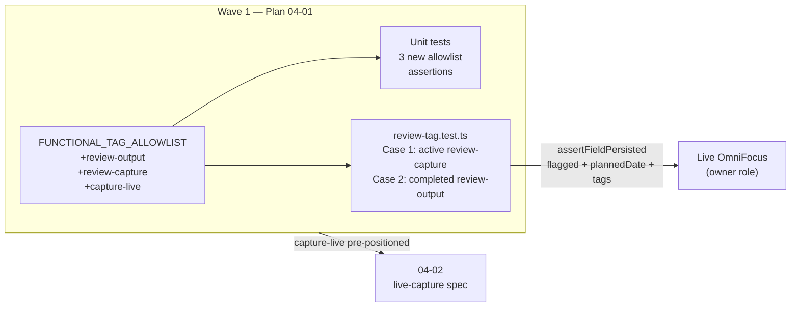

# Phase 04 Plan 01: Review Tag Allowlist + Round-Trip Spec Summary

**One-liner:** Extended `FUNCTIONAL_TAG_ALLOWLIST` with three Phase 4 tags (`review-output`, `review-capture`,
`capture-live`) and proved REVIEW-01/02 round-trips via TDD integration spec covering the active (flag+date+tag) and
completed (tag-only) review paths.

## Tasks Completed

| Task      | Name                                        | Commit     | Files                                                           |
| --------- | ------------------------------------------- | ---------- | --------------------------------------------------------------- |
| 1         | Extend FUNCTIONAL_TAG_ALLOWLIST + unit test | `3c2eb261` | `mutation-script-builder.ts`, `mutation-script-builder.test.ts` |
| 2 (RED)   | Failing integration spec stub               | `ab5abc2f` | `review-tag.test.ts`                                            |
| 2 (GREEN) | Integration spec — both cases passing       | `fba32964` | `review-tag.test.ts`                                            |

## Verification Results

| Check                                               | Result                             |
| --------------------------------------------------- | ---------------------------------- |
| `npm run build`                                     | PASS                               |
| `npm run test:unit -- mutation-script-builder`      | PASS — 2405/2405                   |
| `npm run test:integration -- review-tag`            | PASS — 2/2 cases                   |
| `grep -c "assertFieldPersisted" review-tag.test.ts` | 8                                  |
| No `clear*` OmniFocus ops in spec                   | PASS (only `clearTimeout` present) |
| `fullCleanup` zero errors                           | PASS                               |

## Deviations from Plan

### Auto-fixed Issues

**1. [Rule 1 - Bug] plannedDate epoch comparison fails across timezones**

- **Found during:** Task 2 GREEN
- **Issue:** `new Date('2026-06-15').getTime()` gives UTC midnight; OmniFocus stores `plannedDate` with local time (9am
  PDT = 4pm UTC), making the epoch values differ by hours.
- **Fix:** Changed comparison to `new Date(val).toISOString().slice(0, 10)` vs `TODAY_DATE` (YYYY-MM-DD date-string
  slice).
- **Files modified:** `tests/integration/tools/unified/review-tag.test.ts`
- **Commit:** `fba32964`

**2. [Rule 1 - Bug] Completed task lookup fails via ID filter**

- **Found during:** Task 2 GREEN
- **Issue:** `buildTaskByIdScript` uses OmniJS `flattenedTasks.forEach(...)` which only iterates active tasks —
  completed tasks are invisible to the read-by-ID path, causing "Task not found" errors.
- **Fix:** Changed Case 2 read-back to query `{ tags: { any: ['review-output'] }, status: 'completed' }` and locate by
  task name.
- **Files modified:** `tests/integration/tools/unified/review-tag.test.ts`
- **Commit:** `fba32964`

**3. [Rule 1 - Bug] Response bleed between sequential test cases**

- **Found during:** Task 2 GREEN — `extractId` received a read response (from Case 1) instead of the create response for
  Case 2
- **Issue:** `sendRequest` registered a new `onData` listener without filtering by JSON-RPC `id`, so a buffered/delayed
  response from Case 1's final read could be picked up by Case 2's create call.
- **Fix:** Added `const requestId = req.id` capture and filtered `parsed.id === requestId` before resolving/rejecting.
- **Files modified:** `tests/integration/tools/unified/review-tag.test.ts`
- **Commit:** `fba32964`

## TDD Gate Compliance

| Gate         | Commit     | Status                                              |
| ------------ | ---------- | --------------------------------------------------- |
| RED (test)   | `ab5abc2f` | PASS — failing spec committed before implementation |
| GREEN (feat) | `fba32964` | PASS — both cases pass                              |
| REFACTOR     | N/A        | Not required — code was clean after GREEN fixes     |

## Known Stubs

None — all fields (flagged, plannedDate, tags) are wired to live OmniFocus data via round-trip assertions.

## Threat Flags

None — no new network endpoints, auth paths, or schema changes beyond extending an in-memory string array.

The T-04-01 tamper threat (FUNCTIONAL_TAG_ALLOWLIST widening) was mitigated as planned: only the three explicit names
are added, `isTestTagAllowed` is unchanged, and the integration spec self-cleans via `fullCleanup` with zero-errors
assertion.

## Self-Check: PASSED

- `src/contracts/ast/mutation-script-builder.ts` — exists, contains `review-output`, `review-capture`, `capture-live`
- `tests/unit/contracts/ast/mutation-script-builder.test.ts` — exists, contains 3 new `it(...)` cases
- `tests/integration/tools/unified/review-tag.test.ts` — exists, 2/2 tests pass
- Commits verified: `3c2eb261`, `ab5abc2f`, `fba32964` all present in git log
