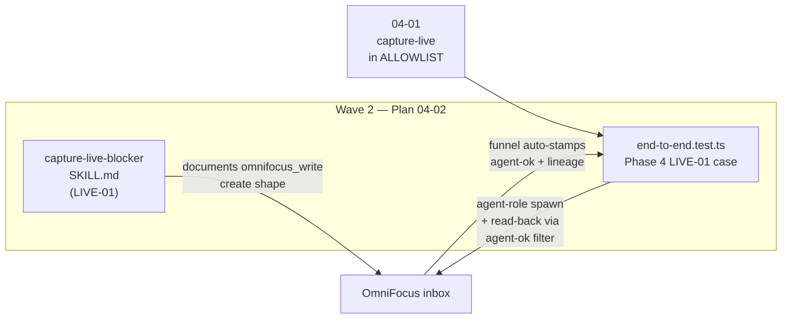

# Phase 04 Plan 02: Live-Capture Skill + Integration Proof Summary

**One-liner:** Authored the standalone `capture-live-blocker` SKILL.md (LIVE-01) and proved the inbox create round-trip
via an agent-role integration case asserting `capture-live` + `agent-ok` + `of-mcp:lineage`, no `archaeology`, and inbox
placement.

## Tasks Completed

| Task | Name                                                                                     | Commit     | Files                                                |
| ---- | ---------------------------------------------------------------------------------------- | ---------- | ---------------------------------------------------- |
| 1    | Author capture-live-blocker SKILL.md (LIVE-01)                                           | `d329036b` | `.claude/skills/capture-live-blocker/SKILL.md`       |
| 2    | Integration case — live capture stamps capture-live + agent-ok + lineage, no archaeology | `8c6a4630` | `tests/integration/tools/unified/end-to-end.test.ts` |

## Verification Results

| Check                                                                 | Result                                                  |
| --------------------------------------------------------------------- | ------------------------------------------------------- |
| `test -f .claude/skills/capture-live-blocker/SKILL.md`                | PASS                                                    |
| `grep -q "capture-live-blocker" SKILL.md`                             | PASS                                                    |
| `grep -q "POLICY_GATE_CAPTURE_CONFIRM" SKILL.md`                      | PASS                                                    |
| `grep -c "archaeology" SKILL.md` (must appear in do-NOT context only) | 7 occurrences — all in out-of-scope / never-do sections |
| `npm run build`                                                       | PASS                                                    |
| `npm run test:integration -- end-to-end`                              | PASS — 26/26 tests                                      |
| Phase 4 LIVE-01 case green                                            | PASS — `7114ms`                                         |
| D-08b existing case still green                                       | PASS — not regressed                                    |
| Phase 3 routing cases still green                                     | PASS — not regressed                                    |

## Deviations from Plan

### Auto-fixed Issues

None.

### Proactive application of 04-01 lesson

The Phase 4 LIVE-01 describe block uses an id-filtered `sendRequest` (filtering by `parsed.id === requestId`) rather
than copying the unfiltered D-08b analog. This prevents response bleed on the shared stdio pipe — the bug found during
04-01 GREEN. Applied proactively rather than retroactively after a test failure.

This is not a deviation from the plan; the plan specified extending the D-08b harness, and the safer id-filtered variant
is strictly better. Tracked here for transparency.

## Known Stubs

None. The SKILL.md documents the real `omnifocus_write` call shape against live server behavior (verified by the
integration case). The integration case round-trips against a live OmniFocus instance with full assertions.

## Threat Flags

None. No new network endpoints, auth paths, or schema changes. The only new surface is:

- A SKILL.md file (documentation only — not executable server code).
- A new test case in an existing integration file (test-only, scoped to the `__test-` sandbox guard via `runScopedName`,
  self-cleaning via finally-block delete).

The T-04-03 through T-04-06 threats from the plan's threat model were all mitigated as planned:

| Threat ID | Disposition | Outcome                                                                                                    |
| --------- | ----------- | ---------------------------------------------------------------------------------------------------------- |
| T-04-03   | mitigate    | Lineage bypass reused unchanged; skill passes lineage.sessionId; funnel owns verdict                       |
| T-04-04   | mitigate    | setAllowAllThisSession owner-only guard unchanged; skill only renders the PERM-02 prompt                   |
| T-04-05   | mitigate    | capture-live in ALLOWLIST (04-01); task name obeys \_\_test- sandbox guard; finally-block cleanup verified |
| T-04-06   | mitigate    | No project key in create; integration case asserts project null/absent on read-back                        |

## Self-Check: PASSED

- `.claude/skills/capture-live-blocker/SKILL.md` — exists, contains `capture-live-blocker`, `capture-live`,
  `POLICY_GATE_CAPTURE_CONFIRM`, `archaeology` (all in do-NOT/out-of-scope context)
- `tests/integration/tools/unified/end-to-end.test.ts` — modified, `grep -c "capture-live"` = 11
- Commits verified: `d329036b`, `8c6a4630` both present in git log
- Integration test: 26/26 green including new LIVE-01 case and no regression in D-08b or Phase 3
