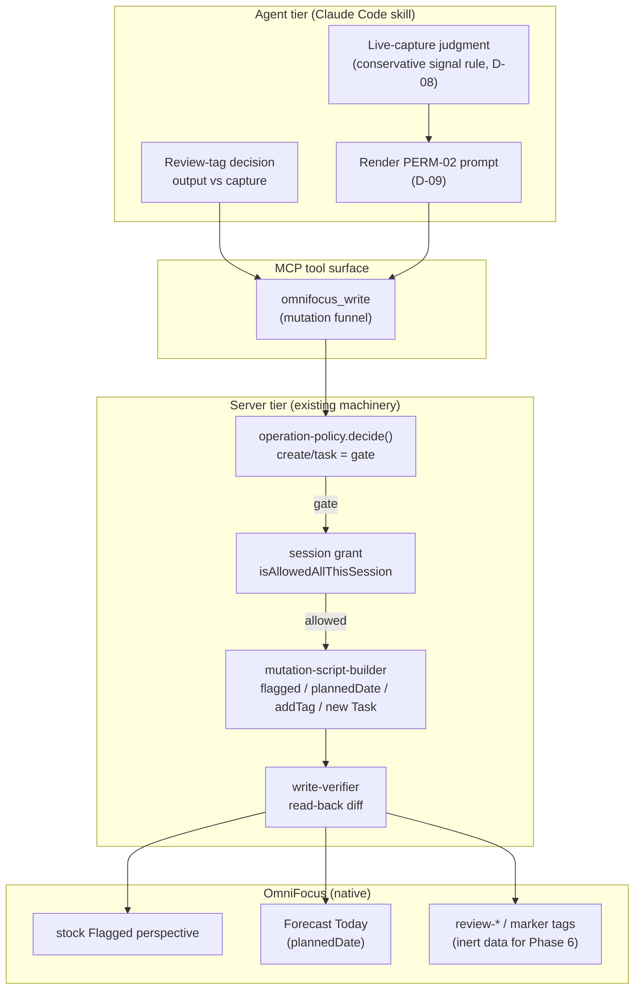

# Phase 4: Review Loops & Live Auto-Capture - Research

**Researched:** 2026-06-15 **Domain:** OmniFocus native task properties (tag/flag/plannedDate), MCP write funnel +
verifier reuse, Claude Code skill authoring **Confidence:** HIGH

<user_constraints>

## User Constraints (from CONTEXT.md)

### Locked Decisions

- **D-01:** Two flat sibling tags — `review-output` and `review-capture`. Classification carried by which tag is
  assigned. Flat siblings, not a hierarchy, not an `agent/*` rewrite.
- **D-02:** `review-*` tags sit alongside the shipped flat family (`agent-okay`, `routing-unplaced`, future
  `archaeology`), coherent by prefix. `routing-unplaced` keeps its shipped name.
- **D-03:** Tags assigned via OmniJS `addTag` find-or-create (a `Tag` object is required; a string throws — DISC-TAG-02;
  JXA assignment no-ops — DISC-TAG-01). Reuse the existing tag-add path; no new tag engine. New `review-*` names go into
  `FUNCTIONAL_TAG_ALLOWLIST`.
- **D-04:** Surface via `flagged: true` + `plannedDate` = today + the review tag. Three native task-property writes, no
  perspective machinery. Flag → stock Flagged perspective (zero setup). `plannedDate` = today → Forecast "Today" without
  a fake deadline. Review tag → inert data Phase 6 filters on.
- **D-05:** Due/defer dates rejected for agent-asserted work — agent has no authority to invent a deadline.
- **D-06:** Flag-dilution into the user's existing Flagged view accepted as the price of a zero-setup surface.
- **D-07 (hard Phase 6 boundary):** Phase 4 writes ONLY native task properties (flag, planned date, tag membership).
  NEVER enumerate `Perspective.Custom`, read/write `archivedFilterRules`, build a filter-rule interpreter, or provision
  the JessOS perspective. All surfacing rides built-in Flagged/Forecast.
- **D-08:** Live-capture trigger = named-signal rule, conservative. Captures only on an explicit blocker / follow-up /
  "TODO later" / unresolvable-open-question signal, as a tight enumerated judgment rule in the skill prompt. Rare,
  trusted, single-item.
- **D-09:** Permission reuses PERM-02 verbatim — prompt-before-create + owner-set "allow all this session" grant. Funnel
  owns the verdict; agent renders the prompt. No second mechanism.
- **D-10:** Placement = inbox + `agent-okay` + a live-capture marker tag + LINE-01 lineage stamp; route later. NO
  `archaeology` tag.
- **D-11:** Capture reuses Phase 2's native OmniJS `new Task(name, inbox)` path, the server-side lineage stamp, and the
  funnel/verifier — no new capture mechanism.

### Claude's Discretion

- **Live-capture marker tag name** (D-10) — pick during planning against the `review-*` / `routing-*` family; add to
  `FUNCTIONAL_TAG_ALLOWLIST`.
- **Review-flag lifecycle** — when/how a review flag clears so the today view does not accumulate; bias toward native
  behavior over a custom clearing mechanism.
- **Whether "completed work" (REVIEW-01) is flagged the same as created work** — a completed task may not want a future
  `plannedDate`; keep surfacing native and reversible.
- **Exact judgment-rule wording** for the named-signal trigger (D-08) — conservative.
- **Whether live capture is its own skill or folded into an existing skill** — against the established skill pattern
  (`sync-work-tasks-to-omnifocus`, `route-inbox-to-projects`).

### Deferred Ideas (OUT OF SCOPE)

- Review-flag lifecycle as a custom clearing mechanism (bias native).
- Hierarchical `agent/*` tag namespace.
- Phase 6 — JessOS custom perspective (PROV-01 / READAS-01).
- Phase 5 — session archaeology (ARCH-\*). Live capture stays distinct: no `archaeology` tag. </user_constraints>

<phase_requirements>

## Phase Requirements

| ID        | Description                                                                                                                                        | Research Support                                                                                                                                                                                                            |
| --------- | -------------------------------------------------------------------------------------------------------------------------------------------------- | --------------------------------------------------------------------------------------------------------------------------------------------------------------------------------------------------------------------------- |
| REVIEW-01 | Agent flags created/completed work with a review tag so it surfaces in the user's today view.                                                      | Reuse existing create/update path: `flagged`, `plannedDate` setters (mutation-script-builder), `addTag` find-or-create. Native Flagged + Forecast surfaces (D-04). Completed-work surfacing resolved below (Discretion #2). |
| REVIEW-02 | Review flags distinguish review-output (agent did) from review-capture (agent decided should exist).                                               | Distinction carried entirely by tag name: `review-output` vs `review-capture` (D-01). No structural difference in the write — only the tag string differs.                                                                  |
| LIVE-01   | During a live session, agent captures a concrete blocker/open question as an OmniFocus task in real time (with permission), without `archaeology`. | Reuse Phase 2 capture path + lineage + PERM-02 gate (D-09/D-11). New live-capture marker tag + `agent-okay` for later routing (D-10). Conservative judgment rule in a skill prompt (D-08).                                  |

</phase_requirements>

## Summary

Phase 4 is almost entirely an assembly job over machinery that already shipped in Phases 2 and 3. There is **zero new
server-side capability** required: every write Phase 4 needs — set `flagged`, set `plannedDate`, find-or-create +
`addTag`, create an inbox task with a lineage stamp, dispatch through the funnel, confirm with the verifier — is already
implemented and integration-tested. The work is (1) registering three new tag names in `FUNCTIONAL_TAG_ALLOWLIST`, and
(2) authoring one or more Claude Code skills that drive the existing `omnifocus_read` / `omnifocus_write` tools,
mirroring the `route-inbox-to-projects` SKILL.md pattern exactly.

The three discretion items resolve cleanly in favor of native behavior. **Review-flag lifecycle:** completing a task
natively removes it from the stock Flagged and Forecast (active-only) perspectives — no custom clearing mechanism is
needed; the today view self-cleans on completion, and a user can manually unflag for items they review but don't
complete. **Completed-work surfacing (REVIEW-01):** a completed task should get the `review-output` tag (and may keep
`flagged`/`plannedDate` for audit), but it will not appear in active Forecast/Flagged because completion removes it — so
for completed work the tag is the durable signal and the flag/plannedDate is optional and inert. The cleanest
interpretation: agent **completed** work gets `review-output` tag only (it already left the active view); agent
**created/asserted** work gets the full `flagged` + `plannedDate=today` + `review-capture` treatment because it is
active and needs to surface today. **Live-capture skill structure:** make it its own skill (`capture-live-blocker` or
similar), because its trigger model (passive, in-the-moment, single-item, conservative judgment rule) is fundamentally
different from the batch summarize-then-approve loops, and folding it in would dilute both skills' trigger descriptions.

**Primary recommendation:** Plan two slices — (1) a tiny server slice adding `review-output`, `review-capture`, and the
live-capture marker tag to `FUNCTIONAL_TAG_ALLOWLIST` plus integration tests proving each round-trips live; (2) a skills
slice authoring the review-tagging guidance and a standalone live-capture skill, both mirroring
`route-inbox-to-projects/SKILL.md`. No new compilers, schemas, or policy rules.

## Architectural Responsibility Map

| Capability                                       | Primary Tier                                  | Secondary Tier         | Rationale                                                                                         |
| ------------------------------------------------ | --------------------------------------------- | ---------------------- | ------------------------------------------------------------------------------------------------- |
| Review-tag classification (output vs capture)    | Agent (skill prompt)                          | Server (tag write)     | Which tag to apply is a judgment the agent makes; the server only persists the chosen tag string. |
| Today-view surfacing (flag + plannedDate + tag)  | Server (existing setters + funnel + verifier) | —                      | Native task-property writes; already implemented. No new tier.                                    |
| Live-capture trigger / judgment                  | Agent (skill prompt, D-08)                    | —                      | The "is this a concrete blocker" decision is LLM judgment; the server stays plumbing.             |
| Live-capture permission gate                     | Server (funnel, PERM-02 verdict)              | Agent (renders prompt) | D-09: funnel owns the verdict, agent renders. Reused verbatim.                                    |
| Live-capture write (inbox task + lineage + tags) | Server (Phase 2 create path)                  | —                      | Reuses `new Task(name, inbox)` + lineage stamp + funnel/verifier (D-11).                          |
| Tag allowlist registration                       | Server (`FUNCTIONAL_TAG_ALLOWLIST`)           | —                      | Test-mode guard exemption for functional tags the product legitimately applies.                   |
| Today-view filtering / dedicated perspective     | **OUT OF SCOPE — Phase 6**                    | —                      | D-07 hard boundary. Phase 4 produces native data; Phase 6 builds the view.                        |

## Standard Stack

No new packages. Phase 4 uses only the existing codebase and the OmniFocus native API surface already mapped in Phase 1.

| Component                               | Location                                                                                                                                                            | Purpose                                                         | Phase 4 use                                            |
| --------------------------------------- | ------------------------------------------------------------------------------------------------------------------------------------------------------------------- | --------------------------------------------------------------- | ------------------------------------------------------ |
| `flagged` / `plannedDate` setters       | `src/contracts/ast/mutation-script-builder.ts` (create + update task paths)                                                                                         | Set native surfacing properties                                 | D-04: `flagged=true`, `plannedDate=today`              |
| `addTag` find-or-create                 | `src/contracts/ast/mutation-script-builder.ts` (update-task tag block + create-task tag loop)                                                                       | Assign a Tag object, creating it if missing                     | D-03: apply `review-*` and live-capture marker tags    |
| `FUNCTIONAL_TAG_ALLOWLIST`              | `src/contracts/ast/mutation-script-builder.ts`                                                                                                                      | Exempt product-applied tags from the test-mode tag-prefix guard | Add `review-output`, `review-capture`, `<live-marker>` |
| Native inbox capture                    | `new Task(spec.name)` (inbox default)                                                                                                                               | Phase 2 capture path                                            | D-11: live capture                                     |
| Lineage stamp                           | `composeLineageStamp()` (wired in `OmniFocusWriteTool.ts`)                                                                                                          | Append `of-mcp:lineage` JSON block to note                      | D-10/D-11: stamp live captures                         |
| Permission gate + grant                 | `src/auth/operation-policy.ts` (`decide` → `create/task = gate`), `src/auth/session-state.ts` (`isAllowedAllThisSession` / `setAllowAllThisSession`), `parseMode()` | PERM-02 verdict + allow-all-session bypass                      | D-09: reused verbatim                                  |
| Single mutation funnel + write-verifier | `src/tools/unified/OmniFocusWriteTool.ts`, `src/tools/unified/verifier/`                                                                                            | Dispatch + independent read-back confirmation                   | All Phase 4 writes                                     |

**No installation step.** This phase adds no dependencies.

## Package Legitimacy Audit

Not applicable — Phase 4 installs no external packages. All work is internal code edits plus skill-prompt authoring
(Markdown). No `npm install`, no registry interaction.

## Architecture Patterns

### System Architecture Diagram



### Pattern 1: Apply a review tag + surfacing properties to an existing task (REVIEW-01/02)

**What:** Update an agent-touched task to flag it, set today's plannedDate, and add the classification tag. **When to
use:** Agent **created/asserted** work that should appear in today's view (review-capture). The skill drives this via
`omnifocus_write` update. **Tool call shape** (mirrors the route skill's update+addTags reference):

```jsonc
// review-capture: agent asserted this task should exist — surface it today
{
  "mutation": {
    "operation": "update",
    "target": "task",
    "id": "<id>",
    "changes": {
      "flagged": true,
      "plannedDate": "2026-06-15", // today, date-only; D-04
      "addTags": ["review-capture"], // or "review-output"
    },
  },
}
```

The update path applies `task.flagged = true`, `task.plannedDate = new Date(...)`, and `addTag(resolveTag(name, true))`
(find-or-create) in one OmniJS mutation. Source: `mutation-script-builder.ts` update-task block (`changes.flagged`,
`changes.plannedDate`, `changes.addTags` → `resolveTag(tagName, true)` → `task.addTag(tag)`).

### Pattern 2: Tag completed agent work (REVIEW-01, completed branch)

**What:** Tag a completed task with `review-output`. Do NOT rely on flag/plannedDate to surface it. **Why:** Completion
natively removes the task from the active Flagged and Forecast perspectives (see Pitfall 1). The tag is the durable
record; a future Phase 6 perspective can include completed `review-output` items if desired.

```jsonc
{
  "mutation": {
    "operation": "update",
    "target": "task",
    "id": "<id>",
    "changes": { "addTags": ["review-output"] },
  },
}
```

Setting `flagged`/`plannedDate` on a completed task is harmless (it persists on the object) but does not surface it in
stock active views — so for completed work it is optional. Bias: apply tag only, keep it clean.

### Pattern 3: Live capture an inbox blocker (LIVE-01)

**What:** Create an inbox task in real time, stamped with lineage + `agent-okay` + the live-capture marker tag, gated by
PERM-02. **Tool call shape:**

```jsonc
{
  "mutation": {
    "operation": "create",
    "target": "task",
    "data": {
      "name": "<concise blocker statement>",
      "note": "<context>",
      "tags": ["<live-capture-marker>"], // agent-okay is auto-stamped when role=agent + lineage present
      "lineage": { "sessionId": "<cc-session-uuid>" },
    },
  },
}
```

Notes:

- No `project` → defaults to inbox (DISC-CAPTURE-01).
- No `dueDate`/`deferDate` — a captured blocker is undated (consistent with D-05's "don't invent dates").
- **Do NOT add `archaeology`** (D-10). Do NOT add `review-*` — live capture is "decided should exist," it routes later,
  and the routing/review surfacing happens on a subsequent run.
- The lineage param triggers two server behaviors automatically (see `OmniFocusWriteTool.ts` lineage block): note gets
  the `of-mcp:lineage` stamp, AND when `role=agent` the funnel appends `agent-okay` to `data.tags`. So the skill does
  **not** need to pass `agent-okay` itself — but passing it is idempotent and matches the route-skill convention.
  Confirm during planning whether to pass it explicitly for clarity.

### Anti-Patterns to Avoid

- **Building a today-view filter/perspective.** D-07 hard boundary — Phase 4 sets native properties only. Surfacing
  rides stock Flagged + Forecast.
- **Applying tags via JXA `task.addTags()`.** Silently no-ops (DISC-TAG-01). Always go through `omnifocus_write` (OmniJS
  `addTag` inside the funnel).
- **Inventing a due date to force "today."** D-05 — use `plannedDate` only.
- **A custom flag-clearing daemon.** Completion clears the view natively (Pitfall 1). Don't build a sweeper.
- **A second permission mechanism for live capture.** D-09 — reuse PERM-02's funnel verdict + session grant verbatim.
- **Adding `archaeology` to a live capture.** D-08/D-10 — live capture stays distinct from Phase 5.

## Don't Hand-Roll

| Problem                                   | Don't Build                                 | Use Instead                                                   | Why                                                                                          |
| ----------------------------------------- | ------------------------------------------- | ------------------------------------------------------------- | -------------------------------------------------------------------------------------------- | --- | ----------------------------------------------------------- |
| Find-or-create a tag before assigning     | A bespoke tag-lookup loop in the skill      | `addTags` in `omnifocus_write` update/create                  | The OmniJS path already does `flattenedTags.find(...)                                        |     | new Tag(name, null)`then`addTag` (mutation-script-builder). |
| Surface a task "today" without a deadline | A due-date hack or a custom perspective     | `plannedDate = today` (native, OF 4.7+)                       | Purpose-built non-committal "work on this today" signal; lands on Forecast Today.            |
| Clear stale review flags                  | A nightly sweep that unflags reviewed items | Native completion (removes from active views) + manual unflag | Completion self-cleans Flagged/Forecast; no mechanism needed.                                |
| Permission prompt + allow-all-session     | A new prompt/grant for live capture         | PERM-02 `gate` verdict + `isAllowedAllThisSession()`          | Already owner-only, forge-resistant, integration-tested.                                     |
| Confirm the write landed                  | An in-skill read-back assertion             | The write-verifier (fires automatically)                      | Independent post-mutation read-back diff already gates every agent write through the funnel. |

**Key insight:** Phase 4's only genuinely new artifacts are three tag-name strings and skill prose. Everything else is
reuse — this is the most reuse-heavy phase in the milestone.

## Runtime State Inventory

> Phase 4 is additive (new tags + new skill), not a rename/refactor. This inventory confirms no migration is hiding.

| Category            | Items Found                                                                                                     | Action Required                             |
| ------------------- | --------------------------------------------------------------------------------------------------------------- | ------------------------------------------- |
| Stored data         | None — new tags are created on first `addTag`; no existing records carry `review-*`.                            | None.                                       |
| Live service config | None — surfacing rides stock OmniFocus perspectives; nothing registered in a UI/DB.                             | None (Phase 6 owns the custom perspective). |
| OS-registered state | None — no scheduler/launchd change in this phase (TRIG-02 deferred).                                            | None.                                       |
| Secrets/env vars    | Reuses `OMNIFOCUS_MCP_INTERACTIVE` (mode) and the owner role seam — no new env var.                             | None.                                       |
| Build artifacts     | `FUNCTIONAL_TAG_ALLOWLIST` is a source constant; changing it requires `npm run build` before integration tests. | Rebuild before running integration tests.   |

## Common Pitfalls

### Pitfall 1: Expecting completed tasks to stay in the today view

**What goes wrong:** The plan assumes a completed agent task with `flagged=true` + `plannedDate=today` still shows in
Flagged/Forecast. **Why it happens:** OmniFocus's stock Flagged and Forecast perspectives are active-only — completing a
task removes it from both. The `flagged`/`plannedDate` fields persist on the completed object, but the view filters out
completed items by default. **How to avoid:** For completed work, treat the `review-output` tag as the durable signal,
not the flag/plannedDate. Don't expect the active today view to show completed items. Source: Omni Group forums
(Forecast/Flagged are active-only); confirms the "completed work" discretion resolution. [CITED:
discourse.omnigroup.com]

### Pitfall 2: `clearPlannedDate` / `clear*` two-phase round-trip flake (OMN-55 class)

**What goes wrong:** An integration test that sets a date then clears it and reads null intermittently races the
clear-write vs the verify-null read against live OmniFocus. **Why it happens:** Live OmniFocus eventual consistency
between the clear write and the independent read-back. Documented in STATE.md Deferred Items
(`clearPlannedDate`/`clearEstimatedMinutes`, OMN-55 class; passes on re-run). **How to avoid:** Phase 4 does **not need
to clear plannedDate** (lifecycle relies on native completion, not programmatic clear). Avoid building a
clear-on-next-run sweeper that would lean on the flaky `clearPlannedDate` path. If any Phase 4 test exercises clear,
mark it as a known re-run flake, not a regression. Source: `tests/integration/tools/unified/field-roundtrip.test.ts`
(clearPlannedDate row), STATE.md Deferred Items.

### Pitfall 3: Forgetting the dual-schema sync for any new write field

**What goes wrong:** Adding a field to a Zod schema without updating the hand-crafted `inputSchema` override (CLAUDE.md
rule). `BaseTool.inputSchema` throws if a subclass forgets to override. **Why it happens:** Two schemas must stay in
sync per tool. **How to avoid:** Phase 4 should **not need any new write field** — `flagged`, `plannedDate`, `addTags`,
`tags`, `note`, and `lineage` all already exist in the write schema. If planning discovers a gap, both schemas plus the
description string must change together. Confirm no schema change is needed before planning a schema task.

### Pitfall 4: New tag blocked by the test-mode sandbox guard

**What goes wrong:** An integration test creating a `review-output` tag fails the `__test-`-prefix guard. **Why it
happens:** `validateTagMutation` / `isTestTagAllowed` reject non-`__test-` tags in sandbox mode unless they are in
`FUNCTIONAL_TAG_ALLOWLIST`. **How to avoid:** Add `review-output`, `review-capture`, and the chosen live-capture marker
to `FUNCTIONAL_TAG_ALLOWLIST` (exactly as `routing-unplaced` was added in Phase 3 03-01). Source:
`mutation-script-builder.ts` (`FUNCTIONAL_TAG_ALLOWLIST`, `isTestTagAllowed`).

### Pitfall 5: Script-size limit from combining tag + flag + date in one mutation

**What goes wrong (hypothetical):** A single create/update with note + lineage + tags + flag + plannedDate exceeds a
script size limit. **Assessment:** **No risk.** The existing create and update OmniJS bodies already set note, dates,
flagged, estimatedMinutes, project move, AND iterate tags in one script (mutation-script-builder). Phase 4 adds at most
one more tag name and two scalar property sets — a few hundred bytes against a 261KB OmniJS / 523KB JXA limit. Combining
tag + flag + date in one update is the existing, tested shape. [VERIFIED: mutation-script-builder update-task block sets
all these in one script]

## Code Examples

Verified patterns from the codebase.

### Find-or-create tag assignment (the D-03 path)

```javascript
// Source: src/contracts/ast/mutation-script-builder.ts (update-task tag block)
function resolveTag(tagName, create) {
  var pathSegs = parseTagPath(tagName);
  if (pathSegs) {
    return create ? resolveOrCreateTagByPath(pathSegs) : resolveTagByPath(pathSegs);
  }
  var found = flattenedTags.find((t) => t.name === tagName);
  if (!found && create) found = new Tag(tagName, null); // find-or-create
  return found;
}
if (changes.addTags) {
  for (const tagName of changes.addTags) {
    var tag = resolveTag(tagName, true);
    if (tag) task.addTag(tag); // OmniJS addTag (DISC-TAG-01/02)
  }
}
```

### Flagged + plannedDate setters (the D-04 path)

```javascript
// Source: src/contracts/ast/mutation-script-builder.ts (update-task)
if (changes.flagged !== undefined) task.flagged = changes.flagged;
if (changes.plannedDate !== undefined) {
  task.plannedDate = changes.plannedDate ? new Date(changes.plannedDate) : null;
}
```

### Lineage + agent-okay auto-stamp on agent create (the D-10/D-11 path)

```typescript
// Source: src/tools/unified/OmniFocusWriteTool.ts (lineage block)
if (compiled.operation === 'create' && compiled.target === 'task' && args.mutation.operation === 'create') {
  const lineage = (args.mutation.data as { lineage?: LineageInput }).lineage;
  if (lineage) {
    compiled.data.note = composeLineageStamp(compiled.data.note, lineage);
    if (parseRole() === 'agent') {
      compiled.data.tags = [...(compiled.data.tags ?? []), 'agent-okay']; // auto-stamp
    }
  }
}
```

### PERM-02 gate + session-grant bypass (the D-09 path)

```typescript
// Source: src/tools/unified/OmniFocusWriteTool.ts (gate handling)
if (outcome === 'gate') {
  if (isAllowedAllThisSession()) {
    continue;
  } // owner allow-all-session bypass (D-02)
  // ... lineage-attestation bypass for inbox capture ...
  const mode = parseMode(); // 'interactive' | 'background'
  if (item.operation === 'create' && mode === 'interactive') {
    return /* POLICY_GATE_CAPTURE_CONFIRM — agent renders the yes/no prompt */;
  }
}
```

A **live** session sets `OMNIFOCUS_MCP_INTERACTIVE=true` → `parseMode()` returns `interactive` → the gate returns
`POLICY_GATE_CAPTURE_CONFIRM`, which the skill surfaces conversationally. The owner-set
`setAllowAllThisSession('owner')` grant skips the prompt for the rest of the session. **No new code needed for D-09.**

## State of the Art

| Old Approach                         | Current Approach                                                                    | Source                                                               |
| ------------------------------------ | ----------------------------------------------------------------------------------- | -------------------------------------------------------------------- |
| Force "today" with a due date        | `plannedDate` (OF 4.7+, available 4.8.11) — non-committal scheduled-for-work signal | omni-automation.com/omnifocus/task.html; capabilities §Custom Fields |
| Manage tags via JXA `task.addTags()` | OmniJS `addTag(TagObject)` find-or-create (JXA no-ops)                              | DISC-TAG-01/02 (capabilities §Tagging)                               |
| In-script read to confirm a write    | Independent post-mutation read-back (write-verifier)                                | hardening Phase 5; verifier/                                         |

**Deprecated/outdated for this phase:** none — the native API and codebase machinery are current as of OF 4.8.11.

## Discretion Resolutions (the planner's decisions)

### Discretion #1 — Review-flag lifecycle / clearing

**Recommendation: rely on native behavior; build no clearing mechanism.**

- Completing a task removes it from the stock Flagged and Forecast (active-only) perspectives (Pitfall 1). So agent work
  the user **completes** disappears from the today view automatically.
- For agent-asserted items the user reviews but doesn't complete, the user **manually unflags** (the durable, zero-code
  path), or completes/defers them through their normal GTD flow.
- Do NOT build a "clear on next agent run" sweeper — it would lean on the OMN-55-flaky `clearPlannedDate` path
  (Pitfall 2) and re-introduce a custom mechanism the user explicitly biased against.
- **Confidence: HIGH** (native semantics confirmed; codebase has the clear\* path but it is flaky and unnecessary here).

### Discretion #2 — Is completed work flagged the same as created work?

**Recommendation: differentiate.**

- **Agent-created / asserted (active) work → `review-capture` tag + `flagged=true` + `plannedDate=today`.** It is active
  and must surface today.
- **Agent-completed work → `review-output` tag only.** It already left the active view via completion (Pitfall 1);
  flag/plannedDate would be inert in stock perspectives. The tag is the durable, native, reversible signal that Phase
  6's perspective can filter on (including completed items if the perspective opts in).
- This also maps the REVIEW-02 vocabulary cleanly: `review-output` = "verify work the agent did" (typically completed),
  `review-capture` = "verify a task the agent decided should exist" (typically active, needs surfacing).
- **Confidence: HIGH** (follows directly from native completion semantics + the locked tag vocabulary).

### Discretion #3 — Live-capture skill: standalone or folded?

**Recommendation: a standalone skill** (e.g. `capture-live-blocker`).

- The two existing skills (`route-inbox-to-projects`, `sync-work-tasks-to-omnifocus`) are **batch, user-invoked,
  summarize-then-approve** loops. Live capture is **passive, in-the-moment, single-item, conservative-judgment** (D-08).
  Folding it into a batch skill would muddy that skill's trigger `description` and its procedure.
- The skill `description` frontmatter is the dispatch signal in Claude Code. A live-capture skill needs a description
  keyed on the agent _noticing_ a blocker mid-session, which is a different activation surface from "Jess says 'route my
  inbox'."
- Follow the `route-inbox-to-projects/SKILL.md` structure: `name` + `description` frontmatter, an Overview citing the
  decisions, a conservative judgment rule (the enumerated "what counts as a concrete blocker"), the PERM-02 prompt
  rendering, a Tool call reference table, an Out-of-scope section (no `archaeology`, no routing — routes later), and a
  Common mistakes table.
- **Confidence: HIGH** (the established skill pattern is explicit and the trigger models genuinely differ).

### Discretion #4 — Live-capture marker tag name

**Recommendation: `capture-live`** (or `review-live` if the planner prefers the `review-*` prefix). Pick one, keep it
collision-free with `agent-okay`/`routing-unplaced`/`review-output`/`review-capture`/future `archaeology`, and add it to
`FUNCTIONAL_TAG_ALLOWLIST`. `capture-live` reads as a sibling to the functional family and signals provenance ("captured
live") distinct from `archaeology` (retrospective) and `routing-unplaced` (routing outcome).

- **Confidence: MEDIUM** (naming is genuinely the planner's call; both candidates satisfy the namespace-coherence
  constraint D-02/D-10).

## Skill-Authoring Conventions (for the live-capture skill)

From `route-inbox-to-projects/SKILL.md` and `sync-work-tasks-to-omnifocus/SKILL.md`:

| Convention            | Detail                                                                                                                                                                                   |
| --------------------- | ---------------------------------------------------------------------------------------------------------------------------------------------------------------------------------------- |
| Frontmatter           | `name:` (kebab-case, matches dir) + `description:` (starts "Use when Jess…", enumerates trigger phrases).                                                                                |
| Overview              | One paragraph citing the locked decisions (D-08/D-09/D-10/D-11) and the "OmniFocus is canonical" stance; state it adds no server code, drives `omnifocus_write`.                         |
| Tool shapes           | `omnifocus_write` takes `{mutation:{…}}`; create puts fields in `data` (no `id`); pass `lineage:{sessionId}`.                                                                            |
| Permission rendering  | On a `POLICY_GATE_CAPTURE_CONFIRM` response, present the proposed task to the user (yes/no), honoring an existing allow-all-session grant. Mirror the Jira-creation conversational flow. |
| Idempotency           | Live capture is single-item and in-the-moment; note that re-noticing the same blocker should not double-create (the agent's judgment, not a server dedup).                               |
| Latency note          | OmniFocus calls can take 10+ seconds; do not retry on slowness.                                                                                                                          |
| Out of scope          | No `archaeology` tag (Phase 5), no routing (Phase 3 routes it later), no review surfacing (a captured blocker is not yet review work).                                                   |
| Common mistakes table | JXA tag no-op; adding `archaeology`; inventing a date; skipping the permission prompt.                                                                                                   |

## Validation Architecture

> nyquist_validation is enabled (no `workflow.nyquist_validation:false` in config). Section included.

### Test Framework

| Property           | Value                                                                                                                                                                       |
| ------------------ | --------------------------------------------------------------------------------------------------------------------------------------------------------------------------- |
| Framework          | Vitest                                                                                                                                                                      |
| Config             | `vitest.config.ts` (unit) + integration project; integration excluded from `test:unit`                                                                                      |
| Quick run command  | `npm run test:unit`                                                                                                                                                         |
| Full suite command | `npm run test:integration` (use **npm, not bun** — bare `npx vitest run` trips the sandbox guard, ~96 phantom failures; see project memory `post-merge-gate-use-test-unit`) |

### Phase Requirements → Test Map

| Req ID                | Behavior                                                                                          | Test Type   | Automated Command                                                                  | File Exists?                      |
| --------------------- | ------------------------------------------------------------------------------------------------- | ----------- | ---------------------------------------------------------------------------------- | --------------------------------- |
| REVIEW-02             | `review-output` and `review-capture` are accepted functional tags (allowlist)                     | unit        | `npm run test:unit -- mutation-script-builder`                                     | ❌ Wave 0 (extend allowlist test) |
| REVIEW-01             | update task with `flagged+plannedDate+addTags:[review-capture]` round-trips live                  | integration | `npm run test:integration -- field-roundtrip` (or a new review-tag spec)           | ❌ Wave 0                         |
| REVIEW-01 (completed) | completed task accepts `addTags:[review-output]` and the tag reads back                           | integration | new spec under `tests/integration/tools/unified/`                                  | ❌ Wave 0                         |
| LIVE-01               | inbox create with lineage + live-marker tag stamps `agent-okay`, NO `archaeology`, lands in inbox | integration | extend the existing agent-capture integration harness (`create-with-lineage` test) | ❌ Wave 0 (extend)                |
| LIVE-01 (gate)        | interactive-mode agent create returns `POLICY_GATE_CAPTURE_CONFIRM`; session grant bypasses       | unit        | existing policy/gate tests — add live-marker case                                  | ✅ (pattern exists, extend)       |

### Sampling Rate

- **Per task commit:** `npm run test:unit`
- **Per wave merge:** `npm run test:integration` (allowlist + round-trip rows green; tolerate OMN-55 clear* re-run flake
  — but Phase 4 should not add clear* dependencies)
- **Phase gate:** Full suite green before `/gsd-verify-work`

### Wave 0 Gaps

- [ ] Extend `FUNCTIONAL_TAG_ALLOWLIST` unit test to assert `review-output`, `review-capture`, `<live-marker>` are
      allowed.
- [ ] Integration spec: review-capture update (flag + plannedDate + tag) round-trips on an active task.
- [ ] Integration spec: review-output tag on a completed task reads back.
- [ ] Integration spec: live capture (inbox + lineage + live-marker), assert `agent-okay` present, `archaeology` absent,
      item in inbox.
- [ ] (No new conftest/fixtures needed — reuse `sandbox-manager`, `run-id`, `assert-field-persisted` helpers.)

## Security Domain

> `security_enforcement` is in effect via the hardening role/policy model. Phase 4 adds no new attack surface — it
> reuses the funnel, policy, and grant verbatim.

### Applicable ASVS Categories

| ASVS Category       | Applies | Standard Control                                                                                  |
| ------------------- | ------- | ------------------------------------------------------------------------------------------------- |
| V4 Access Control   | yes     | `operation-policy.decide()` — agent create = `gate`; owner = allow. Reused unchanged.             |
| V5 Input Validation | yes     | Zod write schema (existing) validates `flagged`/`plannedDate`/`tags`/`lineage`. No new field.     |
| V6 Cryptography     | no      | Phase 4 handles no secrets/crypto.                                                                |
| V2/V3 Auth/Session  | partial | Session grant (`setAllowAllThisSession`) is owner-only, forge-resistant (D-02). Reused unchanged. |

### Known Threat Patterns

| Pattern                                               | STRIDE                 | Standard Mitigation                                                                                                               |
| ----------------------------------------------------- | ---------------------- | --------------------------------------------------------------------------------------------------------------------------------- |
| Agent self-grants allow-all-session                   | Elevation of Privilege | `setAllowAllThisSession` throws if role≠owner (session-state.ts). Reused.                                                         |
| Agent forges a live capture to bypass the gate        | Spoofing               | Lineage-attestation bypass is scoped to recoverable inbox create only; destructive ops untouched (OmniFocusWriteTool gate block). |
| New functional tag widens the test-mode write surface | Tampering              | Tag is added to `FUNCTIONAL_TAG_ALLOWLIST` explicitly; task name/folder still obey sandbox guards; tests clean up.                |

## Assumptions Log

| #   | Claim                                                                                          | Section                     | Risk if Wrong                                                                                                                                                                                        |
| --- | ---------------------------------------------------------------------------------------------- | --------------------------- | ---------------------------------------------------------------------------------------------------------------------------------------------------------------------------------------------------- |
| A1  | Completing a task removes it from stock active Flagged AND Forecast perspectives in OF 4.8.11. | Pitfall 1, Discretion #1/#2 | Low — corroborated by Omni forums; if wrong, completed items would linger in today view and Discretion #2 would flip to "tag only is insufficient." Verify by eyeball on the host during UAT.        |
| A2  | Recommended live-marker name `capture-live`.                                                   | Discretion #4               | None — explicitly the planner's call; any collision-free name works.                                                                                                                                 |
| A3  | No new write-tool field is required (all needed fields exist in the schema).                   | Pitfall 3                   | Low — verified by grep of write-schema for `plannedDate`/`flagged`/`tags`/`lineage`; if a projection gap surfaces (e.g. plannedDate read-back), it is a small read-layer add, not a new write field. |

## Open Questions

1. **Should the live-capture skill pass `agent-okay` explicitly, or rely on the funnel's lineage-triggered auto-stamp?**
   - What we know: the funnel auto-appends `agent-okay` when `role=agent` AND `lineage` is present (OmniFocusWriteTool
     lineage block). The route skill passes functional tags explicitly.
   - What's unclear: whether being explicit (clarity) or implicit (DRY) reads better in the skill.
   - Recommendation: pass the live-marker tag explicitly in `data.tags`; let the funnel auto-stamp `agent-okay`.
     Document both in the skill's Tool call reference.

2. **Does the `omnifocus_read` task projection return `plannedDate` for the round-trip verification?**
   - What we know: `field-roundtrip.test.ts` already reads `plannedDate` back (it's a clearRow), so the projection
     includes it.
   - What's unclear: nothing material — confirmed present.
   - Recommendation: reuse the existing round-trip harness extractors; no read-layer change needed.

## Sources

### Primary (HIGH confidence)

- `src/contracts/ast/mutation-script-builder.ts` — `FUNCTIONAL_TAG_ALLOWLIST`, `isTestTagAllowed`, create/update task
  setters (flagged, plannedDate, addTag find-or-create), complete path, clear\* handling.
- `src/tools/unified/OmniFocusWriteTool.ts` — funnel, gate handling, lineage stamp + agent-okay auto-stamp,
  session-grant bypass.
- `src/auth/operation-policy.ts` — `decide()`, `create/task = gate`.
- `src/auth/session-state.ts` — owner-only `setAllowAllThisSession` / `isAllowedAllThisSession`.
- `src/auth/role-resolver.ts` — `parseMode()` (`OMNIFOCUS_MCP_INTERACTIVE === 'true'`).
- `src/tools/unified/verifier/field-comparator.ts` — date comparator (±60s tolerance), plannedDate in DATE_FIELDS.
- `.claude/skills/route-inbox-to-projects/SKILL.md`, `~/.claude/skills/sync-work-tasks-to-omnifocus/SKILL.md` — skill
  pattern.
- `docs/reference/omnifocus-capabilities.md` — DISC-TAG-01/02/03, DISC-CAPTURE-01, plannedDate v4.7+ native, flagged
  native.
- `tests/integration/tools/unified/field-roundtrip.test.ts` — clearPlannedDate row (OMN-55 flake context), round-trip
  harness.
- `src/omnifocus/api/OmniFocus-4.8.6-d.ts` — `plannedDate: Date | null` (native API surface).
- `.planning/STATE.md` Deferred Items — OMN-55 clear\* flake, http_role_gap, read_path_gap.

### Secondary (MEDIUM confidence)

- omni-automation.com/omnifocus/task.html — `plannedDate` / `effectivePlannedDate` / `effectiveFlagged` semantics (cited
  in capabilities doc).
- Omni Group user forums — Forecast/Flagged are active-only; completed tasks leave these views. [CITED:
  discourse.omnigroup.com]

## Metadata

**Confidence breakdown:**

- Standard stack (reuse): HIGH — every needed setter/path located in source and already integration-tested.
- Discretion resolutions: HIGH — all three follow from native completion semantics + locked tag vocabulary, with native
  bias the user asked for.
- Live-capture skill conventions: HIGH — explicit template in `route-inbox-to-projects/SKILL.md`.
- Native completion-clears-view behavior: MEDIUM-HIGH — confirmed by forums + capabilities doc; flag for a host eyeball
  at UAT (A1).

**Research date:** 2026-06-15 **Valid until:** ~2026-07-15 (stable — internal codebase + OF 4.8.x native API; re-verify
only on an OmniFocus major version bump).
