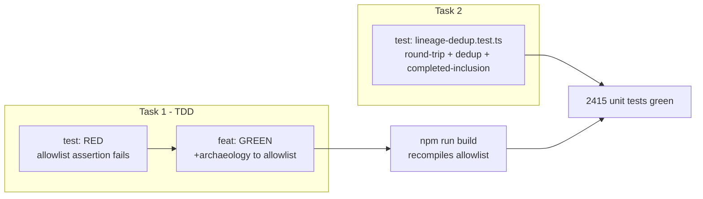

# Phase 5 Plan 01: Allowlist Registration + Dedup Backbone Summary

**One-liner:** `archaeology` registered in FUNCTIONAL_TAG_ALLOWLIST and lineage dedup backbone proven over fixtures with
union-completed polarity (D-05, D-07, LINE-01).

## TL;DR

## Completed Tasks

| Task      | Name                              | Commit   | Files                                                    |
| --------- | --------------------------------- | -------- | -------------------------------------------------------- |
| 1 (RED)   | Failing allowlist test            | 74e7d9fa | tests/unit/contracts/ast/mutation-script-builder.test.ts |
| 1 (GREEN) | Register archaeology in allowlist | 47a5140f | src/contracts/ast/mutation-script-builder.ts             |
| 2         | Lineage round-trip + dedup spec   | 13fe9c1f | tests/unit/contracts/ast/lineage-dedup.test.ts           |

## What Was Built

**Task 1:** Added `'archaeology', // Phase 5 D-05 session-archaeology marker` as the last entry in
`FUNCTIONAL_TAG_ALLOWLIST`. Updated the doc comment to mention the Phase 5 use case. Ran `npm run build` to recompile.
Added the per-tag assertion `it('allows archaeology (Phase 5 D-05) in test mode', ...)` to the existing describe block
in `mutation-script-builder.test.ts` — following the `capture-live` case as the exact analog.

**Task 2:** Created `tests/unit/contracts/ast/lineage-dedup.test.ts` with 9 specs covering:

- Round-trip: `composeLineageStamp` → `LINEAGE_RE` match → `JSON.parse(.session)` equals input sessionId
- Idempotency: double-stamping yields exactly one `LINEAGE_RE` match (strip-before-reappend invariant)
- Dedup-skip: session IDs from fixture notes land in `buildExtractedSessionSet`, excluding already-handled transcripts
- Multi-note collection, notes-without-lineage skip, completed-task inclusion

The `buildExtractedSessionSet` in-test helper mirrors the exact parse the skill will perform on the dedup read result.

## Deviations from Plan

None — plan executed exactly as written.

## Known Stubs

None. Both tasks are deterministic unit specs over existing source; no wired data paths are stubbed.

## Threat Surface Scan

No new network endpoints, auth paths, file access patterns, or schema changes introduced. Task 1 adds one entry to an
enumerated allowlist; the blast radius is bounded to the named idempotent functional tag `archaeology` (T-05-01
mitigated). Task 2 is test-only.

## TDD Gate Compliance

- Task 1 RED gate: commit `74e7d9fa` (`test(05-01): add failing test...`)
- Task 1 GREEN gate: commit `47a5140f` (`feat(05-01): register archaeology...`)
- Task 2 is a new test spec for existing source — no separate RED/GREEN cycle needed (source already exists)

## Self-Check: PASSED

Files verified present:

- `src/contracts/ast/mutation-script-builder.ts` — FOUND (contains `'archaeology'`)
- `tests/unit/contracts/ast/mutation-script-builder.test.ts` — FOUND (contains `toContain('archaeology')`)
- `tests/unit/contracts/ast/lineage-dedup.test.ts` — FOUND (159 lines)

Commits verified:

- `74e7d9fa` — FOUND
- `47a5140f` — FOUND
- `13fe9c1f` — FOUND

Unit suite: 2415 tests, 120 test files — all green.
