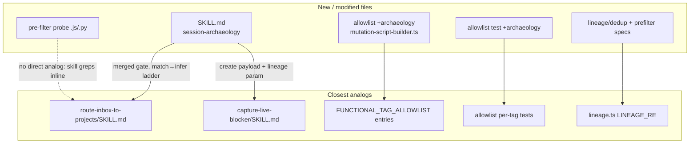

# Phase 5: Session Archaeology - Pattern Map

**Mapped:** 2026-06-16 **Files analyzed:** 6 (3 new, 1 modified, 1 test-modified, 1 new test) + read-only reuse set
**Analogs found:** 6 / 6

## TL;DR (visual)



## File Classification

| New/Modified File                                                                                | Role                 | Data Flow                 | Closest Analog                                                                | Match Quality                                 |
| ------------------------------------------------------------------------------------------------ | -------------------- | ------------------------- | ----------------------------------------------------------------------------- | --------------------------------------------- |
| `.claude/skills/session-archaeology/SKILL.md`                                                    | skill (agent prompt) | batch / transform         | `.claude/skills/route-inbox-to-projects/SKILL.md`                             | exact (role + two-pass gate)                  |
| pre-filter helper (`probes/<name>.js` or `.py`, OR inline in SKILL.md)                           | utility              | transform (stream filter) | route skill's inline `grep` vault read                                        | role-match (no committed-probe analog exists) |
| `src/contracts/ast/mutation-script-builder.ts` (add `archaeology` to `FUNCTIONAL_TAG_ALLOWLIST`) | config               | —                         | existing `routing-unplaced` / `capture-live` entries (same file, lines 77-83) | exact                                         |
| `tests/unit/contracts/ast/mutation-script-builder.test.ts` (add `archaeology` assertion)         | test                 | —                         | existing per-tag `toContain` blocks (lines 1217-1250)                         | exact                                         |
| new unit spec: lineage round-trip + dedup-skip over fixture notes                                | test                 | —                         | `src/contracts/ast/lineage.ts` round-trip contract                            | role-match                                    |
| new unit spec: pre-filter noise-strip over fixture JSONL (only if helper is committed)           | test                 | —                         | (none — new)                                                                  | no analog                                     |

**Read-only reuse (no new code):** `src/contracts/ast/lineage.ts` (`LINEAGE_RE` / `composeLineageStamp`),
`src/contracts/ast/tag-mutation-script-builder.ts` (`addTag` find-or-create), `src/tools/unified/OmniFocusReadTool.ts`
(tag + `details:true` dedup read).

## Pattern Assignments

### `.claude/skills/session-archaeology/SKILL.md` (skill, batch/transform)

**Analog:** `.claude/skills/route-inbox-to-projects/SKILL.md` (primary — gate + ladder);
`.claude/skills/capture-live-blocker/SKILL.md` (secondary — create payload + lineage + tag boundary).

**Frontmatter pattern** — copy the YAML shape; trigger phrases describe the user invocation (route skill lines 1-7):

```yaml
---
name: route-inbox-to-projects
description:
  Use when Jess says "route my inbox", "process agent-ok items", "file inbox tasks", "run routing", or "route inbox
  items" — runs the on-demand routing loop that files agent-ok inbox tasks into matching projects, creates projects for
  vault-inferred items, or leaves the rest marked for later review.
---
```

For archaeology: `name: session-archaeology`; description triggers on "scan my sessions", "session archaeology", "find
open loops", "what did I leave undone".

**Two-pass summarize-then-approve gate** — the exact `yes / edit / abort` primitive D-04/D-06 reuse (route skill lines
33, 50-51):

```
Two passes, in order. Pass 1 plans and shows you a proposal; Pass 2 executes only after you approve.
...
6. **Ask for approval:** "Approve this plan? (yes / edit / abort)". Wait. On **abort**, stop with no writes. On
   **edit**, accept row-level corrections, then re-show the table. On **yes**, proceed to Pass 2.
```

Archaeology divergence (D-06): ONE merged table — `Session | What it was about | Open loops? | Count` plus per-loop
proposed placement — and ONE gate. Do NOT chain the route skill (it would fire its own gate; see Anti-patterns).

**Routing ladder followed inline (NOT chained)** — copy the MATCH → INFER → LEAVE classification verbatim as the
proposal step (route skill lines 75-92):

```
1. **MATCH** — A project name clearly identifies the item's home (high confidence). File it there. ...
2. **INFER** — No obvious project match, but a vault note's `omnifocus-project` field deterministically names the
   target. Create the project (if missing) and file there. ...
3. **LEAVE** — Cannot match and cannot infer. Leave the item in the inbox ...
**Bias to leave.** When in doubt between MATCH and LEAVE, choose LEAVE.
```

Archaeology create differs from routing in one way (RESEARCH §Routing Reuse): routing files _existing inbox tasks_
(`update + project`); archaeology **creates new tasks** then files them. LEAVE → inbox fallback is ARCH-03's fallback.
The vault-signal read (route skill lines 94-104) carries over verbatim for INFER.

**Tool-call reference table** — reuse this exact format and the read/write shapes (route skill lines 106-128). The dedup
read replaces the inbox read; create replaces update.

**Create payload + lineage + tag boundary** (capture-live-blocker lines 27-32) — the create path archaeology mirrors,
plus the `archaeology`-is-never-on-live boundary that this phase inverts:

```
- **D-10** — placement is inbox + `agent-ok` + `capture-live` marker tag + `of-mcp:lineage` stamp; `archaeology` is
  never added.
- **D-11** — reuses Phase 2's native OmniJS inbox-create path, server-side lineage stamp, and the funnel/verifier — no
  new capture mechanism.
Adds no server code. Drives `omnifocus_write` through the existing write funnel and write-verifier.
```

For archaeology each created task carries `agent-ok` + `archaeology` + the `of-mcp:lineage` stamp (D-05). Note the
polarity: capture-live forbids `archaeology`; archaeology requires it.

**Detection rubric** — agent-side prompt, no analog (judgment, not code). Use the four-category rubric +
guaranteed-catch floor verbatim from RESEARCH §Open-Loop Detection Rubric (open question / deferred work /
stated-but-unfiled intent / unfinished edit; floor = `TODO` / `blocker` / `next:` / unanswered question). This is the
**inverse** of capture-live's "Bias to NOT capture" (capture skill line ~45).

---

### Pre-filter helper (utility, transform)

**Analog:** route skill's inline vault grep (lines 96-98) — the established "agent drives a runtime tool inline, ships
no `src/` module" pattern:

```
The agent reads `~/vaults/jess-os/` directly with `Grep` / `Read` — no MCP layer (D-05).
- Grep the vault: `grep -r "omnifocus-project:" ~/vaults/jess-os/ --include="*.md" -l`.
```

Archaeology mirrors this by invoking `python3` / `find` inline against `~/.claude/projects/<encoded-cwd>*/`. CLAUDE.md
convention: `src/` is TS-only; a runtime probe may be `.js` under `probes/` or `tests/manual/`. RESEARCH recommends a
small committed `.js`/`.py` under `probes/` so the noise-strip is unit-testable (Open Q2). Filter rule (RESEARCH
§Pre-Filter Implementation, lines 142-153): exclude `isSidechain`; keep `user` lines whose content is a string OR has a
`text` item; keep `assistant` lines with a `text` item; drop everything else; window by per-message `timestamp` ≥
now−7d. Emit `{session_id, timestamp, role, text}` grouped by session.

---

### `src/contracts/ast/mutation-script-builder.ts` (config — allowlist add)

**Analog:** existing entries in the same array (lines 77-83):

```typescript
export const FUNCTIONAL_TAG_ALLOWLIST: readonly string[] = [
  'agent-ok',
  'routing-unplaced',
  'review-output', // Phase 4 D-01/D-02
  'review-capture', // Phase 4 D-01/D-02
  'capture-live', // Phase 4 D-10 live-capture marker
];
```

**Change:** add one line following the precedent comment style:

```typescript
  'archaeology', // Phase 5 D-05 session-archaeology marker
```

Rebuild after the edit (`npm run build`) — the funnel reads the compiled allowlist at runtime (RESEARCH §Runtime State
Inventory).

---

### `tests/unit/contracts/ast/mutation-script-builder.test.ts` (test — allowlist assertion)

**Analog:** the per-tag blocks in the same `describe` (lines 1217-1250). The allowlist is enumerated one `it` per tag:

```typescript
it('allows the live-capture marker (Phase 4 D-10) in test mode', () => {
  expect(FUNCTIONAL_TAG_ALLOWLIST).toContain('capture-live');
  expect(isTestTagAllowed('capture-live')).toBe(true);
});
```

**Add** a matching block inside the existing `describe(...)` (before its closing `})` at line 1250):

```typescript
it('allows archaeology (Phase 5 D-05) in test mode', () => {
  expect(FUNCTIONAL_TAG_ALLOWLIST).toContain('archaeology');
  expect(isTestTagAllowed('archaeology')).toBe(true);
});
```

---

### New unit spec: lineage round-trip + dedup-skip (test)

**Analog / contract source:** `src/contracts/ast/lineage.ts`. The dedup read parses notes with `LINEAGE_RE`,
`JSON.parse`s the payload, reads `.session` (lineage.ts lines 30, 50-58):

```typescript
export const LINEAGE_RE: RegExp = /\n\n<!-- of-mcp:lineage\n.*?\n-->/s;
// payload shape from composeLineageStamp:
//   { v: 1, agent: 'claude-code', session: <sessionId>, created_at: <iso> }
```

**Test pattern to assert:**

- Round-trip: `composeLineageStamp(note, { sessionId })` → match with `LINEAGE_RE` → `JSON.parse` the inner block →
  `.session` equals `sessionId`.
- Dedup-skip: given a fixture note carrying a lineage block, the parsed session ID lands in the dedup `Set`, and a
  transcript with that `session_id` is excluded.
- Idempotency guard (lineage.ts lines 47-48 strip-before-reappend): stamping twice yields one block.

The dedup read shape it stands in for (RESEARCH §Dedup Read Mechanics, verified against `OmniFocusReadTool.ts`):
`{ query: { type:"tasks", filters:{ tags:{ all:["archaeology"] } }, details:true } }`. `details:true` is mandatory —
without it the note truncates to `NOTE_TRUNCATE_LENGTH` (200) and the lineage block at note-end is lost
(`OmniFocusReadTool.ts` line 128: `const shouldTruncateNotes = !compiled.details;`). Completed-task caveat (Open Q1):
decide whether to union a `filters:{completed:true}` read into the dedup set, and test the chosen behavior.

---

### New unit spec: pre-filter noise-strip over fixture JSONL (test, only if helper committed)

**Analog:** none (new). Fixture JSONL with one of each line type → assert only `user`-prose and `assistant`-`text` lines
survive, `isSidechain:true` lines and `tool_result`-only `user` lines are dropped, and out-of-window timestamps are
excluded. Skip this spec if the pre-filter stays inline in the skill prompt (then mark detection coverage human-verified
per RESEARCH §Validation).

## Shared Patterns

### Tag find-or-create (auto-creates `archaeology` on first use)

**Source:** `src/contracts/ast/tag-mutation-script-builder.ts` lines 137-145 **Apply to:** the archaeology create path
(no manual tag pre-creation)

```javascript
if (!current) {
  current = parent ? new Tag(segments[i], parent) : new Tag(segments[i], null);
  created.push(segments[i]);
}
```

The builder find-or-creates the `Tag` object before `addTag` (JXA `task.tags=`/`addTags()` silently no-op; OmniJS
`addTag(<Tag>)` is required, and `addTag(<string>)` throws — the builder passes the object). `archaeology` is created
automatically the first time a task is tagged with it.

### Lineage stamp (provenance + dedup backbone)

**Source:** `src/contracts/ast/lineage.ts` (`composeLineageStamp`, `LINEAGE_RE`) **Apply to:** every archaeology create
(write side) and the dedup read (read side)

```typescript
export const LINEAGE_RE: RegExp = /\n\n<!-- of-mcp:lineage\n.*?\n-->/s;
```

Write side is handled by the funnel automatically (capture-live D-11). Read side is the dedup parse. Already idempotent
and written explicitly for this phase.

### Plain-text `yes / edit / abort` consent gate

**Source:** `.claude/skills/route-inbox-to-projects/SKILL.md` lines 50-51 **Apply to:** the single merged approval gate
(D-04a — not `AskUserQuestion`)

```
6. **Ask for approval:** "Approve this plan? (yes / edit / abort)". Wait. On **abort**, stop with no writes. On
   **edit**, accept row-level corrections, then re-show the table. On **yes**, proceed to Pass 2.
```

### No-server-code skill stance

**Source:** route skill line 21-22, capture skill line 32 **Apply to:** the archaeology skill Both shipped skills state
they add no server code and drive `omnifocus_read` / `omnifocus_write` directly. Archaeology adds exactly one server
line (the allowlist entry); everything else is prompt + existing tool surfaces.

## No Analog Found

| File                             | Role | Data Flow | Reason                                                                                                                                               |
| -------------------------------- | ---- | --------- | ---------------------------------------------------------------------------------------------------------------------------------------------------- |
| pre-filter noise-strip unit spec | test | transform | No committed transcript-filter probe exists yet; closest pattern is the inline vault grep, which is not unit-tested. New if the helper is committed. |

The pre-filter _helper itself_ has a role-level analog (inline runtime-tool invocation in the route skill), so it is not
strictly "no analog" — but no prior **committed, unit-tested** filter probe exists to copy structure from.

## Metadata

**Analog search scope:** `.claude/skills/`, `src/contracts/ast/`, `src/tools/unified/`, `tests/unit/contracts/ast/`
**Files read for excerpts:** `route-inbox-to-projects/SKILL.md`, `capture-live-blocker/SKILL.md` (head), `lineage.ts`,
`mutation-script-builder.ts` (allowlist), `mutation-script-builder.test.ts` (allowlist describe),
`tag-mutation-script-builder.ts` (find-or-create), `OmniFocusReadTool.ts` (truncation/details grep) **Pattern extraction
date:** 2026-06-16

```

```
