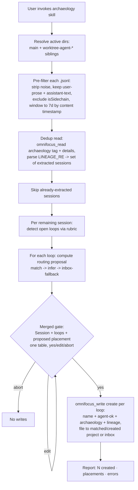

# Phase 5: Session Archaeology - Research

**Researched:** 2026-06-16 **Domain:** Claude Code transcript mining + agent-side skill prompt + OmniFocus task
creation/dedup **Confidence:** HIGH (all findings verified against live transcript data and current source)

<user_constraints>

## User Constraints (from CONTEXT.md)

### Locked Decisions (D-01..D-07 — DO NOT relitigate)

- **D-01 source:** Scan raw transcripts `~/.claude/projects/<encoded-cwd>/<session-id>.jsonl`. `.remember/` rejected as
  source (records completed wins; lossy); usable only as optional triage index.
- **D-02 windowing:** "Last 7 days" keys off each message's per-message ISO `timestamp` (content date), NOT file mtime.
  "Active" = this repo's encoded-cwd dir + its `…--claude-worktrees-agent-*` sibling dirs, filtered to messages within 7
  days. **Exclude `isSidechain` subagent transcripts in v1.**
- **D-03 rule:** Broad semantic inference of incomplete intent (open question / deferred work / stated-but-unfiled
  intent / unfinished edit) WITH the Phase-4 D-08 enumerated markers (`TODO`, `blocker`, `next:`, unanswered question)
  as a guaranteed-catch floor. A deterministic pre-filter strips
  `tool_use`/`tool_result`/`attachment`/`file-history-snapshot` before the model reads.
- **D-04 approval:** First pass is a read-only plain-text summary table
  `Session | What it was about | Open loops? | Count`; user approves which **sessions**; row-level `edit` verb trims
  loops. Mirrors `route-inbox-to-projects` Pass-1 `yes/edit/abort`.
- **D-04a primitive:** Plain-text reply (`yes/edit/abort`), NOT `AskUserQuestion`.
- **D-05 placement:** Approved loops placed via Phase-3 routing (`match→infer→create→leave`) carrying `archaeology`.
  Each created task carries `agent-ok` + `archaeology` + LINE-01 lineage stamp. Add `archaeology` to
  `FUNCTIONAL_TAG_ALLOWLIST`.
- **D-06 merged gate:** Extraction approval + placement approval = ONE merged gate. Archaeology pre-computes the routing
  proposal and shows loop + proposed placement in one table; single `yes/edit/abort`. Archaeology must run routing's
  `match→infer` to produce a proposal WITHOUT triggering route-inbox-to-projects' own approval pass.
- **D-07 dedup:** Before surfacing, `omnifocus_read` for `archaeology`-tagged tasks, parse originating session ID from
  `of-mcp:lineage` (`LINEAGE_RE`), skip already-extracted sessions. Reuses `lineage.ts`. Session granularity. No new
  persistent state.

### Claude's Discretion (resolve during planning — this research recommends)

- Exact loop-category rubric wording (D-03) → see **Open-Loop Detection Rubric**.
- Skill composition (own skill reusing routing's matching procedure vs. composing route skill) → see **Routing Reuse
  Mechanism**.
- Pre-filter implementation (inline vs jq/python helper) → see **Pre-Filter Implementation**.
- Hybrid per-loop dedup key (D-08, deferred) — NOT built now.
- Summary table exact columns/wording → frame is `Session | What it was about | Open loops? | Count`.

### Deferred Ideas (OUT OF SCOPE)

- Hybrid per-loop dedup key (D-08).
- n8n 15-min polling of archaeology (TRIG-02).
- Phase 6 JessOS custom perspective filtering on `archaeology` (Phase 5 produces data, not machinery).
  </user_constraints>

<phase_requirements>

## Phase Requirements

| ID      | Description                                                                      | Research Support                                                                                           |
| ------- | -------------------------------------------------------------------------------- | ---------------------------------------------------------------------------------------------------------- |
| ARCH-01 | Scan last 7 days of active sessions for unresolved open loops                    | Transcript schema, content-date windowing, active-dir resolution, pre-filter, detection rubric (all below) |
| ARCH-02 | Per-session summarize-then-approve; never bulk auto-create                       | Merged-gate design reuses shipped `route-inbox-to-projects` Pass-1 `yes/edit/abort` plain-text gate        |
| ARCH-03 | Approved loops → tasks in correct project (inbox fallback), tagged `archaeology` | Routing reuse mechanism + `archaeology` allowlist registration + native create/lineage path                |
| LINE-01 | Lineage stamp (read back for dedup)                                              | `LINEAGE_RE` + dedup query spec confirmed against read tool                                                |

</phase_requirements>

## Summary

This phase ships **one agent-side skill** (`extract-session-archaeology` or similar) that drives existing MCP/file
tooling. It adds essentially no server code beyond a **one-line allowlist addition** (`archaeology` →
`FUNCTIONAL_TAG_ALLOWLIST`) and a matching unit-test assertion. Everything else — transcript reading, pre-filtering,
loop detection, summary, routing-proposal computation, the merged gate, dedup — lives in the skill prompt plus the
established `omnifocus_read`/`omnifocus_write` surfaces. This matches the repo's locked architecture stance:
intelligence agent-side, server stays plumbing.

Live inspection of this repo's transcript store **confirms CONTEXT.md's order-of-magnitude estimates and refines them**:
13 encoded-cwd dirs exist for this repo, but only 3 (main + 2 worktrees) have activity in the last 7 days; 38 `.jsonl`
files were touched in 7 days totalling ~20.6 MB (max single file 2.65 MB — matching the "~2.6 MB each" estimate; the
"~76 files" estimate counts all files, not the 7-day-active subset). The dominant cost is tool noise: stripping
`tool_use`/`tool_result` content plus `attachment`/`file-history-snapshot`/`system`/`mode`/`queue-operation` line types
leaves only **~22% of bytes** — and the _real_ signal (user prose + assistant text) is far smaller still, since 1074 of
1240 `user` lines carry only a `tool_result` (these are tool-output echoes, not user utterances).

**Primary recommendation:** Build a single self-contained skill. Use a committed throwaway `.js` pre-filter probe (per
repo convention) OR inline `python3`/`jq` invoked from the skill procedure to reduce each transcript to user-prose +
assistant-text lines within the 7-day content-date window, excluding `isSidechain`. Reuse routing's `match→infer` as a
**documented shared procedure** the archaeology skill follows inline (do NOT chain the route skill — that would fire its
own Pass-1 gate). Dedup by tag+note read (`filters.tags.all:["archaeology"]`, `details:true`), parsing session IDs via
`LINEAGE_RE`, with the **completed-task caveat** flagged below.

## Architectural Responsibility Map

| Capability                       | Primary Tier                                             | Secondary Tier                                 | Rationale                                                                                                             |
| -------------------------------- | -------------------------------------------------------- | ---------------------------------------------- | --------------------------------------------------------------------------------------------------------------------- |
| Transcript discovery + windowing | Skill (filesystem read)                                  | Pre-filter helper                              | Raw files live outside the repo and outside OmniFocus; agent reads them directly like the route skill reads the vault |
| Tool-noise pre-filter            | Pre-filter helper (`.js`/`python3`/`jq`) OR skill-inline | —                                              | Deterministic line-type strip; a probe-class helper is allowed `.js` per CLAUDE.md; pure plumbing                     |
| Open-loop detection              | Skill prompt (agent semantic inference)                  | —                                              | Detection rubric is judgment, not code — server stays plumbing                                                        |
| Routing proposal (`match→infer`) | Skill (reuses documented routing procedure)              | `omnifocus_read` projects + vault grep         | Proposal-only; no writes; mirrors route skill Pass 1 without its gate                                                 |
| Merged approval gate             | Skill prompt (plain-text `yes/edit/abort`)               | —                                              | UX/consent layer; identical primitive to shipped routing gate                                                         |
| Task create + tag + lineage      | `omnifocus_write` funnel                                 | `addTag` find-or-create, `composeLineageStamp` | Single mutation funnel + write-verifier own every write                                                               |
| `archaeology` tag registration   | Server (`FUNCTIONAL_TAG_ALLOWLIST`)                      | Unit test                                      | One-line allowlist + test; only server code change in the phase                                                       |
| Dedup read                       | `omnifocus_read` (tag+note) + `LINEAGE_RE`               | —                                              | State lives in OmniFocus; regex over existing infra                                                                   |

## Standard Stack

No new packages. This phase composes existing repo assets and OS/runtime tools already present.

### Core (existing, reused)

| Asset                                                                                                       | Purpose                                                            | Why standard                                                             |
| ----------------------------------------------------------------------------------------------------------- | ------------------------------------------------------------------ | ------------------------------------------------------------------------ |
| `src/contracts/ast/lineage.ts` (`LINEAGE_RE`, `composeLineageStamp`)                                        | Dedup backbone — parse session ID from note                        | Written explicitly for this phase; idempotent; `[VERIFIED: source read]` |
| `src/contracts/ast/mutation-script-builder.ts` (`FUNCTIONAL_TAG_ALLOWLIST`, `new Task(name, inbox)`)        | Tag registration + native create path                              | `routing-unplaced` precedent; `[VERIFIED: source read]`                  |
| `src/contracts/ast/tag-mutation-script-builder.ts` (OmniJS `addTag` + `new Tag(name, null)` find-or-create) | Creates `archaeology` tag if absent                                | Confirmed create path at line ~138; `[VERIFIED: source read]`            |
| `src/tools/unified/OmniFocusReadTool.ts`                                                                    | Tag/note filters for dedup read                                    | `details:true` returns full notes; `[VERIFIED: source read]`             |
| `.claude/skills/route-inbox-to-projects/SKILL.md`                                                           | `match→infer→create→leave` procedure + `yes/edit/abort` gate shape | Shipped; reused for placement + proposal step                            |
| `.claude/skills/capture-live-blocker/SKILL.md`                                                              | User-invoked-skill-calls-MCP pattern to mirror                     | Shipped; create-payload shape + lineage param usage                      |

### Supporting (OS/runtime — for pre-filter; pick one during planning)

| Tool              | Purpose                                           | When to use                                                          |
| ----------------- | ------------------------------------------------- | -------------------------------------------------------------------- |
| `python3`         | Line-type strip + content-date window in one pass | Available on macOS; handles JSON robustly; recommended               |
| `jq`              | Stream-filter JSONL by `.type` and `.timestamp`   | If present; concise but date math is awkward in pure jq              |
| Inline skill read | Agent `Read`s + filters mentally                  | Only viable for tiny transcripts; NOT recommended given 2.6 MB files |

**Installation:** none. `python3` confirmed present (used throughout this research session).

## Package Legitimacy Audit

Not applicable — this phase installs **zero external packages**. No npm/PyPI/crates additions. The only code change is a
one-line edit to an existing allowlist array plus a test assertion. Pre-filter uses runtime tools already on the machine
(`python3`/`jq`). No slopcheck run required.

## Raw Transcript Structure (verified live — answers research Q1)

**Location confirmed:** `~/.claude/projects/-Users-jessicaking-projects-omnifocus-mcp/*.jsonl` (main) plus 12
`…--claude-worktrees-agent-<hash>/` sibling dirs. `[VERIFIED: filesystem]`

**Volume (7-day window, all repo dirs):** `[VERIFIED: filesystem 2026-06-16]`

- 13 encoded-cwd dirs total; **only 3 active in last 7 days** (main + 2 worktrees).
- **38 `.jsonl` files** touched in 7 days, **~20.6 MB total**, max single file **2.65 MB** (matches the ~2.6 MB
  estimate), median ~365 KB.
- CONTEXT.md's "~76 files" is the all-time main-dir count (87 actually); the **7-day-active subset is ~38 files** — plan
  windowing against the active subset, not all 114 repo files.

**Per-line JSONL schema** (one JSON object per line; `cat -n`-style). Top-level `type` values observed across 7,840
recent lines: `[VERIFIED: filesystem]`

| `type`                           | Count (sample) | Classification                                           | Action                   |
| -------------------------------- | -------------- | -------------------------------------------------------- | ------------------------ |
| `user`                           | 1240           | **MIXED** — 166 prose, **1074 tool_result-only (NOISE)** | Keep only prose lines    |
| `assistant`                      | 2533           | MIXED — 743 carry `text`, 1790 thinking/tool-only        | Keep only `text`-bearing |
| `attachment`                     | 2555           | NOISE                                                    | Strip                    |
| `file-history-snapshot`          | 161            | NOISE                                                    | Strip                    |
| `system`                         | 162            | NOISE (hook/system output)                               | Strip                    |
| `mode` / `permission-mode`       | 432            | NOISE                                                    | Strip                    |
| `queue-operation`                | 86             | NOISE                                                    | Strip                    |
| `ai-title`                       | 192            | METADATA (useful for "What it was about" column)         | Optional keep            |
| `last-prompt` / `bridge-session` | 479            | NOISE                                                    | Strip                    |

**Key fields on content lines:** `[VERIFIED: filesystem]`

- `timestamp` — per-message ISO-8601 (e.g. `2026-06-12T14:39:08.079Z`). Present on **all** `user`/`assistant` lines
  (1240/1240 user lines carried it). This is the D-02 content-date key. 1264 of 7840 lines lack `timestamp` (the
  pure-noise types) — they get stripped anyway.
- `isSidechain` — boolean. In this sample **every line was `isSidechain: false`** (no subagent threads in the active
  window), but the flag is present and must still be filtered per D-02. Subagent transcripts set it `true`.
- `message.role` — `"user"` or `"assistant"`, matches top-level `type`.
- `message.content` — string (user prose) OR array of `{type: text|thinking|tool_use|tool_result}` items.
- Other useful keys: `sessionId`, `cwd`, `gitBranch`, `uuid`, `parentUuid`, `version`.

**Critical refinement for the pre-filter spec:** the dominant noise is NOT just the obvious noise line-types — it is
**`user` lines whose `content` array contains only `tool_result`** (1074 of 1240 user lines = 87%). A naive "keep all
user + assistant lines" filter retains massive tool-output echo. The correct rule: keep a `user` line only if its
content is a string OR contains a `text` item; keep an `assistant` line only if its content contains a `text` item.

**Token reduction:** stripping tool noise leaves **~22% of bytes** (2.73 MB content vs 9.43 MB tool-noise in the
sample); applying the user-prose/assistant-text rule above pushes the actual model-fed signal materially lower.
`[VERIFIED: filesystem byte measurement]`

## Pre-Filter Implementation (answers research Q2)

**Recommendation: a committed throwaway `python3` helper invoked by the skill**, OR inline `python3 -c` from the skill
procedure. Both honor repo convention.

**Why python3 over jq:** content-date windowing requires comparing each line's `timestamp` to `now − 7d`, and
discriminating `user` prose from `user` tool_result-only requires inspecting the content array shape. python3 does both
cleanly in one pass; pure jq date math and content-shape predicates are awkward and error-prone.

**Repo-convention placement** (CLAUDE.md): `src/` is TypeScript-only, BUT throwaway probe scripts under `tests/manual/`
or `probes/` may be `.js` because `osascript`/raw-runtime scripts cannot run compiled TS. A pre-filter is exactly this
class — a runtime-invoked helper, not a `src/` module. **Two viable shapes:**

| Option                                             | Placement                    | Tradeoff                                                                                                                    |
| -------------------------------------------------- | ---------------------------- | --------------------------------------------------------------------------------------------------------------------------- |
| **Inline `python3 -c` in the skill** (recommended) | No committed file            | Zero new artifact; matches route skill's "agent drives tools directly, adds no code" pattern. Self-contained in the prompt. |
| Committed helper                                   | `probes/` or `tests/manual/` | Reusable/testable in isolation; but adds an artifact the route/capture skills deliberately avoid                            |

**Consistency with shipped skills:** `route-inbox-to-projects` and `capture-live-blocker` both state "adds no server
code — drives existing tool surfaces." The route skill greps the vault inline (`grep -r … ~/vaults/jess-os/`) rather
than shipping a helper. The archaeology pre-filter should mirror this: **the skill procedure invokes
`python3`/`grep`/`find` inline**, keeping the artifact count at zero. If the planner wants a deterministic,
unit-testable filter (favored by the Validation section below), a small committed `.js`/`.py` helper under `probes/` is
acceptable and lets a unit test assert "strips noise line types."

**Filter pseudocode the planner can specify:**

```
for each .jsonl in active dirs (main + worktree-agent-* siblings):
  for each line:
    o = json.loads(line)
    if o.isSidechain: skip                      # D-02 exclude subagents
    t = o.type
    if t == 'user' and content is str: keep (prose)
    elif t == 'user' and content has a 'text' item: keep
    elif t == 'assistant' and content has a 'text' item: keep (emit text only)
    else: skip                                  # all noise types + tool_result-only
  drop any kept line whose timestamp < now-7d   # D-02 content-date window
```

Emit `{session_id, timestamp, role, text}` records grouped by session.

## Routing Reuse Mechanism (answers research Q3 — the D-06 added-complexity item)

**Finding:** The route skill's `match→infer` logic is **Pass 1 (read-only planning)** and is cleanly separable from Pass
2 (execute) and Pass 3 (report). Pass 1 already produces exactly the proposal archaeology needs: for each item, a
`MATCH (project name+id)` / `INFER+CREATE (vault topic + omnifocus-project + omnifocus-folder)` / `LEAVE (reason)`
classification, computed entirely from `omnifocus_read` projects + a vault grep, with **no writes**.
`[VERIFIED: source read SKILL.md Pass 1 + Routing Decision Rules]`

**Recommendation: archaeology owns its own merged gate and follows routing's classification ladder as a DOCUMENTED
SHARED PROCEDURE — do NOT chain/invoke the route skill.**

Rationale:

- Chaining `route-inbox-to-projects` would fire **its** Pass-1 `yes/edit/abort` gate ("Approve this plan?"), producing
  the exact double-gate D-06 forbids. There is no documented "proposal-only / suppress-gate" entry point in the current
  route skill.
- The route skill's Routing Decision Rules (the MATCH→INFER→LEAVE ladder, the vault frontmatter read, the bias-to-leave
  rule, the empty-vault case) are **prose procedure**, not executable code — they are trivially followed inline by a
  second skill. This is the established pattern: intelligence lives in the prompt.
- D-06 explicitly biases toward "archaeology owning the gate and reusing routing's `match→infer` logic as a proposal
  step."

**What must be refactored/documented to support this:** Extract the route skill's **Routing Decision Rules + Vault
Signal Read** into a referenceable shared procedure so archaeology and routing cite one source of truth (avoid drift).
Two equally valid mechanisms:

| Mechanism                                     | What it looks like                                                                                            | Tradeoff                                                       |
| --------------------------------------------- | ------------------------------------------------------------------------------------------------------------- | -------------------------------------------------------------- |
| **Shared doc section** (recommended)          | A `docs/` or skill-local fragment "Routing Classification Procedure (match→infer)" that both skills reference | DRY; one place to update routing rules; no behavioral coupling |
| Duplicate the ladder in the archaeology skill | Archaeology restates MATCH/INFER/LEAVE rules in its own prompt                                                | Self-contained but two copies drift over time                  |

Either way, **archaeology computes the proposal for each loop using routing's ladder, merges loop + proposed placement
into ONE table, and presents ONE `yes/edit/abort`.** On `yes`, archaeology executes the creates itself via
`omnifocus_write` (carrying `agent-ok` + `archaeology` + lineage), reusing routing's Pass-2 _create/file_ mechanics
(`update + project` for MATCH, `create project then file` for INFER) but never re-prompting.

**Planning note:** archaeology's create differs from routing's in one way — routing files _existing inbox tasks_
(`update + project`); archaeology **creates new tasks** then files them. The INFER project-existence check (don't
duplicate a project) and the bias-to-leave (→ inbox fallback, the ARCH-03 fallback) carry over verbatim.

## Dedup Read Mechanics (answers research Q4 — D-07 / LINE-01)

**Confirmed query spec:** `[VERIFIED: source read OmniFocusReadTool.ts]`

```jsonc
{
  "query": {
    "type": "tasks",
    "filters": { "tags": { "all": ["archaeology"] } },
    "details": true, // REQUIRED — returns full notes (no 200-char truncation)
  },
}
```

- `details:true` returns the full `note` field (the tool truncates to `NOTE_TRUNCATE_LENGTH`=200 only when `details` is
  falsy). The `of-mcp:lineage` block lives at the _end_ of the note, so truncation would lose it — `details:true` is
  mandatory. `[VERIFIED: OmniFocusReadTool.ts lines ~127-129, 188-190]`
- Parse each returned task's `note` with `LINEAGE_RE` (`/\n\n<!-- of-mcp:lineage\n.*?\n-->/s`), then `JSON.parse` the
  payload and read `.session`. Build a `Set<sessionId>` of already-extracted sessions; skip any transcript whose
  `session_id` is in the set. `[VERIFIED: lineage.ts]`

**The `filters.ids` gap does NOT affect this path.** STATE row `read_path_gap`: "`omnifocus_read` ignores `filters.ids`
(plural); by-id projections omit tags." `[VERIFIED: STATE.md line 149]` The dedup read filters by **tag**
(`filters.tags.all`), not by id, and requests **full details** (not a by-id projection), so it sidesteps both halves of
the gap entirely. No workaround needed.

**Caveat the planner MUST address — completed/dropped archaeology tasks:** a default tasks read returns **active** tasks
only. If the user completes or drops an archaeology task, its session disappears from the dedup set and the loop
re-surfaces on the next scan. Two design options:

- **(Recommended) Accept it as intended self-healing** — D-07 explicitly says "a deleted task legitimately re-surfaces
  its loop." A _completed_ loop re-surfacing is arguably wrong polarity (the user handled it). To avoid re-surfacing
  handled loops, run the dedup read **including completed**: add `filters.completed` handling, or run two reads
  (active + `filters:{completed:true}` / `status:"completed"`) and union the session sets.
  `[VERIFIED: OmniFocusReadTool.ts lines 199-201 — completed reachable via filters.completed/status]`
- The planner should pick explicitly and write a deterministic test for the chosen behavior.

## `archaeology` Tag Registration (answers research Q5 — D-05)

**One-line addition** to `FUNCTIONAL_TAG_ALLOWLIST` in `src/contracts/ast/mutation-script-builder.ts` (currently
`['agent-ok','routing-unplaced','review-output','review-capture','capture-live']`): add `'archaeology', // Phase 5 D-05`
following the `routing-unplaced`/`capture-live` precedent. `[VERIFIED: source read lines 77-83]`

**A unit test DOES enumerate the allowlist** — `tests/unit/contracts/ast/mutation-script-builder.test.ts`,
`describe('FUNCTIONAL_TAG_ALLOWLIST / isTestTagAllowed …')` asserts membership per tag
(`expect(FUNCTIONAL_TAG_ALLOWLIST).toContain('routing-unplaced')` etc.). `[VERIFIED: test read lines 1217-1249]` **The
planner must add a matching assertion:**

```ts
it('allows archaeology (Phase 5 D-05) in test mode', () => {
  expect(FUNCTIONAL_TAG_ALLOWLIST).toContain('archaeology');
  expect(isTestTagAllowed('archaeology')).toBe(true);
});
```

**`addTag` find-or-create confirmed:** the tag builder calls `doc.flattenedTags()`, and when a tag is absent constructs
`new Tag(segments[i], parent)` / `new Tag(name, null)` and pushes it (`action: 'created'`). So `archaeology` is
auto-created on first use if it does not exist. `[VERIFIED: tag-mutation-script-builder.ts lines ~138-146]` Note
DISC-TAG-02: `addTag(<string>)` throws — a `Tag` object is required; the builder already find-or-creates the object
first. `[CITED: docs/reference/omnifocus-capabilities.md §Tagging line 142+]`

## Open-Loop Detection Rubric (answers research Q6 — prompt guidance, D-03)

Proposed skill-prompt rubric. Keep it tight so "incomplete intent" does not balloon into every passing remark — the
approval gate licenses recall, but a 200-loop table is its own overwhelm failure.

> **An open loop is a concrete, still-unresolved intent the session left behind.** Surface a candidate only if it fits
> one of these four categories AND is actionable (could become an OmniFocus task), not a general musing:
>
> 1. **Open question** — a question the user or agent raised that the session never answered, where the answer needs
>    information or a decision not yet made.
> 2. **Deferred work** — work explicitly postponed ("later", "next time", "follow-up", "circle back", "out of scope for
>    now").
> 3. **Stated-but-unfiled intent** — the user said they want/need/should do something and no task was created for it.
> 4. **Unfinished edit** — a code/doc change started or planned in the session but left incomplete (a stubbed function,
>    a TODO left in, a half-applied refactor).
>
> **Guaranteed-catch floor (always surface, even if borderline):** any line containing `TODO`, the word `blocker`, a
> `next:` marker, or an explicitly unanswered question. This is the Phase-4 D-08 floor.
>
> **Bias to recall, but exclude:** resolved items (the session already handled them), pure observations/opinions with no
> action, speculative "we could maybe someday" ideas with no commitment, and anything already turned into a task during
> the session. When two phrasings describe the same loop, merge them into one.

Rationale: this is the **inverse** of capture-live-blocker's "bias to NOT capture" — archaeology biases to recall
because a human approves the whole batch before any write (the gate is the safety mechanism). The merge/exclude clauses
are what keep the table reviewable. `[CITED: CONTEXT.md D-03, capture-live SKILL.md conservative rule]`

## Architecture Patterns

### System flow (proposal)



### Anti-patterns to avoid

- **Chaining the route skill** (fires its own gate → violates D-06 single-gate). Follow routing's ladder inline instead.
- **Keeping all `user` lines** in the pre-filter — 87% are tool_result echoes. Filter on content shape.
- **Reading dedup notes without `details:true`** — truncation drops the lineage block at note-end.
- **Filtering transcripts by file mtime** — D-02 forbids it; mtime drifts hours-to-days from content date.
- **JXA tag assignment** — `task.tags=`/`addTags()` silently no-op; use OmniJS `addTag` via the write funnel.

## Don't Hand-Roll

| Problem                | Don't build                               | Use instead                               | Why                                                                       |
| ---------------------- | ----------------------------------------- | ----------------------------------------- | ------------------------------------------------------------------------- |
| Dedup persistent state | A scanned-marker file / sidecar DB        | OmniFocus tag+lineage read (`LINEAGE_RE`) | D-07 — state in OmniFocus is cross-machine + self-healing; zero new state |
| Lineage parse          | A custom note-scraper                     | `LINEAGE_RE` + `JSON.parse`               | Already written, idempotent, tested                                       |
| Tag creation           | Pre-create the `archaeology` tag manually | `addTag` find-or-create                   | Auto-creates `new Tag(name,null)` on first use                            |
| Routing logic          | A new match/infer engine                  | route skill's documented ladder           | D-05 — routing is consumed, not rebuilt                                   |
| Task create            | Direct JXA `new Task`                     | `omnifocus_write` funnel                  | Write-verifier + lineage auto-stamp + `agent-ok` auto-tag                 |
| Approval UX            | `AskUserQuestion` widget                  | plain-text `yes/edit/abort`               | D-04a — caps poorly across many sessions; matches shipped gate            |

## Runtime State Inventory

Greenfield-ish skill phase, but it reads/writes runtime state. Explicit inventory:

| Category            | Items found                                                                                                                         | Action required                   |
| ------------------- | ----------------------------------------------------------------------------------------------------------------------------------- | --------------------------------- |
| Stored data         | Existing `archaeology`-tagged OmniFocus tasks (none yet — first run) carry session IDs in `of-mcp:lineage`; this IS the dedup state | Read-only consume via dedup query |
| Live service config | None — skill is on-demand, no scheduler/service registered (n8n polling is deferred)                                                | None                              |
| OS-registered state | Claude Code transcript store `~/.claude/projects/<dir>/*.jsonl` — read-only source, written by Claude Code itself                   | None (read-only)                  |
| Secrets/env vars    | None                                                                                                                                | None                              |
| Build artifacts     | Adding to `FUNCTIONAL_TAG_ALLOWLIST` requires `npm run build` before the tag passes the funnel at runtime                           | Rebuild after the allowlist edit  |

## Common Pitfalls

### Pitfall 1: Double approval gate

**What goes wrong:** archaeology chains the route skill, the user sees two "approve?" prompts. **Why:** the route
skill's Pass 1 has its own gate. **Avoid:** follow routing's ladder inline; archaeology owns the single merged gate
(D-06). **Warning sign:** the word "Approve this plan?" appears twice in one run.

### Pitfall 2: Tool-noise blowout

**What goes wrong:** pre-filter keeps all user/assistant lines; model context floods with tool_result JSON. **Why:** 87%
of `user` lines are tool_result-only echoes. **Avoid:** filter on content shape (string or has-`text`), not just `type`.
**Warning sign:** filtered output still megabytes per session.

### Pitfall 3: Lost lineage block on dedup read

**What goes wrong:** dedup misses sessions; loops re-surface every week. **Why:** note truncated to 200 chars without
`details:true`; lineage lives at note end. **Avoid:** always pass `details:true` on the dedup read.

### Pitfall 4: Completed-task re-surfacing

**What goes wrong:** a handled loop re-appears next scan. **Why:** default read returns active tasks only; completed
archaeology task drops out of the dedup set. **Avoid:** decide explicitly — union a completed-tasks read into the dedup
set, or accept re-surfacing as intended.

### Pitfall 5: Forgotten allowlist rebuild / test

**What goes wrong:** `archaeology` write rejected at runtime, or CI green but allowlist untested. **Avoid:**
`npm run build` after the edit; add the `toContain('archaeology')` assertion alongside the existing per-tag tests.

## Validation Architecture (REQUIRED — Nyquist)

### Test Framework

| Property   | Value                                                                                                              |
| ---------- | ------------------------------------------------------------------------------------------------------------------ |
| Framework  | Vitest (existing)                                                                                                  |
| Quick run  | `npm run test:unit`                                                                                                |
| Full suite | `npm run test:integration` (use npm, not bun — sandbox guard)                                                      |
| Note       | Bare `npx vitest run` trips the sandbox guard (~96 phantom failures) — always `npm run test:unit` (project memory) |

### Deterministic (automated) vs agent-behavioral (human-verified)

| What                                                                                       | Type                     | Verification                                                                                                                                                      |
| ------------------------------------------------------------------------------------------ | ------------------------ | ----------------------------------------------------------------------------------------------------------------------------------------------------------------- |
| `archaeology` ∈ `FUNCTIONAL_TAG_ALLOWLIST` + `isTestTagAllowed('archaeology')`             | Deterministic unit       | New assertion in `mutation-script-builder.test.ts`                                                                                                                |
| `LINEAGE_RE` round-trips a session ID (`composeLineageStamp` → parse → `.session` matches) | Deterministic unit       | Test in a lineage/dedup spec                                                                                                                                      |
| Dedup skips an already-extracted session                                                   | Deterministic unit       | Given a fixture note with a lineage block, the dedup set contains its session ID and that session is excluded                                                     |
| Pre-filter strips noise line types + tool_result-only user lines + isSidechain             | Deterministic unit       | If pre-filter is a committed helper: fixture JSONL → asserts only prose/text survive. If inline: cover via a small extracted pure function or mark human-verified |
| Completed-task dedup behavior (chosen option)                                              | Deterministic unit       | Assert the selected behavior against a completed-fixture                                                                                                          |
| Detection recall/precision (does it find the _right_ loops)                                | Agent-behavioral         | Human review of a real 7-day scan; sample sessions and confirm no obvious loop missed / no noise surfaced                                                         |
| Summary table quality ("What it was about" accuracy)                                       | Agent-behavioral         | Human spot-check rows against transcripts                                                                                                                         |
| Merged-gate UX (one decision surface, edit verb works)                                     | Agent-behavioral         | Human run-through; confirm single `yes/edit/abort`, row-level edit                                                                                                |
| Routing proposal correctness (right project / inbox fallback)                              | Agent-behavioral + reuse | Leans on Phase-3 routing (already validated); spot-check placements                                                                                               |

### Requirement → verification map

| Req     | Sampling approach                                                                                                                                     |
| ------- | ----------------------------------------------------------------------------------------------------------------------------------------------------- |
| ARCH-01 | Unit: windowing + pre-filter on fixtures. Human: detection recall on a live scan                                                                      |
| ARCH-02 | Human: confirm summary-then-approve gate fires, never auto-creates; unit: assert no `omnifocus_write` call before approval token in any scripted path |
| ARCH-03 | Unit: allowlist + lineage + tag on created task. Human: placement lands in correct project / inbox fallback                                           |
| LINE-01 | Unit: lineage round-trip + dedup skip                                                                                                                 |

### Wave 0 gaps

- [ ] Add `archaeology` assertion to `tests/unit/contracts/ast/mutation-script-builder.test.ts`
- [ ] New unit spec: lineage round-trip + dedup-skip over fixture notes
- [ ] (If committed pre-filter) unit spec: noise-strip over a fixture JSONL
- [ ] Decide + test the completed-task dedup behavior

## Environment Availability

| Dependency                   | Required by              | Available    | Version        | Fallback                                  |
| ---------------------------- | ------------------------ | ------------ | -------------- | ----------------------------------------- |
| `python3`                    | Pre-filter (recommended) | ✓            | system (macOS) | `jq` or inline agent read                 |
| `jq`                         | Alt pre-filter           | unverified   | —              | python3                                   |
| Claude Code transcript store | Transcript source        | ✓            | —              | none (hard requirement; it is the source) |
| OmniFocus + running app      | Dedup read + create      | ✓ (per repo) | 4.8.x          | none                                      |
| `find`/`grep`                | Dir + window discovery   | ✓            | —              | —                                         |

**No blocking gaps.** `python3` confirmed in-session; transcript store and OmniFocus are the inherent dependencies.

## State of the Art

| Old approach                              | Current approach                | Impact                                                             |
| ----------------------------------------- | ------------------------------- | ------------------------------------------------------------------ |
| `.remember/` derived files as scan source | Raw `.jsonl` transcripts        | D-01 — wins-only files have wrong polarity for finding undone work |
| File mtime windowing                      | Per-message content `timestamp` | D-02 — mtime drifts hours-to-days                                  |
| Scanned-marker sidecar for dedup          | OmniFocus tag+lineage read      | D-07 — no new state, self-healing, cross-machine                   |

## Assumptions Log

| #   | Claim                                                                                                                                 | Section                     | Risk if wrong                                                                                                                                                                                                                                           |
| --- | ------------------------------------------------------------------------------------------------------------------------------------- | --------------------------- | ------------------------------------------------------------------------------------------------------------------------------------------------------------------------------------------------------------------------------------------------------- |
| A1  | `isSidechain` flag is present on subagent transcripts (none in this 7-day window to observe directly; all sampled lines were `false`) | Transcript Structure / D-02 | Low — if a session has subagent lines and the flag is absent on them, the v1 exclusion silently no-ops; detection still works, just includes agent-internal threads. Verify on a transcript known to contain a subagent before relying on the exclusion |
| A2  | `jq` may not be installed                                                                                                             | Environment                 | Low — python3 is the recommended path regardless                                                                                                                                                                                                        |

_(All other claims are `[VERIFIED: filesystem/source]` or `[CITED: …]`.)_

## Open Questions (RESOLVED)

All three questions were settled during planning. Resolutions recorded inline below.

1. **Completed-task dedup polarity** — should a _completed_ archaeology task suppress re-surfacing, or should only an
   _existing_ (active) one? Recommendation: union completed into the dedup set so handled loops stay handled; let
   _deleted_ tasks re-surface (matches D-07's self-healing intent). **RESOLVED:** union completed archaeology tasks into
   the dedup set (deleted tasks re-surface, matching D-07 self-healing). Settled in `05-01-PLAN.md` Task 2 with a
   deterministic completed-task fixture test.
2. **Pre-filter: inline vs committed helper** — inline matches the zero-artifact skill pattern; committed helper is
   unit-testable. The Validation section favors a committed helper for the deterministic noise-strip test.
   Recommendation: small committed `.js`/`.py` under `probes/` so the strip is testable, invoked by the skill.
   **RESOLVED:** committed `probes/archaeology-prefilter.js` (CommonJS, per the CLAUDE.md probe exception and the
   `probes/disc-*.js` precedent), invoked inline by the skill, unit-tested via its pure function. Settled in
   `05-02-PLAN.md`.
3. **`ai-title` line as "What it was about" source** — present in transcripts and cheap; could populate the summary
   column directly instead of agent-summarizing. **RESOLVED:** use the transcript `ai-title` line as the default "What
   it was about" column when present, with agent summary as fallback. Settled in `05-03-PLAN.md` Task 1.

## Sources

### Primary (HIGH confidence)

- Filesystem inspection of `~/.claude/projects/-Users-jessicaking-projects-omnifocus-mcp*` — schema, volume, byte
  measurements (2026-06-16)
- `src/contracts/ast/lineage.ts`, `mutation-script-builder.ts`, `tag-mutation-script-builder.ts` — verified source
- `src/tools/unified/OmniFocusReadTool.ts` — tag/note filter + truncation behavior
- `tests/unit/contracts/ast/mutation-script-builder.test.ts` — allowlist enumeration test
- `.claude/skills/route-inbox-to-projects/SKILL.md`, `capture-live-blocker/SKILL.md` — shipped skill patterns
- `.planning/phases/05-session-archaeology/05-CONTEXT.md` — locked decisions
- `.planning/STATE.md` line 149 — `read_path_gap`
- `docs/reference/omnifocus-capabilities.md` §Tagging, §Capture

### Secondary (MEDIUM)

- `.planning/REQUIREMENTS.md` — ARCH-01/02/03, LINE-01

## Metadata

**Confidence breakdown:**

- Transcript structure/volume: HIGH — measured on live files
- Tag registration / dedup query: HIGH — verified against current source
- Routing reuse mechanism: HIGH — shipped skill read directly
- Detection rubric: MEDIUM — prompt-engineering judgment, validated against the conservative-net inverse logic
- isSidechain exclusion: MEDIUM — flag present but no subagent lines in-window to observe `true` (A1)

**Research date:** 2026-06-16 **Valid until:** ~2026-07-16 (stable; transcript schema and source are local and
slow-moving)
