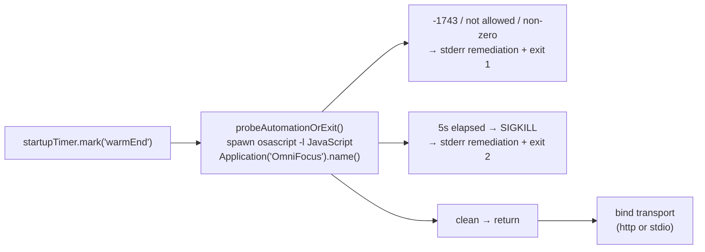

# Phase 06 Plan 01: Automation-Permission Startup Probe Summary

**Fail-fast `probeAutomationOrExit()` that spawns `osascript` to verify the OmniFocus Automation grant before any MCP transport binds — exits 1 on denial, exits 2 on a 5s SIGKILL timeout, and supersedes the old non-blocking permission warn path (DEPLOY-03).**

## TL;DR



## Tasks Completed

| Task | Name | Commit | Type |
|------|------|--------|------|
| 1 | Failing probe unit tests + module stub (RED) | `4396f95` | test |
| 2 | Implement probeAutomationOrExit (GREEN) | `3559c25` | feat |
| 3 | Wire probe into runServer() before transport bind | `4793241` | feat |

## What Was Built

### Task 2: `src/utils/automation-probe.ts`

`probeAutomationOrExit(timeoutMs = 5000)` spawns `osascript -l JavaScript -e 'Application("OmniFocus").name()'`, accumulates stderr, and arms a `setTimeout` → `proc.kill('SIGKILL')` hard timeout cleared in the close/error handlers. Decision logic:

- `signal === 'SIGKILL'` → timeout remediation to `process.stderr`, `process.exit(2)`.
- non-zero exit code OR stderr contains `-1743` / `not allowed` → Automation-denied remediation, `process.exit(1)`.
- clean → resolve, caller proceeds to bind transports.

Uses `createLogger('AutomationProbe')` and ESM `.js` import specifiers per repo convention.

### Task 3: `src/index.ts`

Added `import { probeAutomationOrExit } from './utils/automation-probe.js'` (replacing the now-unused `PermissionChecker` import) and `await probeAutomationOrExit()` immediately after `startupTimer.mark('warmEnd')`, before the `if (cliConfig.httpMode)` branch. The former non-blocking `checkPermissions()` warn block was removed; a comment marks where it was and why the probe supersedes it. `startupTimer` marks `initEnd`/`permsEnd` are retained (the timer degrades gracefully).

## Verification Results

```
npm run build                                              → exit 0 (tsc clean)
npx vitest run tests/unit/utils/automation-probe.test.ts   → 3/3 pass (exit 1, exit 2, clean)
npm run test:unit                                          → 2375/2375 pass (117 files)
grep -n probeAutomationOrExit src/index.ts                 → import (L9) + await (after warmEnd, before httpMode)
```

## Deviations from Plan

### 1. Removed the soft-warn block instead of relocating it
- **Found during:** Task 3 (wiring).
- **Issue:** The plan offered "remove OR leave strictly after the probe." The existing `checkPermissions()` warn ran *before* `warmEnd`, but the probe's mandated insertion point is *at* `warmEnd`. Leaving the warn in place would let it fire on a denied grant before the probe exits — contradicting the "soft warn never runs on a denied grant" rationale.
- **Fix:** Removed the block; swapped the import to the probe to keep the import list clean.
- **Verification:** `npm run build` clean, full unit suite green.

### 2. Updated `tests/unit/index.test.ts` for the new contract
- **Issue:** The entrypoint test asserted `checkPermissions()` was called once. With the probe superseding it, that assertion was stale.
- **Fix:** Replaced the `MockPermissionChecker` mock and its `vi.mock('.../permissions.js')` with a `probeAutomationOrExitMock` and `vi.mock('.../automation-probe.js')`; the test now asserts the probe is called once.
- **Verification:** `tests/unit/index.test.ts` passes.

### 3. `signal` typed as `string`, not `NodeJS.Signals`
- **Issue:** The repo eslint config flags the `NodeJS` global (`no-undef`); the original draft used `NodeJS.Signals`, which blocked the pre-commit hook.
- **Fix:** Typed the signal as `string | null` (the `=== 'SIGKILL'` comparison is unaffected), matching `OmniAutomation.ts` which leaves the close-handler signal untyped.

**Total deviations:** 3 — all necessary for the supersede contract and to pass hooks/tests. No scope creep.

## Issues Encountered

The initial background executor could not commit (pre-commit eslint rejected the `NodeJS.Signals` annotation, and the backgrounded agent could not answer Bash permission prompts). The orchestrator completed Task 2's commit, Task 3, the test update, and this SUMMARY inline after fixing the lint error. All commits ran through the pre-commit hooks (no `--no-verify`).

## Threat Flags

T-06-01 (silent Automation-grant loss → silently broken server) and T-06-02 (suppressed TCC dialog hangs the probe) are mitigated as designed: loud non-zero exit on denial, hard SIGKILL timeout → exit 2 on hang. Validated by unit Tests 1 and 2.

## Requirements Closed

| Req | Description | Status |
|-----|-------------|--------|
| DEPLOY-03 | Startup runs a fail-fast Automation probe that exits loudly (1 on denial, 2 on timeout), never hangs, and supersedes the non-blocking checker | Closed |

## Self-Check: PASSED

- `src/utils/automation-probe.ts` — exists, exports `probeAutomationOrExit`
- `tests/unit/utils/automation-probe.test.ts` — exists, 3 cases green
- `src/index.ts` — probe imported and awaited after warmEnd, before the httpMode branch
- Commits `4396f95` (RED), `3559c25` (GREEN), `4793241` (wire) present on the worktree branch
