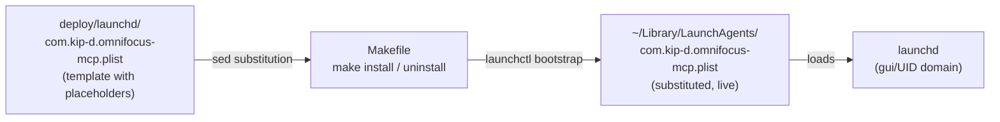

# Phase 06 Plan 03: LaunchAgent Plist + Makefile Summary

Least-privilege LaunchAgent plist template and one-command Makefile install/uninstall targeting `launchctl bootstrap`/`bootout`, closing the artifact side of DEPLOY-01 and DEPLOY-02.

## TL;DR



## Tasks Completed

| Task | Name | Commit | Files |
|------|------|--------|-------|
| 1 | Author least-privilege LaunchAgent plist template | 8994115 | deploy/launchd/com.kip-d.omnifocus-mcp.plist |
| 2 | Author Makefile install/uninstall targets | 75552b6 | Makefile |

## What Was Built

### Task 1: `deploy/launchd/com.kip-d.omnifocus-mcp.plist`

A versioned XML plist template with exactly these keys:

| Key | Value |
|-----|-------|
| `Label` | `com.kip-d.omnifocus-mcp` |
| `ProgramArguments[0]` | `__NODE_BINARY__` → `~/.local/libexec/of-mcp-node` |
| `ProgramArguments[1]` | `__SERVER_ENTRYPOINT__` → `dist/index.js` |
| `RunAtLoad` | `true` |
| `KeepAlive` | `{ Crashed = true }` only |
| `ThrottleInterval` | `10` |
| `ProcessType` | `Background` |
| `StandardOutPath` / `StandardErrorPath` | `__LOG_DIR__/server.{log,err}` |
| `EnvironmentVariables` | `__MCP_AGENT_TOKEN__` / `__MCP_OWNER_TOKEN__` placeholders |

Keys deliberately absent: `SessionCreate`, `UserName`, `GroupName`, `Sockets`, any `FullDiskAccess` or entitlement key.

Verification: `plutil -lint` passes; all forbidden keys confirmed absent by grep.

### Task 2: `Makefile`

Three `.PHONY` targets:

- **`install`** — validates tokens present, creates `~/Library/Logs/omnifocus-mcp/` and `~/.local/libexec/`, substitutes all placeholders via `sed`, writes to `~/Library/LaunchAgents/`, then `launchctl bootstrap gui/$(id -u)`.
- **`uninstall`** — `launchctl bootout gui/$(id -u)/com.kip-d.omnifocus-mcp` (tolerates not-loaded via `|| true`), removes installed plist.
- **`verify`** (advisory) — prints `launchctl print` service status and tails `server.err`.

The Makefile header comment points at `docs/adr/ADR-005-deployment-posture.md` and the node-pinning runbook per D-07.

## Verification Results

```
plutil -lint deploy/launchd/com.kip-d.omnifocus-mcp.plist  → OK
grep com.kip-d.omnifocus-mcp                               → OK
grep __MCP_AGENT_TOKEN__                                    → OK (placeholder present)
grep <key>SessionCreate</key>                               → absent (OK)
grep <key>UserName</key>                                    → absent (OK)
grep <key>Sockets</key>                                     → absent (OK)
grep FullDiskAccess                                         → absent (OK)
grep SuccessfulExit                                         → absent (OK)
make -n install                                             → OK (parses, no error)
grep launchctl bootstrap                                    → OK
grep launchctl bootout                                      → OK
grep brew --prefix                                          → absent (OK)
```

## Deviations from Plan

None — plan executed exactly as written. The verify grep in the plan's `<automated>` block matched the XML comment mentioning "SessionCreate" (explaining why it is absent), but not the actual plist key. The acceptance criteria test `<key>SessionCreate</key>` (the real key), which is absent. The comment is correct behavior per D-09.

## Known Stubs

The plist contains intentional placeholders:
- `__NODE_BINARY__` — filled by `make install` with `$HOME/.local/libexec/of-mcp-node`
- `__SERVER_ENTRYPOINT__` — filled by `make install` with `$(pwd)/dist/index.js`
- `__LOG_DIR__` — filled by `make install` with `$HOME/Library/Logs/omnifocus-mcp`
- `__MCP_AGENT_TOKEN__` / `__MCP_OWNER_TOKEN__` — filled at install time from caller-supplied make vars

These are the intended template placeholders — not stubs to be wired later. The plist is committed as a template by design (T-06-05 mitigation).

## Threat Flags

No new security-relevant surface beyond what the plan's threat model covers. The plist is a config template with no executable code; the Makefile calls `launchctl`, `sed`, and `mkdir` — all standard macOS tooling. T-06-03, T-06-04, and T-06-05 mitigations are structurally present in the artifacts.

## Requirements Closed

| Req | Description | Status |
|-----|-------------|--------|
| DEPLOY-01 (artifact side) | Plist pins `~/.local/libexec/of-mcp-node`; Makefile installs in one command | Closed |
| DEPLOY-02 | Automation-only grant; no FDA/Sockets/entitlement keys in plist | Closed |

## Self-Check: PASSED

- `deploy/launchd/com.kip-d.omnifocus-mcp.plist` — exists, lints clean
- `Makefile` — exists, `make -n install` parses
- Commit `8994115` — Task 1 (plist)
- Commit `75552b6` — Task 2 (Makefile)
