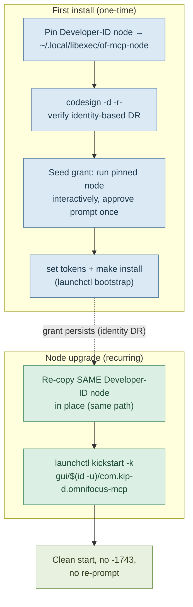

# OmniFocus MCP — LaunchAgent Deployment Runbook

Pin a Developer-ID Node, seed the one-time Automation grant, install the LaunchAgent, and survive Node upgrades without
a re-grant. This is the operational companion to [ADR-005](../../docs/adr/ADR-005-deployment-posture.md), which records
_why_ each step is shaped the way it is.

> **The one rule that makes this work:** pin a **Developer-ID-signed** Node (official `nodejs.org` pkg or an nvm build),
> **never** Homebrew's Node. Homebrew's Node is ad-hoc signed — its TCC designated requirement is a content hash
> (`cdhash`), so every upgrade is a different identity and the Automation grant breaks on the exact upgrade pinning is
> meant to survive. A Developer-ID Node's designated requirement is identity-based and content-independent, so an
> in-place overwrite keeps the grant.

## TL;DR



## Prerequisites

- A Developer-ID-signed Node binary. The official `nodejs.org` `.pkg` and nvm builds are signed by
  `Node.js Foundation (HX7739G8FX)`. Homebrew's Node is **not** suitable (ad-hoc signed).
- `MCP_AGENT_TOKEN` and `MCP_OWNER_TOKEN` values ready (the install step needs them).
- A built server: `npm run build` (produces `dist/index.js`).
- For the optional TCC.db inspection step (S2), a terminal with Full Disk Access.

## 1. Pin the Developer-ID Node

Copy your Developer-ID Node to the fixed path the plist points at, then confirm its designated requirement is
identity-based, not a cdhash:

```bash
mkdir -p ~/.local/libexec
cp /usr/local/bin/node ~/.local/libexec/of-mcp-node    # official pkg / nvm node — NOT Homebrew's node
codesign -d -r- ~/.local/libexec/of-mcp-node
# EXPECT: designated => identifier "node" and anchor apple generic ... leaf[subject.OU] = HX7739G8FX
# REJECT: designated => cdhash H"..."   ← that is an ad-hoc (Homebrew) node; do not pin it
```

If `codesign` shows a `cdhash` designated requirement, stop — that Node will lose its grant on the next upgrade. Source
a Developer-ID Node instead.

## 2. Seed the first-run Automation grant

`launchd` has **no consent UI** — a denied grant under launchd fails silently rather than prompting. So the grant must
be seeded interactively _as the pinned Node binary_, which makes Node the TCC responsible process. Run it once and
approve the single prompt:

```bash
~/.local/libexec/of-mcp-node -e 'require("child_process").spawnSync("osascript",["-l","JavaScript","-e","Application(\"OmniFocus\").name()"],{stdio:"inherit"})'
# → macOS prompts ONCE, naming node, to control OmniFocus. Approve it.
```

After approval the grant persists for that Node identity, including across in-place overwrites by the same Developer-ID
signer (Section 4).

## 3. Install the LaunchAgent

Provide the tokens and run the Makefile install target. It substitutes the pinned Node path and token placeholders into
the plist template, writes it to `~/Library/LaunchAgents/`, and `launchctl bootstrap`s it into the `gui/$(id -u)`
domain:

```bash
make install MCP_AGENT_TOKEN='…' MCP_OWNER_TOKEN='…'
tail -f ~/Library/Logs/omnifocus-mcp/server.err
# → expect a clean start: no -1743, the fail-fast Automation probe passes and the transport binds.
```

`make uninstall` reverses this (`launchctl bootout` + removes the installed plist).

## 4. Surviving a Node upgrade (the DEPLOY-01 guarantee)

When you upgrade Node, re-copy the Developer-ID binary **in place** to the same path, then kick the service. Because the
designated requirement is identity-based, TCC re-validates the new content against the same signer and the grant holds —
**no re-grant, no prompt**:

```bash
cp /usr/local/bin/node ~/.local/libexec/of-mcp-node    # same Developer-ID signer, new version, same path
launchctl kickstart -k gui/$(id -u)/com.kip-d.omnifocus-mcp
tail -f ~/Library/Logs/omnifocus-mcp/server.err        # → clean restart, no -1743
```

**Contrast (why not Homebrew):** repeating this with Homebrew's ad-hoc Node changes the `cdhash`, breaks the stored
`csreq`, and produces a `-1743` denial on the next access — even though the path is identical. That is the failure mode
this runbook exists to avoid.

## 5. Permission-denial behavior

If the grant is ever revoked, the fail-fast probe writes a remediation message to `server.err` and exits non-zero
(`exit(1)` on denial, `exit(2)` on a 5s probe timeout). The plist's `KeepAlive = { Crashed = true }` restarts **only**
on signal-induced crashes, so a clean denial exit does **not** restart-loop — the agent stays down until you re-grant
and `kickstart` it. Re-grant via **System Settings → Privacy & Security → Automation**, re-enable OmniFocus for Node,
then:

```bash
launchctl kickstart -k gui/$(id -u)/com.kip-d.omnifocus-mcp
```

---

## Spike Results

> Filled by the on-host TCC verification spike (Plan 06-04 Task 2). Each step is run on the target Mac **under
> `launchctl`** — a terminal-run probe inherits the terminal's grant and gives a false pass, so it does not count.
> Record pass/fail, any `-1743` observations, the S2 TCC.db row if captured, and the S6 created-task id / read-back
> confirmation.

| Step                                 | What it proves                                                                                                                          | Result    | Notes                                 |
| ------------------------------------ | --------------------------------------------------------------------------------------------------------------------------------------- | --------- | ------------------------------------- |
| **S0**                               | Pinned Node has an identity-based DR (`codesign -d -r-` shows `identifier "node" and anchor apple generic …`, not a cdhash)             | _pending_ |                                       |
| **S1**                               | One-time interactive prompt names Node; grant seeded as responsible process                                                             | _pending_ |                                       |
| **S2**                               | TCC.db row for `kTCCServiceAppleEvents` / OmniFocus keyed to the pinned Node, `auth_value=2` (optional; needs FDA)                      | _pending_ |                                       |
| **S3**                               | `make install` → clean LaunchAgent start, no `-1743`, no prompt                                                                         | _pending_ |                                       |
| **S4 (Developer-ID)**                | In-place overwrite with a different Developer-ID Node version → grant survives, **no re-prompt** (core survival test)                   | _pending_ |                                       |
| **S4 (Homebrew contrast, optional)** | In-place overwrite with Homebrew's ad-hoc Node → `-1743` failure reproduced                                                             | _pending_ |                                       |
| **S5**                               | Revoke grant + kickstart → ONE `exit(1)` with remediation, agent stays **down** (no restart loop)                                       | _pending_ |                                       |
| **S6**                               | Real `omnifocus_write` create + `omnifocus_read` read-back under `launchctl`, **no interactive prompt** (the verified end-to-end write) | _pending_ | created task id: **_ ; read-back: _** |

**Spike S0–S6 commands:** see [`06-RESEARCH.md`](../../.planning/phases/06-launchd-deployment-adr/06-RESEARCH.md)
(Verification Spike section). S6 extends the read-only S0–S5 sequence with a live write round-trip to satisfy success
criterion 1 (a verified end-to-end write under `launchctl`).

---

_Related: [ADR-005 — Deployment Posture & Security Model](../../docs/adr/ADR-005-deployment-posture.md) · plist
template: [`com.kip-d.omnifocus-mcp.plist`](./com.kip-d.omnifocus-mcp.plist) · install/upgrade targets:
[`Makefile`](../../Makefile)_
