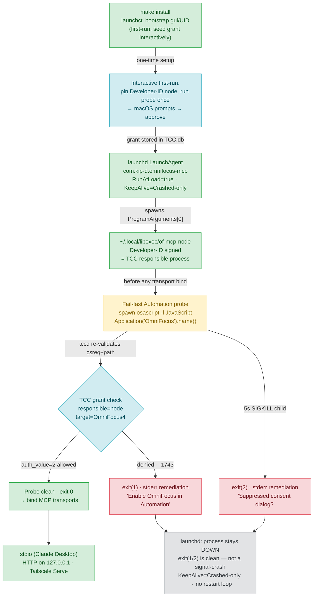

# ADR-005: Deployment Posture and Security Model

**Status:** Accepted — Supersedes ADR 001

---

## TL;DR — Deployment Flow



---

## Context

### Forces in play

This deployment targets a single user's Mac. The MCP server drives OmniFocus via `osascript`/Apple Events — a
Mac-resident, host-only execution path that cannot be containerized or cloud-hosted.

**macOS TCC Automation attribution (the load-bearing constraint)**

macOS Transparency, Consent and Control (TCC) attributes the OmniFocus Automation grant to the **responsible process** —
the binary at `ProgramArguments[0]` when running under launchd — not to the `osascript` child it spawns. The grant is
keyed to both the process path and a stored **`csreq` (designated requirement)** that TCC re-validates on every Apple
Events access.

Homebrew's `node` is **ad-hoc signed**. Its designated requirement is its cdhash — content-derived. An in-place
overwrite with a newer Homebrew node produces a different cdhash, which breaks the stored `csreq` and **revokes the
Automation grant despite an identical file path**. This was verified on the host by inspecting
`~/Library/Application Support/com.apple.TCC/TCC.db` and running `codesign -d -r-` against both a Homebrew node and a
Developer-ID (nvm/official) node.

A Developer-ID-signed node's designated requirement is **identity-based**
(`identifier "node" and anchor apple generic ... leaf[subject.OU] = HX7739G8FX`), not cdhash-based. An in-place
overwrite with a newer release from the same signer satisfies the same DR — the grant survives.

**launchd has no TCC consent UI**

Background processes under launchd receive no Automation consent dialog. A missing or revoked grant produces a silent
`-1743` (`errAEEventNotPermitted`) error. Without a fail-fast probe, the server appears to start normally while all
OmniFocus calls silently fail.

**Destructive-capable owner token on the tailnet surface**

Phase 4 placed a bearer-authenticated HTTP/Tailscale-Serve transport in service. The owner token grants full OmniFocus
write access including hard deletes. This makes "never auto-restart on denial" and "loopback-only bind" hard
requirements, not recommendations.

**macOS version caveat**

The TCC and launchd behavior documented here was verified on **macOS 26.x** (Darwin 25.x). TCC schema,
`launchd.plist(5)` semantics, and `launchctl` API are consistent with this version. Any major OS upgrade re-opens these
findings for re-verification.

---

## Decision

### D-01 · Pinned Developer-ID-signed Node at a fixed path

Pin a **Developer-ID-signed** Node binary (from the official nodejs.org `.pkg` or an nvm/official build — not Homebrew's
ad-hoc node) to `~/.local/libexec/of-mcp-node`. This path is the `ProgramArguments[0]` in the launchd plist and
therefore the TCC responsible process.

Because the Developer-ID designated requirement is identity-based (not cdhash-based), an in-place overwrite with a newer
release from the same signer preserves the DR and the TCC grant survives across upgrades without any re-grant step. The
runbook owns the one-line copy on deliberate upgrade.

| Node source        | Signing      | Designated requirement | Grant survives in-place overwrite |
| ------------------ | ------------ | ---------------------- | --------------------------------- |
| Homebrew `node`    | ad-hoc       | cdhash (content hash)  | **No** — breaks on every upgrade  |
| nvm / official pkg | Developer ID | identity-based         | **Yes** — same signer, same DR    |

### D-02 · Automation-only TCC grant — no FDA, no entitlements, no open network

The plist carries no Full Disk Access, no open-network entitlement keys, and no `UserName`/`GroupName` (those belong to
system LaunchDaemons). The only privilege requested at runtime is `kTCCServiceAppleEvents` targeting
`com.omnigroup.OmniFocus4`, Automation only.

### D-03 · Fail-fast Automation probe before any transport bind

A synchronous JXA probe (`osascript -l JavaScript -e 'Application("OmniFocus").name()'`) runs as a child of the pinned
node **before any MCP transport binds**. The probe reuses the same JXA execution path the server already uses for live
OmniFocus calls (`src/omnifocus/OmniAutomation.ts`).

| Outcome                               | Exit code | stderr message                                   |
| ------------------------------------- | --------- | ------------------------------------------------ |
| Denied (`-1743` or non-zero)          | `1`       | "Enable OmniFocus in Automation settings"        |
| Timeout (5 s, SIGKILL child)          | `2`       | "Suppressed consent dialog? Grant interactively" |
| Clean (`exit 0`, OmniFocus name back) | —         | Proceeds to bind transports                      |

The 5-second timeout via `setTimeout + proc.kill('SIGKILL')` kills the **child** `osascript` process; the **node**
parent exits via `process.exit(1/2)` — a clean exit, not a signal-induced crash.

### D-04 · KeepAlive=Crashed-only — no restart loop on permission denial

`man 5 launchd.plist` defines `Crashed=true` as "restarted as long as it exited due to a signal typically associated
with a crash (SIGILL, SIGSEGV, etc.)". `process.exit(1)` and `process.exit(2)` are clean exits, not signal crashes. A
permission denial therefore keeps the service **down** until a human intervenes — no rapid restart loop.

```
KeepAlive:
  Crashed: true
```

`SuccessfulExit` is deliberately absent — combining it with `Crashed` would restart on clean shutdown, which is the
opposite of the intended behavior.

### D-05 · launchd install via `launchctl bootstrap` / `bootout`

The modern API (`launchctl bootstrap gui/$(id-u) <plist>` / `launchctl bootout gui/$(id-u)/...`) supersedes the
deprecated `launchctl load -w` / `unload -w`. An in-repo plist template
(`deploy/launchd/com.kip-d.omnifocus-mcp.plist.tmpl`) and a `Makefile` with `install` / `uninstall` targets make
deployment one command, git-tracked, and reviewable.

### D-06 · `SessionCreate` left unset; `ProcessType=Background`

Setting `SessionCreate=true` spawns the job into a new security audit session that can break the Apple Events /
Automation responsibility chain. It is left unset. `ProcessType=Background` applies macOS background resource scheduling
— correct for a daemon not directly responding to user input.

### D-07 · Network posture carried forward from Phase 4 (not re-decided here)

These decisions were locked in Phase 4 and are documented here for completeness:

| Decision                       | Outcome                                                                                                                   | Reference |
| ------------------------------ | ------------------------------------------------------------------------------------------------------------------------- | --------- |
| Bind address default           | `127.0.0.1` (loopback only). Fail-closed startup assertion refuses any non-loopback interface.                            | D-13      |
| Remote access                  | **Tailscale Serve only, never Funnel.** Serve forwards tailnet → loopback; no public hostname.                            | D-16      |
| Cloudflare Tunnel/Access       | **Evaluated and declined.** Publishes a public hostname at Cloudflare's edge and decrypts TLS there — posture conflict.   | D-16      |
| Cloud hosting (Railway, etc.)  | **Ruled out by Mac pin.** The server drives OmniFocus via `osascript`/Apple Events; cannot run in a Linux container.      | PROJECT   |
| Runtime funnel-detection guard | **Declined.** Loopback bind + mandatory per-request bearer make a Funnel misconfiguration harmless. No fragile CLI guard. | D-17      |

### D-08 · ADR numbering and supersede chain

ADR 001 (obsidian-tasks-plugin), ADR 003 (integration-policy), and ADR 004 (OAuth amendment) live in the JessOS Obsidian
vault. Continuing at ADR-005 avoids a second numbering scheme. ADR 001 is superseded by this ADR via the Status line
above; a one-line back-reference stub
(`Superseded by ADR-005 — omnifocus-mcp repo, docs/adr/ADR-005-deployment-posture.md`) should be added to the vault copy
of ADR 001 as a manual follow-up (outside this repo).

---

## Consequences

### Positive

- **Grant survives `brew upgrade`.** A Developer-ID node's designated requirement is identity-based; an in-place
  overwrite with a newer release from the same signer leaves the TCC `csreq` intact.
- **No restart loop on permission failure.** `KeepAlive=Crashed-only` combined with `process.exit(1/2)` (clean exits,
  not signal crashes) keeps the service down on denial — a human must fix the grant before the service restarts.
- **Fail-fast, not silent degradation.** The probe fires before any transport binds; a missing grant produces a clear
  stderr message and a non-zero exit rather than a server that appears healthy but fails all OmniFocus calls.
- **Minimal TCC surface.** Automation-only grant, no FDA, no open-network entitlements. The plist carries nothing a
  `launchd` service does not need to run.
- **Least-privilege network.** Loopback-only bind + Tailscale Serve means the server is never reachable from the public
  internet; bearer auth still applies on every Tailscale request.
- **Rationale survives in version control.** This ADR lives alongside the plist and probe it governs; Cloudflare and
  Funnel declines are recorded so they are not re-litigated.

### Negative / Trade-offs

- **First-run grant must be seeded interactively.** launchd has no TCC consent UI. The install runbook must include a
  step that runs the probe once **as the pinned node binary** in an interactive terminal session so macOS prompts once
  and the user approves. Thereafter the grant persists (subject to the Developer-ID DR stability above).
- **Upgrade runbook must re-copy node from the Developer-ID source.** `brew upgrade node` does not update the pinned
  copy. The runbook documents the one-line re-copy step. Forgetting this step leaves the service running a stale node
  until the service is restarted.
- **Probe must be validated under `launchctl`, not from a terminal.** A terminal (e.g. iTerm) holds its own OmniFocus
  Automation grant; a terminal-run probe inherits it and passes even when the LaunchAgent's node is ungranted. The
  verification spike must run the probe via `launchctl kickstart` and inspect the agent's `server.err` log.
- **Findings are macOS-26.x-specific.** TCC schema, `Crashed` semantics, and `launchctl bootstrap` syntax are verified
  on macOS 26.x. A major OS upgrade re-opens all of these for re-verification.
- **Developer-ID source requirement.** Homebrew's ad-hoc node is explicitly **not** suitable as the pinned binary.
  Anyone following the runbook must use the official nodejs.org installer or nvm's builds, not a `brew install node`
  copy, for the grant-survival guarantee to hold.

---

_Recorded: 2026-06-09 | Platform: macOS 26.x | Replaces: ADR 001 (JessOS vault)_ _Back-reference follow-up: add one-line
stub to ADR 001 in JessOS vault (manual step, not a code task)_
