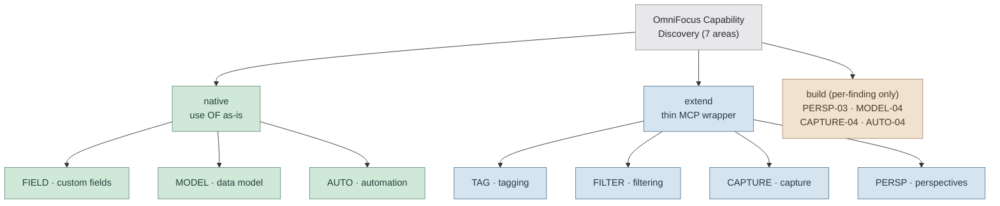

# OmniFocus Capability Discovery Report

> **Status:** Complete. All seven areas are populated and audited (Plan 04). Area-level verdicts below are final;
> per-finding `build` verdicts (PERSP-03, MODEL-04, CAPTURE-04, AUTO-04) carry the nuance within `native`/`extend`
> areas.

## TL;DR



Final area-level verdicts: **native** = FIELD, MODEL, AUTO · **extend** = TAG, FILTER, CAPTURE, PERSP. No area is
`build` at the area level — the four `build` verdicts are per-finding (DISC-PERSP-03 perspective task-resolution,
DISC-MODEL-04 cross-task dependencies, DISC-CAPTURE-04 templates, DISC-AUTO-04 plug-ins), each scoped to a later phase.

## Purpose and Scope

This report targets **OmniFocus 4.8.11 (build v185.15.0)** and documents OmniFocus native behavior across the seven
capability areas named in DISC-01: tagging, filtering, custom fields, perspectives, the project/task data model
(sequencing + dependencies, sequential vs. parallel), native capture (inbox, templates), and automation surfaces
(OmniAutomation / URL schemes / plug-ins). For each area it records a **3-way native-vs-build verdict** (DISC-02) so
downstream phases (2–6) can cite a specific finding when making a build-vs-reuse call. This phase produces
**documentation and evidence**, not feature code — the only scripts written are throwaway probes used to confirm
capability claims against the live app.

## Evidence Standard and Verdict Format

### Verdict values (D-04)

Each area's call is exactly one of:

| Verdict  | Meaning                                                               |
| -------- | --------------------------------------------------------------------- |
| `native` | Use OmniFocus as-is; no MCP logic needed beyond invoking the API.     |
| `extend` | Thin MCP wrapper over native behavior (CRUD glue, a permission gate). |
| `build`  | Genuine custom logic OmniFocus does not provide.                      |

**Single-value area-verdict rule:** each area-level verdict MUST be exactly one of `native` / `extend` / `build`. When
behavior genuinely differs across sub-claims within an area, express the nuance through separate **per-finding**
verdicts; the area-level verdict remains a single value.

### Evidence tags (D-05)

Every verdict carries a one-line rubric reason (tied to the "don't build what's already solved" principle) plus exactly
one evidence tag:

- `evidence: verified` — the claim was **LIVE-PROBED on OmniFocus 4.8.11** and the probe output is recorded in this
  report. This tag is **reserved for live probes on 4.8.11**. NEVER use it for codebase-doc citations, README
  references, or inference from existing scripts.
- `evidence: doc` — the claim is cited from official OF4 documentation, the Scripting Dictionary, or an identified
  codebase file (CLAUDE.md, SETTER-PATTERNS.md, etc.) that itself documents the behavior.
- `evidence: unverified` — the claim comes from a community post, an API omission, inference, or any other source that
  is neither a live probe nor official doc. Always accompanied by a follow-up note.

### Anchor-ID scheme (D-07)

Findings carry stable anchor IDs of the form `DISC-<AREA>-NN`, where `<AREA>` is one of **TAG / FILTER / FIELD / PERSP /
MODEL / CAPTURE / AUTO** and `NN` starts at `01` and increments sequentially within the area (one finding per distinct
capability claim). The `NN=00` slot is reserved for an area-level verdict summary if useful.

**Tombstone discipline:** if a finding is invalidated during the consistency audit (Plan 04), mark it `REMOVED` in place
— do **not** renumber. Downstream phases may already cite a DISC ID, so ID stability is the contract; renumbering would
silently break those citations.

### Finding entry template

Each finding is recorded as a header plus a five-field table:

```markdown
#### DISC-TAG-01 — <short claim title>

| Field           | Value                                              |
| --------------- | -------------------------------------------------- |
| Verdict         | native \| extend \| build                          |
| Rubric          | one-line reason tied to "don't rebuild solved"     |
| Evidence        | evidence: verified \| doc \| unverified            |
| Source          | probe script path, doc URL, or codebase file:line  |
| Downstream cite | which phase(s)/requirement(s) consume this finding |
```

---

## Tagging (TAG)

DISC-01 coverage: "tagging"

### Area Verdict

- Verdict: **extend**
- Evidence: evidence: verified (OmniJS tag-assignment path live-probed on 4.8.11)
- Rubric: OF has a complete native tag API; a thin OmniJS wrapper already exists in `mutation-script-builder.ts`. The
  agent adds only semantic conventions (tag names) and a find-or-create step — no new tag engine.

### Findings

#### DISC-TAG-01 — Tag assignment requires the OmniJS bridge (JXA silently no-ops)

| Field           | Value                                                                                              |
| --------------- | -------------------------------------------------------------------------------------------------- |
| Verdict         | extend                                                                                             |
| Rubric          | JXA `task.tags = [...]` silently no-ops; the working path is OmniJS `task.addTag(tagObject)`       |
| Evidence        | evidence: verified                                                                                 |
| Source          | Live probe `probes/disc-tag-02-addtag-omni.js` (OmniJS path); SETTER-PATTERNS.md row 6 (JXA no-op) |
| Downstream cite | Phase 2 (CAP-01, PERM-01), Phase 4 (REVIEW-01)                                                     |

The OmniJS `addTag(tagObject)` path was confirmed to assign and survive read-back on 4.8.11
(`addTagViaObjectWorks: true`, `readBackConfirmed: true`). The JXA silent-no-op half is cited from SETTER-PATTERNS.md
row 6 (not re-probed here).

#### DISC-TAG-02 — `addTag()` does not auto-create from a string; a Tag object is required

| Field           | Value                                                                                        |
| --------------- | -------------------------------------------------------------------------------------------- |
| Verdict         | extend                                                                                       |
| Rubric          | Passing a string to `addTag()` throws; MCP must find-or-create (`new Tag(name, null)`) first |
| Evidence        | evidence: verified                                                                           |
| Source          | Live probe `probes/disc-tag-01-auto-create.js`                                               |
| Downstream cite | Phase 2 tag management (PERM-01)                                                             |

Resolves research assumption **A3**: `task.addTag(<string>)` raises `Task.addTag argument "tag" requires [a Tag object]`
and does NOT auto-create the tag. The agent layer must resolve or create the `Tag` object before assignment (the
existing `mutation-script-builder.ts` find-or-create pattern already does this).

#### DISC-TAG-03 — Tags are hierarchical first-class objects

| Field           | Value                                                                                                              |
| --------------- | ------------------------------------------------------------------------------------------------------------------ |
| Verdict         | native                                                                                                             |
| Rubric          | `Tag` class (name/id/parent/children/tasks) is complete; nested tags supported natively                            |
| Evidence        | evidence: doc                                                                                                      |
| Source          | omni-automation.com/omnifocus/tag.html; codebase `tag-mutation-script-builder.ts`                                  |
| Downstream cite | Phase 4 (REVIEW-01/02) and Phase 5 (ARCH-03) — agent tags (agent-okay, review-output, archaeology) are conventions |

Agent-workflow tags are conventional names over the native tag model; no OF extension required.

<!-- DISC-TAG sanitized probe evidence (counts / booleans / probe-created names only; no live-DB names) -->

| Probe                        | Timestamp (UTC)   | Sanitized result                                                                        | Cleanup        | OF build |
| ---------------------------- | ----------------- | --------------------------------------------------------------------------------------- | -------------- | -------- |
| `disc-tag-01-auto-create.js` | 2026-06-11T20:27Z | tagAutoCreateFromString=false (string throws); addTagViaObjectWorks=true; readBack=true | cleanedUp=true | 185.15   |
| `disc-tag-02-addtag-omni.js` | 2026-06-11T20:27Z | addTagViaObjectWorks=true; readBackConfirmed=true                                       | cleanedUp=true | 185.15   |

---

## Filtering (FILTER)

DISC-01 coverage: "filtering"

### Area Verdict

- Verdict: **extend**
- Evidence: evidence: doc (codebase query-alternatives + AST query compiler)
- Rubric: OF filtering is imperative OmniJS iteration; the AST query compiler already wraps it. No new build needed.

### Findings

#### DISC-FILTER-01 — Targeted collections avoid full scans for scoped queries

| Field           | Value                                                                                 |
| --------------- | ------------------------------------------------------------------------------------- |
| Verdict         | native                                                                                |
| Rubric          | `inbox`, `tag.remainingTasks`, `project.flattenedTasks` are direct scoped collections |
| Evidence        | evidence: doc                                                                         |
| Source          | docs/OMNIFOCUS_QUERY_ALTERNATIVES.md (codebase doc citation, not a live probe)        |
| Downstream cite | Phase 3 routing (ROUTE-01)                                                            |

#### DISC-FILTER-02 — `.whose()` / `.where()` is forbidden in this codebase

| Field           | Value                                                                    |
| --------------- | ------------------------------------------------------------------------ |
| Verdict         | native                                                                   |
| Rubric          | OF exposes `.whose()` but it is too slow/unreliable; repo policy bans it |
| Evidence        | evidence: doc                                                            |
| Source          | CLAUDE.md (Quick Symptom Index); docs/OMNIFOCUS_QUERY_ALTERNATIVES.md    |
| Downstream cite | All phases that query tasks                                              |

Native capability exists but is unusable at the project's performance bar; enforced at the CLAUDE.md level. Queries
iterate OmniJS collections instead.

#### DISC-FILTER-03 — Date/flag combined filtering requires a `flattenedTasks` linear scan

| Field           | Value                                                                                     |
| --------------- | ----------------------------------------------------------------------------------------- |
| Verdict         | extend                                                                                    |
| Rubric          | No server-side date-range API; combined predicates need an in-process scan + wrapper      |
| Evidence        | evidence: doc                                                                             |
| Source          | docs/OMNIFOCUS_QUERY_ALTERNATIVES.md; existing AST query compiler in `src/contracts/ast/` |
| Downstream cite | Phase 4 review / today-view filtering                                                     |

---

## Custom Fields (FIELD)

DISC-01 coverage: "custom fields"

### Area Verdict

- Verdict: **native**
- Evidence: evidence: doc
- Rubric: `task.note` plus the native structured fields handle every agent custom-data need; no build required.

### Findings

#### DISC-FIELD-01 — `task.note` is the custom-data extension point

| Field           | Value                                                                                       |
| --------------- | ------------------------------------------------------------------------------------------- |
| Verdict         | native                                                                                      |
| Rubric          | OF has no first-class custom fields; `task.note` is the intended free-form/JSON surface     |
| Evidence        | evidence: doc                                                                               |
| Source          | omni-automation.com/omnifocus/task.html; codebase `mutation-script-builder.ts` (note write) |
| Downstream cite | Phase 2 (LINE-01 session lineage), Phase 5 (ARCH-03 archaeology)                            |

The note round-trip was additionally live-exercised by `disc-capture-01` (`notePersisted: true`; see the MODEL evidence
appendix). The agent stores session lineage as a structured prefix in `task.note`.

#### DISC-FIELD-02 — Structured native fields cover scheduling metadata

| Field           | Value                                                                                                     |
| --------------- | --------------------------------------------------------------------------------------------------------- |
| Verdict         | native                                                                                                    |
| Rubric          | `estimatedMinutes`, defer/due/completion dates, `flagged`, `plannedDate` (v4.7+), `taskStatus` are native |
| Evidence        | evidence: doc                                                                                             |
| Source          | omni-automation.com/omnifocus/task.html (plannedDate noted v4.7+; available on 4.8.11 by version)         |
| Downstream cite | Phase 3 (task routing metadata)                                                                           |

#### DISC-FIELD-03 — OmniFocus has no first-class custom fields

| Field           | Value                                                                       |
| --------------- | --------------------------------------------------------------------------- |
| Verdict         | native                                                                      |
| Rubric          | Custom fields would require a build; the note field is the accepted pattern |
| Evidence        | evidence: doc                                                               |
| Source          | discourse.omnigroup.com/t/custom-fields (community confirmation of absence) |
| Downstream cite | Any phase tempted to add structured per-task metadata                       |

---

## Data Model (MODEL)

DISC-01 coverage: "the project/task data model (sequencing + dependencies — sequential vs. parallel)"

### Area Verdict

- Verdict: **native**
- Evidence: evidence: verified (project.sequential write-back live-probed on 4.8.11)
- Rubric: The OF data model is fully native; the setter-pattern wrappers (DISC-MODEL-05) are thin and already exist in
  `mutation-script-builder.ts`.

### Findings

#### DISC-MODEL-01 — `project.sequential` controls task availability and persists on write-back

| Field           | Value                                                                     |
| --------------- | ------------------------------------------------------------------------- |
| Verdict         | native                                                                    |
| Rubric          | Direct scalar assignment (SETTER row 4); toggle true→false both read back |
| Evidence        | evidence: verified                                                        |
| Source          | Live probe `probes/disc-model-01-sequential-write.js`                     |
| Downstream cite | Phase 3 (ROUTE-03 project creation with sequential flag)                  |

#### DISC-MODEL-02 — `task.taskStatus` exposes a native status enum

| Field           | Value                                                                                       |
| --------------- | ------------------------------------------------------------------------------------------- |
| Verdict         | native                                                                                      |
| Rubric          | Available / Blocked / Completed / Dropped / DueSoon / Next / Overdue are native enum values |
| Evidence        | evidence: doc                                                                               |
| Source          | omni-automation.com/omnifocus/task.html                                                     |
| Downstream cite | Phase 3 routing (available-task detection)                                                  |

#### DISC-MODEL-03 — Sequential project ordering is the only built-in dependency mechanism

| Field           | Value                                                               |
| --------------- | ------------------------------------------------------------------- |
| Verdict         | native                                                              |
| Rubric          | Sequential projects cover the agent-workflow ordering need natively |
| Evidence        | evidence: doc                                                       |
| Source          | omni-automation.com/omnifocus/project.html                          |
| Downstream cite | Phase 3 (ROUTE-01)                                                  |

#### DISC-MODEL-04 — No native cross-project task dependency system

| Field           | Value                                                                                              |
| --------------- | -------------------------------------------------------------------------------------------------- |
| Verdict         | build                                                                                              |
| Rubric          | Don't build cross-task dependencies for this milestone; if needed later, use the community plug-in |
| Evidence        | evidence: doc                                                                                      |
| Source          | github.com/ksalzke/dependency-omnifocus-plugin (exists because OF lacks native dependencies)       |
| Downstream cite | Phase 3 only if cross-task dependency surfaces (not in current milestone scope)                    |

#### DISC-MODEL-05 — Typed-class setters need wrapper patterns (repetitionRule, reviewInterval)

| Field           | Value                                                                                                 |
| --------------- | ----------------------------------------------------------------------------------------------------- |
| Verdict         | extend                                                                                                |
| Rubric          | `repetitionRule` needs P2 (`new Task.RepetitionRule`), `reviewInterval` needs P4 read-modify-reassign |
| Evidence        | evidence: doc                                                                                         |
| Source          | docs/dev/SETTER-PATTERNS.md rows 1–2                                                                  |
| Downstream cite | Phase 2 if recurrence is set on captured tasks                                                        |

This is a per-finding `extend` verdict; the MODEL area-level verdict stays `native` because the wrappers already exist
in `mutation-script-builder.ts`.

#### DISC-MODEL-06 — `moveTasks()` relocates tasks between projects natively

| Field           | Value                                                                |
| --------------- | -------------------------------------------------------------------- |
| Verdict         | native                                                               |
| Rubric          | `moveTasks([task], destination)` is the native OmniJS relocation API |
| Evidence        | evidence: doc                                                        |
| Source          | omni-automation.com (moveTasks)                                      |
| Downstream cite | Phase 3 (ROUTE-01 task filing)                                       |

<!-- DISC-MODEL / DISC-CAPTURE sanitized probe evidence (counts / booleans / probe-created names only; no live-DB names) -->

| Probe                                     | Timestamp (UTC)   | Sanitized result                                                                  | Cleanup                                                                                  | OF build |
| ----------------------------------------- | ----------------- | --------------------------------------------------------------------------------- | ---------------------------------------------------------------------------------------- | -------- |
| `disc-model-01-sequential-write.js`       | 2026-06-11T20:30Z | initialWrite=true; readBack1=true; writeBack=true; readBack2=true; persisted=true | cleanedUp=true (Project.Status.Dropped — non-destructive; probe project remains dropped) | 185.15   |
| `disc-capture-01-inbox-note-roundtrip.js` | 2026-06-11T20:30Z | taskCreated=true; notePersisted=true; inboxReflectsImmediately=true               | cleanedUp=true (deleteObject)                                                            | 185.15   |

> `disc-capture-01` also supplies CAPTURE-area evidence (inbox immediacy + note round-trip) for **Plan 03's
> DISC-CAPTURE-01** finding, which will cite this same probe run.

---

## Perspectives (PERSP)

DISC-01 coverage: "perspectives"

### Area Verdict

- Verdict: **extend**
- Evidence: evidence: verified (Perspective.Custom.all enumeration + archivedFilterRules in-session write live-probed on
  4.8.11)
- Rubric: Perspective list/read is already implemented and `archivedFilterRules` write is available for repair;
  task-resolution (DISC-PERSP-03) is `build` but scoped to Phase 6 only.

### Findings

#### DISC-PERSP-01 — `archivedFilterRules` is read/write and persists across an OmniFocus restart

| Field           | Value                                                                                                      |
| --------------- | ---------------------------------------------------------------------------------------------------------- |
| Verdict         | extend                                                                                                     |
| Rubric          | JSON rule archive (OF 4.2+) is writable; MCP wraps backup→write→restore for safe repair                    |
| Evidence        | evidence: verified (in-session write + read-back AND cross-restart persistence — both confirmed on 4.8.11) |
| Source          | Live probe `probes/disc-persp-01-filter-rules-persist.js` (Option A: disposable test perspective)          |
| Downstream cite | Phase 6 (PROV-01 — perspective repair)                                                                     |

**Resolution (cross-restart, Plan 04 human checkpoint):** Both dimensions are now confirmed. In-session, the probe
showed the write API accepts the call and round-trips (`writeAccepted: true`, `immediateReadBackMatch: true`,
`originalRestored: true`). For cross-restart, a filter-rule change was written to `disc-probe-test-perspective`,
OmniFocus was fully quit (Cmd-Q) and reopened, and the rules were read back: the change **persisted** (baseline
`archivedFilterRules` length 70 → 93 after restart; signature changed). Phase 6 PROV-01 can rely on
`archivedFilterRules` writes surviving app restarts on 4.8.11.

#### DISC-PERSP-02 — `Perspective.Custom.all` enumerates user custom perspectives

| Field           | Value                                                                          |
| --------------- | ------------------------------------------------------------------------------ |
| Verdict         | native                                                                         |
| Rubric          | `Perspective.Custom.all` plus `byName()` / `byIdentifier()` are native lookups |
| Evidence        | evidence: verified                                                             |
| Source          | Live probe `probes/disc-persp-02-custom-all-enumerate.js`                      |
| Downstream cite | Phase 6 (READAS-01, PROV-01)                                                   |

The probe enumerated the custom-perspective collection and checked for a "JessOS" perspective: **not present yet**
(`jessosFound: false`) — expected, since JessOS is provisioned in Phase 6.

#### DISC-PERSP-03 — No `perspective.tasks` / `matchingTasks` API (task resolution must be built)

| Field           | Value                                                                                           |
| --------------- | ----------------------------------------------------------------------------------------------- |
| Verdict         | build                                                                                           |
| Rubric          | No direct API; READAS-01 requires building a filter-rule interpreter over `archivedFilterRules` |
| Evidence        | evidence: doc                                                                                   |
| Source          | omni-automation.com/omnifocus/perspective.html (property absent)                                |
| Downstream cite | Phase 6 (READAS-01)                                                                             |

The underlying data (`archivedFilterRules`) is native, but the task-resolution _operation_ is not surfaced natively —
hence `build`. The agent must replicate the perspective's filter logic as OmniJS predicates against `flattenedTasks`.

#### DISC-PERSP-04 — Custom perspectives cannot be created programmatically (repair is native)

| Field           | Value                                                                                          |
| --------------- | ---------------------------------------------------------------------------------------------- |
| Verdict         | native                                                                                         |
| Rubric          | Writing `archivedFilterRules` on an existing perspective is the native repair path             |
| Evidence        | evidence: doc                                                                                  |
| Source          | omni-automation.com (no `Perspective.Custom` constructor)                                      |
| Downstream cite | Phase 6 (PROV-01 — "provision or repair": repair is implementable; create-from-scratch is not) |

`Perspective.Custom` has no constructor — create-from-scratch is not supported (it requires the OmniFocus UI, as
exercised in this plan's checkpoint). PROV-01 maps to the supported _repair_ path.

<!-- DISC-PERSP sanitized probe evidence (counts / booleans / identifiers / probe-target name only; no real perspective names) -->

| Probe                                   | Timestamp (UTC)   | Sanitized result                                                                    | Cleanup                           | OF build |
| --------------------------------------- | ----------------- | ----------------------------------------------------------------------------------- | --------------------------------- | -------- |
| `disc-persp-02-custom-all-enumerate.js` | 2026-06-11T20:34Z | customPerspectiveCount=18; jessosFound=false (read-only)                            | n/a (read-only)                   | 185.15   |
| `disc-persp-01-filter-rules-persist.js` | 2026-06-12T00:12Z | target=disc-probe-test-perspective; writeAccepted=true; immediateReadBackMatch=true | originalRestored=true             | 185.15   |
| cross-restart cycle (manual, Plan 04)   | 2026-06-12T00:4xZ | rules length 70→93 across Cmd-Q + reopen; baselineSig 413facb3→5743312c             | persisted=true (UI rule retained) | 185.15   |

---

## Capture (CAPTURE)

DISC-01 coverage: "native capture workflows (inbox, templates)"

### Area Verdict

- Verdict: **extend**
- Evidence: evidence: verified (inbox `new Task()` + note round-trip live-probed in Plan 02)
- Rubric: Inbox creation is native via OmniJS; the permission gate (PERM-01/02) and lineage stamping (LINE-01) are thin
  agent-layer additions. No template system exists.

### Findings

#### DISC-CAPTURE-01 — OmniJS `new Task(name, inbox)` is the MCP capture path

| Field           | Value                                                                                               |
| --------------- | --------------------------------------------------------------------------------------------------- |
| Verdict         | extend                                                                                              |
| Rubric          | Inbox creation is native; the permission gate + lineage stamp are thin agent additions              |
| Evidence        | evidence: verified                                                                                  |
| Source          | Live probe `probes/disc-capture-01-inbox-note-roundtrip.js` (Plan 02 — see MODEL evidence appendix) |
| Downstream cite | Phase 2 (CAP-01, LINE-01)                                                                           |

Cross-referenced from Plan 02: `taskCreated: true`, `notePersisted: true`, `inboxReflectsImmediately: true` (not re-run
here). All OmniJS task properties (note, tags, dates, flagged) are settable in the same creation script.

#### DISC-CAPTURE-02 — URL scheme `omnifocus:///add` is a one-way external capture path

| Field           | Value                                                                                |
| --------------- | ------------------------------------------------------------------------------------ |
| Verdict         | extend                                                                               |
| Rubric          | Alternate capture for external triggers; one-way write only (cannot read back)       |
| Evidence        | evidence: doc                                                                        |
| Source          | inside.omnifocus.com/url-schemes (name/note/project/tags/defer/due/flag/repeat-rule) |
| Downstream cite | Phase 3 if external webhooks drive routing triggers                                  |

#### DISC-CAPTURE-03 — Native user-facing capture surfaces are out of MCP scope

| Field           | Value                                                                                        |
| --------------- | -------------------------------------------------------------------------------------------- |
| Verdict         | native                                                                                       |
| Rubric          | Quick Entry / Clippings / Mail Drop / Share sheet are solved natively; MCP needn't replicate |
| Evidence        | evidence: doc                                                                                |
| Source          | support.omnigroup.com/documentation/omnifocus (capture methods)                              |
| Downstream cite | none (out of agent scope)                                                                    |

#### DISC-CAPTURE-04 — No built-in template system via OmniJS

| Field           | Value                                                                                                    |
| --------------- | -------------------------------------------------------------------------------------------------------- |
| Verdict         | build                                                                                                    |
| Rubric          | If templates are needed they must be custom; `omnifocus:///paste` (TaskPaper) is the nearest native path |
| Evidence        | evidence: unverified                                                                                     |
| Source          | No template API found in official docs or Context7 (absence not definitively proven)                     |
| Downstream cite | Phase 2 if capture needs template-driven task creation                                                   |

**Follow-up note:** Absence of a template API is inferred from missing documentation, not proven. Low priority for Phase
1 scope; re-examine if Phase 2 needs structured task templates.

---

## Automation Surfaces (AUTO)

DISC-01 coverage: "automation surfaces (OmniAutomation / URL schemes / plug-ins)"

### Area Verdict

- Verdict: **native**
- Evidence: evidence: doc
- Rubric: OmniJS is the right surface for all agent operations; JXA is a necessary but minimal outer wrapper; URL
  schemes cover external-trigger use cases.

### Findings

#### DISC-AUTO-01 — OmniJS (via `evaluateJavascript`) is the primary automation surface

| Field           | Value                                                                                |
| --------------- | ------------------------------------------------------------------------------------ |
| Verdict         | native                                                                               |
| Rubric          | OmniJS has full read/write access to the OF data model; MCP relies on it exclusively |
| Evidence        | evidence: doc                                                                        |
| Source          | docs/dev/JXA-VS-OMNIJS-PATTERNS.md, CLAUDE.md (established codebase pattern)         |
| Downstream cite | All phases                                                                           |

#### DISC-AUTO-02 — JXA / AppleScript is a minimal outer wrapper (legacy/sunset)

| Field           | Value                                                                                   |
| --------------- | --------------------------------------------------------------------------------------- |
| Verdict         | extend                                                                                  |
| Rubric          | JXA outer only passes scripts to OmniJS; never used for direct property access          |
| Evidence        | evidence: doc                                                                           |
| Source          | docs/dev/JXA-VS-OMNIJS-PATTERNS.md (JXA sunset; `Can't convert types` on direct access) |
| Downstream cite | All phases (JXA is the osascript entry point but holds no logic)                        |

#### DISC-AUTO-03 — URL schemes are a one-way write / navigation path

| Field           | Value                                                                              |
| --------------- | ---------------------------------------------------------------------------------- |
| Verdict         | native                                                                             |
| Rubric          | `///add`, `///paste`, `/perspective/[name]`, x-callback-url; cannot read data back |
| Evidence        | evidence: doc                                                                      |
| Source          | inside.omnifocus.com/url-schemes                                                   |
| Downstream cite | Phase 3 (TRIG-01) if a manual trigger uses a URL scheme; Phase 6 navigation        |

#### DISC-AUTO-04 — Omni Automation plug-ins are not invocable from MCP background context

| Field           | Value                                                                                 |
| --------------- | ------------------------------------------------------------------------------------- |
| Verdict         | build                                                                                 |
| Rubric          | Plug-in invocation needs OF foreground + selection; not applicable to agent-layer ops |
| Evidence        | evidence: unverified                                                                  |
| Source          | RESEARCH.md Assumptions Log A2 (invocation model; not probed)                         |
| Downstream cite | Phase 6 (PROV-01) only if the `archivedFilterRules` path proves insufficient          |

**Follow-up note:** Plug-in invocability from a background osascript context is assumed-unavailable, not probed. The
current PROV-01 path uses `archivedFilterRules` writes, which do not need a plug-in. Probe only if a downstream phase
requires plug-in invocation.

#### DISC-AUTO-05 — Apple Shortcuts actions exist but are off the MCP execution path

| Field           | Value                                                                                        |
| --------------- | -------------------------------------------------------------------------------------------- |
| Verdict         | native                                                                                       |
| Rubric          | OF 4.5 added Get Action/Project/Perspective/Tag Shortcuts; MCP uses osascript, not Shortcuts |
| Evidence        | evidence: doc                                                                                |
| Source          | mjtsai.com/blog/2024/12/11/omnifocus-4-5/ (cited in RESEARCH.md)                             |
| Downstream cite | none for MCP; potentially Phase 3 if manual triggers via Shortcuts are requested             |

### Automation Surfaces: Fit Assessment (D-08)

Fit of each automation surface against this milestone's actual needs:

| Surface                | Agent Capture (CAP-01)          | Routing Writes (ROUTE-01..04) | Perspective Provisioning (PROV-01) | MCP Server Basis       |
| ---------------------- | ------------------------------- | ----------------------------- | ---------------------------------- | ---------------------- |
| OmniJS (via osascript) | Primary path                    | Primary path                  | Required (`archivedFilterRules`)   | All current operations |
| URL schemes            | Possible alternate (external)   | Not suitable (no reads)       | Not suitable                       | Not currently used     |
| Plug-ins               | Not suitable (needs foreground) | Not suitable                  | Not suitable (unverified — A2)     | Not used               |
| Apple Shortcuts        | Not suitable (MCP context)      | Not suitable                  | Not suitable                       | Not used               |

**Read:** every milestone operation routes through OmniJS. URL schemes are the only viable _alternate_, and only for
external one-way capture triggers. Plug-ins and Shortcuts are out for agent-layer work.

<!-- WAVE-0-HARNESS-CHECK -->
<!--
Wave 0 probe-harness warmup — sanitized evidence (counts / booleans / exit status only; NO task,
project, or perspective names per threat T-01-03). Confirms probes produce valid evidence before
any finding is marked `evidence: verified`.

| Check               | Command                                                                        | Result                                                                  |
| ------------------- | ------------------------------------------------------------------------------ | ----------------------------------------------------------------------- |
| Build               | npm run build (tsc)                                                             | pass — dist/index.js present, no type errors                            |
| Discovery utilities | osascript -l JavaScript docs/jxa-test-utilities.js                             | exit 0 — 7 collections enumerated, no exception thrown                   |
| Perspective harness | osascript -l JavaScript tests/manual/perspectives/test-perspectives-simple.js  | exit 0 — OmniJS Perspective.all returned 25 perspectives (count only)   |

Run timestamp (UTC): 2026-06-11T20:15Z
OmniFocus version: 4.8.11 (build v185.15.0) — user-declared target per D-01; not emitted by these probes.

Notes:
- jxa-test-utilities.js: exit 0; structured output present (7 collection-count lines); zero exceptions.
- test-perspectives-simple.js: exit 0. The OmniJS path (Perspective.all via evaluateJavascript) returned
  25 perspectives cleanly. The JXA fallback sub-path window.perspective() raised a non-fatal
  "Can't convert types" error (expected JXA limitation per docs/dev/JXA-VS-OMNIJS-PATTERNS.md), which
  reinforces OmniJS-first: evidence:verified probes in Plans 02-03 must use the OmniJS bridge, not JXA
  direct property access.
- No user-visible names, task content, or perspective names appear in this block.
-->

<!-- AUDIT-LOG (Plan 04, Task 1 — consistency audit of the finalized report)
Date: 2026-06-12 · OF build: 185.15
Findings reviewed: 28 across 7 area codes (TAG 3, FILTER 3, FIELD 3, PERSP 4, MODEL 6, CAPTURE 4, AUTO 5).
Result: structurally sound. Fixes applied this pass:
  1. TL;DR Mermaid refreshed to final area-level verdicts: native = FIELD/MODEL/AUTO; extend = TAG/FILTER/CAPTURE/PERSP.
     PERSP moved from the provisional "build" bucket to "extend"; "build" is now a per-finding-only node
     (PERSP-03, MODEL-04, CAPTURE-04, AUTO-04). PERSP footnote replaced with the final-verdict statement.
  2. Header status note changed from "Scaffold only / provisional" to "Complete / final".
  3. DISC-TAG-03 Downstream cite strengthened to also name Phase 5 (ARCH-03) — closes a thin Phase-5 citation
     gap (Phase 5 was previously cited only by DISC-FIELD-01).
Checks passed (no fix needed):
  - Zero slash-combined verdicts; every finding carries a single-value verdict + rubric + evidence + source + cite.
  - Evidence discipline: evidence:verified only where a sanitized probe appendix is recorded in-report;
    evidence:doc for codebase/official-doc citations. At audit time 3 findings were evidence:unverified
    (PERSP-01 cross-restart, CAPTURE-04 templates, AUTO-04 plug-ins), each with a follow-up note — no silent gaps.
    (PERSP-01 cross-restart was subsequently resolved to evidence:verified in Task 3, leaving 2 accepted gaps.)
  - Downstream citation coverage: Phase 2 (CAPTURE-01/FIELD-01/TAG-01-02), Phase 3 (MODEL-06/FILTER-01/TAG-02),
    Phase 4 (TAG-01/03), Phase 5 (TAG-03/FIELD-01), Phase 6 (PERSP-01/02/03/04).
  - No findings invalidated; no tombstones required.
Open BUILD-DECISION gate carried to the Task 2 human checkpoint: DISC-PERSP-01 archivedFilterRules cross-restart
  persistence (gates Phase 6 PROV-01) — resolved by the manual quit-reopen-read cycle.
-->
