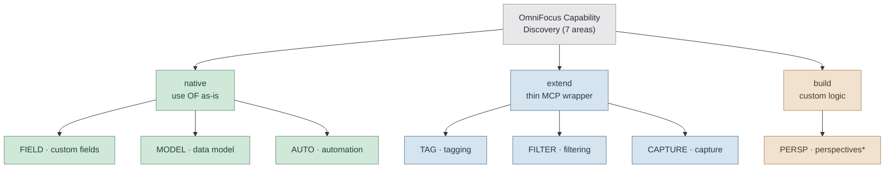

# OmniFocus Capability Discovery Report

> **Status:** Scaffold only. Findings are populated in Plans 02–03 and audited in Plan 04. Area-level verdicts shown in
> the TL;DR below are **provisional** until each finding lands.

## TL;DR



\* PERSP is mixed: list/read is `extend`, filter-rule write is `native` (pending probe), and perspective task-resolution
is `build`. The diagram places it under its most distinctive verdict; per-finding verdicts carry the real nuance. This
diagram is approximate and is refreshed in Plan 04 once all findings are recorded.

## Purpose and Scope

This report targets **OmniFocus 4.8.11 (build v185.15.0)** and documents OmniFocus native behavior across the seven
capability areas named in DISC-01: tagging, filtering, custom fields, perspectives, the project/task data model
(sequencing + dependencies, sequential vs. parallel), native capture (inbox, templates), and automation surfaces
(OmniAutomation / URL schemes / plug-ins). For each area it records a **3-way native-vs-build verdict** (DISC-02) so
downstream phases (2–6) can cite a specific finding when making a build-vs-reuse call. This phase produces
**documentation and evidence**, not feature code — the only scripts written are throwaway probes used to confirm
capability claims against the live app.

## Evidence Standard and Verdict Format

### Verdict values (D-04)

Each area's call is exactly one of:

| Verdict  | Meaning                                                               |
| -------- | --------------------------------------------------------------------- |
| `native` | Use OmniFocus as-is; no MCP logic needed beyond invoking the API.     |
| `extend` | Thin MCP wrapper over native behavior (CRUD glue, a permission gate). |
| `build`  | Genuine custom logic OmniFocus does not provide.                      |

**Single-value area-verdict rule:** each area-level verdict MUST be exactly one of `native` / `extend` / `build`. When
behavior genuinely differs across sub-claims within an area, express the nuance through separate **per-finding**
verdicts; the area-level verdict remains a single value.

### Evidence tags (D-05)

Every verdict carries a one-line rubric reason (tied to the "don't build what's already solved" principle) plus exactly
one evidence tag:

- `evidence: verified` — the claim was **LIVE-PROBED on OmniFocus 4.8.11** and the probe output is recorded in this
  report. This tag is **reserved for live probes on 4.8.11**. NEVER use it for codebase-doc citations, README
  references, or inference from existing scripts.
- `evidence: doc` — the claim is cited from official OF4 documentation, the Scripting Dictionary, or an identified
  codebase file (CLAUDE.md, SETTER-PATTERNS.md, etc.) that itself documents the behavior.
- `evidence: unverified` — the claim comes from a community post, an API omission, inference, or any other source that
  is neither a live probe nor official doc. Always accompanied by a follow-up note.

### Anchor-ID scheme (D-07)

Findings carry stable anchor IDs of the form `DISC-<AREA>-NN`, where `<AREA>` is one of **TAG / FILTER / FIELD / PERSP /
MODEL / CAPTURE / AUTO** and `NN` starts at `01` and increments sequentially within the area (one finding per distinct
capability claim). The `NN=00` slot is reserved for an area-level verdict summary if useful.

**Tombstone discipline:** if a finding is invalidated during the consistency audit (Plan 04), mark it `REMOVED` in place
— do **not** renumber. Downstream phases may already cite a DISC ID, so ID stability is the contract; renumbering would
silently break those citations.

### Finding entry template

Each finding is recorded as a header plus a five-field table:

```markdown
#### DISC-TAG-01 — <short claim title>

| Field           | Value                                              |
| --------------- | -------------------------------------------------- |
| Verdict         | native \| extend \| build                          |
| Rubric          | one-line reason tied to "don't rebuild solved"     |
| Evidence        | evidence: verified \| doc \| unverified            |
| Source          | probe script path, doc URL, or codebase file:line  |
| Downstream cite | which phase(s)/requirement(s) consume this finding |
```

---

## Tagging (TAG)

DISC-01 coverage: "tagging"

### Area Verdict

- Verdict: **extend**
- Evidence: evidence: verified (OmniJS tag-assignment path live-probed on 4.8.11)
- Rubric: OF has a complete native tag API; a thin OmniJS wrapper already exists in `mutation-script-builder.ts`. The
  agent adds only semantic conventions (tag names) and a find-or-create step — no new tag engine.

### Findings

#### DISC-TAG-01 — Tag assignment requires the OmniJS bridge (JXA silently no-ops)

| Field           | Value                                                                                              |
| --------------- | -------------------------------------------------------------------------------------------------- |
| Verdict         | extend                                                                                             |
| Rubric          | JXA `task.tags = [...]` silently no-ops; the working path is OmniJS `task.addTag(tagObject)`       |
| Evidence        | evidence: verified                                                                                 |
| Source          | Live probe `probes/disc-tag-02-addtag-omni.js` (OmniJS path); SETTER-PATTERNS.md row 6 (JXA no-op) |
| Downstream cite | Phase 2 (CAP-01, PERM-01), Phase 4 (REVIEW-01)                                                     |

The OmniJS `addTag(tagObject)` path was confirmed to assign and survive read-back on 4.8.11
(`addTagViaObjectWorks: true`, `readBackConfirmed: true`). The JXA silent-no-op half is cited from SETTER-PATTERNS.md
row 6 (not re-probed here).

#### DISC-TAG-02 — `addTag()` does not auto-create from a string; a Tag object is required

| Field           | Value                                                                                        |
| --------------- | -------------------------------------------------------------------------------------------- |
| Verdict         | extend                                                                                       |
| Rubric          | Passing a string to `addTag()` throws; MCP must find-or-create (`new Tag(name, null)`) first |
| Evidence        | evidence: verified                                                                           |
| Source          | Live probe `probes/disc-tag-01-auto-create.js`                                               |
| Downstream cite | Phase 2 tag management (PERM-01)                                                             |

Resolves research assumption **A3**: `task.addTag(<string>)` raises `Task.addTag argument "tag" requires [a Tag object]`
and does NOT auto-create the tag. The agent layer must resolve or create the `Tag` object before assignment (the
existing `mutation-script-builder.ts` find-or-create pattern already does this).

#### DISC-TAG-03 — Tags are hierarchical first-class objects

| Field           | Value                                                                                        |
| --------------- | -------------------------------------------------------------------------------------------- |
| Verdict         | native                                                                                       |
| Rubric          | `Tag` class (name/id/parent/children/tasks) is complete; nested tags supported natively      |
| Evidence        | evidence: doc                                                                                |
| Source          | omni-automation.com/omnifocus/tag.html; codebase `tag-mutation-script-builder.ts`            |
| Downstream cite | Phase 4 (REVIEW-01/02) — agent tags (agent-okay, review-output, archaeology) are conventions |

Agent-workflow tags are conventional names over the native tag model; no OF extension required.

<!-- DISC-TAG sanitized probe evidence (counts / booleans / probe-created names only; no live-DB names) -->

| Probe                        | Timestamp (UTC)   | Sanitized result                                                                        | Cleanup        | OF build |
| ---------------------------- | ----------------- | --------------------------------------------------------------------------------------- | -------------- | -------- |
| `disc-tag-01-auto-create.js` | 2026-06-11T20:27Z | tagAutoCreateFromString=false (string throws); addTagViaObjectWorks=true; readBack=true | cleanedUp=true | 185.15   |
| `disc-tag-02-addtag-omni.js` | 2026-06-11T20:27Z | addTagViaObjectWorks=true; readBackConfirmed=true                                       | cleanedUp=true | 185.15   |

---

## Filtering (FILTER)

DISC-01 coverage: "filtering"

### Area Verdict

- Verdict: **extend**
- Evidence: evidence: doc (codebase query-alternatives + AST query compiler)
- Rubric: OF filtering is imperative OmniJS iteration; the AST query compiler already wraps it. No new build needed.

### Findings

#### DISC-FILTER-01 — Targeted collections avoid full scans for scoped queries

| Field           | Value                                                                                 |
| --------------- | ------------------------------------------------------------------------------------- |
| Verdict         | native                                                                                |
| Rubric          | `inbox`, `tag.remainingTasks`, `project.flattenedTasks` are direct scoped collections |
| Evidence        | evidence: doc                                                                         |
| Source          | docs/OMNIFOCUS_QUERY_ALTERNATIVES.md (codebase doc citation, not a live probe)        |
| Downstream cite | Phase 3 routing (ROUTE-01)                                                            |

#### DISC-FILTER-02 — `.whose()` / `.where()` is forbidden in this codebase

| Field           | Value                                                                    |
| --------------- | ------------------------------------------------------------------------ |
| Verdict         | native                                                                   |
| Rubric          | OF exposes `.whose()` but it is too slow/unreliable; repo policy bans it |
| Evidence        | evidence: doc                                                            |
| Source          | CLAUDE.md (Quick Symptom Index); docs/OMNIFOCUS_QUERY_ALTERNATIVES.md    |
| Downstream cite | All phases that query tasks                                              |

Native capability exists but is unusable at the project's performance bar; enforced at the CLAUDE.md level. Queries
iterate OmniJS collections instead.

#### DISC-FILTER-03 — Date/flag combined filtering requires a `flattenedTasks` linear scan

| Field           | Value                                                                                     |
| --------------- | ----------------------------------------------------------------------------------------- |
| Verdict         | extend                                                                                    |
| Rubric          | No server-side date-range API; combined predicates need an in-process scan + wrapper      |
| Evidence        | evidence: doc                                                                             |
| Source          | docs/OMNIFOCUS_QUERY_ALTERNATIVES.md; existing AST query compiler in `src/contracts/ast/` |
| Downstream cite | Phase 4 review / today-view filtering                                                     |

---

## Custom Fields (FIELD)

DISC-01 coverage: "custom fields"

### Area Verdict

- Verdict: _to be determined in Plan 02_
- Evidence: _pending_
- Rubric: _pending_

### Findings

— to be populated in Plan 02 or Plan 03 —

---

## Data Model (MODEL)

DISC-01 coverage: "the project/task data model (sequencing + dependencies — sequential vs. parallel)"

### Area Verdict

- Verdict: _to be determined in Plan 02_
- Evidence: _pending_
- Rubric: _pending_

### Findings

— to be populated in Plan 02 or Plan 03 —

---

## Perspectives (PERSP)

DISC-01 coverage: "perspectives"

### Area Verdict

- Verdict: _to be determined in Plan 03_
- Evidence: _pending_
- Rubric: _pending_

### Findings

— to be populated in Plan 02 or Plan 03 —

---

## Capture (CAPTURE)

DISC-01 coverage: "native capture workflows (inbox, templates)"

### Area Verdict

- Verdict: _to be determined in Plan 03_
- Evidence: _pending_
- Rubric: _pending_

### Findings

— to be populated in Plan 02 or Plan 03 —

---

## Automation Surfaces (AUTO)

DISC-01 coverage: "automation surfaces (OmniAutomation / URL schemes / plug-ins)"

### Area Verdict

- Verdict: _to be determined in Plan 03_
- Evidence: _pending_
- Rubric: _pending_

### Findings

— to be populated in Plan 02 or Plan 03 —

<!-- WAVE-0-HARNESS-CHECK -->
<!--
Wave 0 probe-harness warmup — sanitized evidence (counts / booleans / exit status only; NO task,
project, or perspective names per threat T-01-03). Confirms probes produce valid evidence before
any finding is marked `evidence: verified`.

| Check               | Command                                                                        | Result                                                                  |
| ------------------- | ------------------------------------------------------------------------------ | ----------------------------------------------------------------------- |
| Build               | npm run build (tsc)                                                             | pass — dist/index.js present, no type errors                            |
| Discovery utilities | osascript -l JavaScript docs/jxa-test-utilities.js                             | exit 0 — 7 collections enumerated, no exception thrown                   |
| Perspective harness | osascript -l JavaScript tests/manual/perspectives/test-perspectives-simple.js  | exit 0 — OmniJS Perspective.all returned 25 perspectives (count only)   |

Run timestamp (UTC): 2026-06-11T20:15Z
OmniFocus version: 4.8.11 (build v185.15.0) — user-declared target per D-01; not emitted by these probes.

Notes:
- jxa-test-utilities.js: exit 0; structured output present (7 collection-count lines); zero exceptions.
- test-perspectives-simple.js: exit 0. The OmniJS path (Perspective.all via evaluateJavascript) returned
  25 perspectives cleanly. The JXA fallback sub-path window.perspective() raised a non-fatal
  "Can't convert types" error (expected JXA limitation per docs/dev/JXA-VS-OMNIJS-PATTERNS.md), which
  reinforces OmniJS-first: evidence:verified probes in Plans 02-03 must use the OmniJS bridge, not JXA
  direct property access.
- No user-visible names, task content, or perspective names appear in this block.
-->
