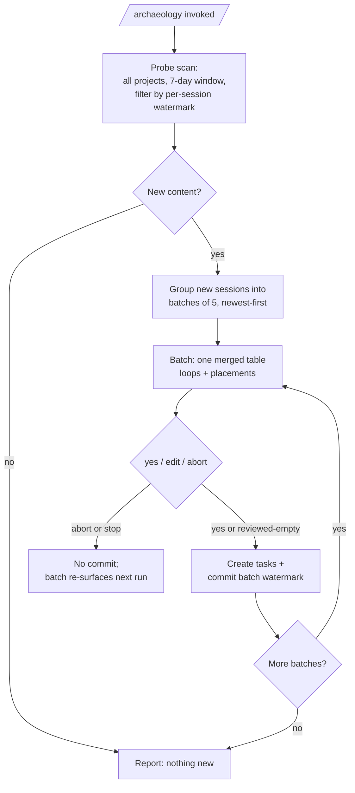

# Session Archaeology — Global Scope + Token-Efficient, Resumable Scan

## Context

Phase 5 shipped `session-archaeology` as a project-scoped skill that scans the current repo's Claude Code transcripts
for unresolved open loops. UAT (Test 1) found it never ran — "scan my sessions" routed to the `remember` skill, and even
when triggered it introspected the live chat instead of executing the probe. The trigger + execution-guard fixes landed
already.

This spec covers the follow-on redesign Jess requested: make the skill **global**, scan **all projects**, and —
critically — make the scan **token-efficient** and **resumable** so re-runs never re-pay for work already done and a
mid-scan stop recovers cleanly.

## Problem

Today the probe emits every session in the 7-day window and the agent reads all of it into context, deduping against
OmniFocus lineage only _after_ the read. Even though no duplicate task is created, the agent still spends tokens
re-reading already-handled sessions. Going all-projects multiplies that cost. There is also no way to stop partway and
resume.

## Goals

- Global availability: invoke from any session, scan all `~/.claude/projects/*`.
- Zero duplicate token cost on re-runs: the agent ingests only genuinely new material.
- Resumable: stopping mid-scan saves progress; the next run picks up what was missed.
- Preserve recall: full-read of new content (no marker-only triage that drops semantic loops).
- Single source of truth: the repo stays canonical; the global install is a symlink, not a copy.

## Non-goals

- Scheduled/background polling (TRIG-02 remains deferred — on-demand only).
- Per-loop content-hash dedup (watermark supersedes the deferred D-08).
- Cross-machine watermark sync (transcripts are local per machine; OmniFocus lineage is the cross-machine backstop
  against duplicate task creation).

## TL;DR



## Decisions

| #   | Decision                                                                                                                 |
| --- | ------------------------------------------------------------------------------------------------------------------------ |
| 1   | **Watermark dedup** at the probe: emit a message only if `ts >= 7-day-cutoff AND ts > lastScannedTs[session]`.           |
| 2   | **Full-read** of new content for recall — no marker-only triage.                                                         |
| 3   | **Scan all** `~/.claude/projects/*` dirs (work repos included; dropped at the gate).                                     |
| 4   | **Global install via symlink** of skill + `/archaeology` command from this repo into `~/.claude/`.                       |
| 5   | **Per-batch processing** — 5 sessions per batch (tunable), newest-first, deterministic order. One merged gate per batch. |
| 6   | **Watermark advances only on a resolved batch** (yes or reviewed-empty), never on abort or mid-batch stop.               |
| 7   | **OmniFocus lineage dedup stays** as the secondary cross-machine correctness backstop.                                   |

## Architecture

### State file

`~/.claude/session-archaeology/state.json` — per machine.

```json
{ "version": 1, "sessions": { "<sessionId>": { "lastScannedTs": "2026-06-16T13:00:00Z" } } }
```

Missing file or unknown session → treated as watermark `0` (full in-window read).

### Probe modes (`probes/archaeology-prefilter.js`)

The pure `filterTranscriptLines` gains a third parameter `watermarkMap` (defaults to `{}` → current behavior, existing
tests unaffected). The CLI gains modes:

- **scan** (default): resolve all project dirs → read state.json → emit new records grouped by session, newest-first →
  write `state.json.pending` mapping each emitted session to its max ts seen this run.
- **`--commit <sid,sid,…>`**: merge only the named sessions' entries from `pending` into `state.json`. Called once per
  approved/reviewed-empty batch.
- **`--reset`** (maintenance): clear state.json to force a full re-scan.

All timestamp math lives in Node; the agent passes session IDs only, never hand-edits JSON.

### Batch loop (skill, Pass 1–2)

1. Run the probe (scan). If no new records → report "nothing new" and stop.
2. Group new sessions into batches of 5, newest-first.
3. For each batch: dedup-check candidates against OF lineage (backstop), detect loops, compute placement, show ONE
   merged table, ask `yes / edit / abort`.
   - **yes** → create tasks for approved loops, then `--commit` this batch's session IDs.
   - **reviewed-empty** (no loops, or all edited away) → `--commit` this batch's session IDs.
   - **abort** → stop the whole run; do not commit this batch.
4. After the last batch, Pass 3 reports totals.

### Data flow

`transcripts → probe(scan, watermark) → new records → batch → agent detect → gate → OF write → probe(--commit) → state.json`

## Edge cases & failure handling

- **Mid-batch stop / crash:** that batch was never committed → re-surfaces next run (bounded re-read of ≤5 sessions).
  Earlier committed batches stay done.
- **Abort:** explicit; nothing in the current run commits past already-committed batches.
- **Deleted state.json:** full re-scan; OF lineage prevents duplicate task creation.
- **Unparseable / missing message timestamp:** fail closed (dropped), unchanged from current probe (WR-02).
- **`pending` left stale from a prior run:** overwritten at the next scan; `--commit` only ever reads the current
  pending.
- **Re-activated session** (worked in again after a prior scan): new messages have `ts > lastScannedTs` → re-surfaces
  with only the new content.

## Testing

- Pure `filterTranscriptLines(lines, nowMs, watermarkMap)`: new specs for watermark filtering (session below/above
  watermark, new session, boundary equality) alongside the existing window/strip specs (which stay green with the
  default empty map).
- Extract and unit-test pure helpers: `mergeWatermark(state, pending, sessionIds)` and `maxTsPerSession(records)`.
- Probe CLI dir-resolution (`resolveAllProjectDirs`) remains integration-only (not unit-tested, per existing precedent).

## Install / rollout

- Probe stays at `probes/archaeology-prefilter.js` (keeps tests + the `probes/` convention).
- Skill references the probe by an absolute path (`$HOME/projects/omnifocus-mcp/probes/archaeology-prefilter.js`) so it
  works when launched from any cwd.
- Symlink `~/.claude/skills/session-archaeology` → repo skill dir, and `~/.claude/commands/archaeology.md` → repo
  command file.
- Document the two symlink commands in the skill's header so the install is reproducible.

## GSD alignment

This is gap-closure for the Phase 5 UAT (Test 1) plus a scoped enhancement. Implementation follows TDD (superpowers)
within the existing phase rather than opening a new phase.
