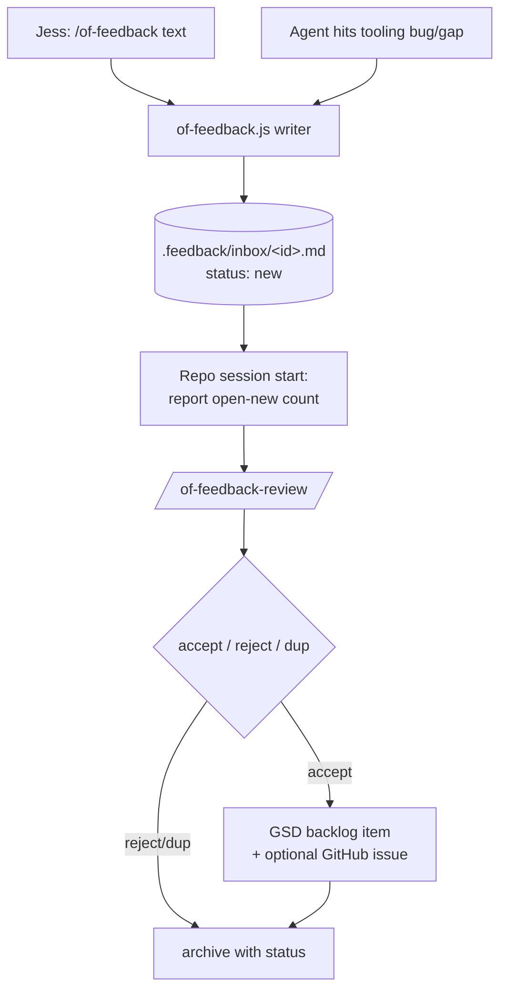

# OmniFocus-Integration Feedback Channel (`/of-feedback`)

## Context

The OmniFocus-MCP + JessOS tooling (the MCP server plus the skills capture-live-blocker, route-inbox-to-projects,
session-archaeology, surface-work-for-review, sync-work-tasks) is now used across many sessions and repos. When a
session — Jess or an agent — hits a bug, limitation, or feature idea in that tooling, there is no durable way to record
it. Today's routing bug (`scan my sessions` → wrong skill) is the motivating example: it would have been captured
automatically if this channel existed.

## Problem

Feedback about the tooling is lost the moment a session ends. It needs a capture path that works from **any** session
anywhere, a store that **omnifocus-mcp repo sessions and Jess** can act on, and a triage path into the repo's existing
GSD workflow.

## Goals

- Any session (Jess via command, or an agent autonomously) can log a tooling bug/feature/friction.
- Entries land in the omnifocus-mcp repo where future repo sessions and Jess triage them.
- Triage promotes accepted items into GSD (backlog) — or a GitHub issue per item on request.
- Distinctive, collision-free naming (`/of-feedback`) — no generic `/feedback` that mis-routes.

## Non-goals

- General task capture (that's OmniFocus) or work/personal task routing (the separate adoption initiative).
- Cross-vault tooling adoption (separate initiative) — this spec only adds self-report pointers to the in-repo CLAUDE.md
  and the five JessOS tooling skills, not global session behavior.
- Auto-committing entries from unrelated sessions (capture is write-only; triage commits in-repo).
- A SessionStart hook for surfacing (v1 uses a CLAUDE.md pointer; hook is a possible v2).

## TL;DR



## Decisions

| #   | Decision                                                                                                                                                                                     |
| --- | -------------------------------------------------------------------------------------------------------------------------------------------------------------------------------------------- |
| 1   | Store is repo-local `.feedback/` in omnifocus-mcp (committed; one file per entry).                                                                                                           |
| 2   | Capture is global: `/of-feedback` command + `omnifocus-feedback` skill (agent self-report), both writing by absolute path.                                                                   |
| 3   | Naming is OmniFocus-scoped and distinctive: command `/of-feedback`, skill `omnifocus-feedback`, triage `/of-feedback-review`.                                                                |
| 4   | Entries are written directly by the skill/command from a strict template (id timestamp via `date`); no Node writer in v1. A tested writer is a future hardening only if entry formats drift. |
| 5   | Triage promotes accepted items into GSD backlog by default; GitHub issue is a per-item option at triage.                                                                                     |
| 6   | Surfacing v1 = a CLAUDE.md pointer (report open-`new` count at session start); SessionStart hook deferred.                                                                                   |
| 7   | Capture is write-only (no commit from unrelated sessions); triage commits/pushes from within the repo.                                                                                       |

## Architecture

### Store — `.feedback/`

```
.feedback/
  README.md            # schema + flow (committed)
  inbox/<id>.md        # status:new entries, one file each
  archive/<id>.md      # triaged entries (accepted/rejected/duplicate)
```

`<id>` = `YYYY-MM-DD-HHMMSS-<slug>` (timestamp avoids collisions when several sessions write at once). `.feedback/` is
tracked (not gitignored). A raw drop sits uncommitted until a repo session commits it during triage.

Entry shape:

```yaml
---
id: 2026-06-17-130500-archaeology-gate-uuid-only
type: bug # bug | feature | friction | idea
title: ''
status: new # new | accepted | rejected | duplicate
severity: '' # blocker | major | minor (bugs only; else empty)
reporter: agent # agent | jess
source_repo: '' # absolute path where it was observed, or ?
source_session: '' # session id or ?
created: YYYY-MM-DD
gsd_ref: '' # backlog path / issue URL, set on accept
---
## What
## Why it matters
## Context
## Suggested fix (optional)
```

### Capture — command + skill (direct write from a template)

Both entry points resolve the entry path against the absolute repo root
(`$HOME/projects/omnifocus-mcp/.feedback/inbox/`) so they work from any cwd, generate the id with
`date +%Y-%m-%d-%H%M%S` plus a kebab slug of the title, and write the entry file directly (Write tool) from the strict
template above. No Node writer in v1.

- **`/of-feedback` command** (`.claude/commands/of-feedback.md`, symlinked into `~/.claude/commands/`): takes freeform
  text; the agent infers `type`, a one-line `title`, optional `severity`, fills `reporter: jess`, `source_repo` =
  current repo, `source_session` if known, then writes the entry.
- **`omnifocus-feedback` skill** (`.claude/skills/omnifocus-feedback/SKILL.md`, symlinked global): `reporter: agent`.
  Its description triggers when an agent encounters a bug/limitation/gap in the OmniFocus-MCP/JessOS tooling,
  instructing it to write one entry (abstractive, no secrets) and continue. Both must keep entries abstractive —
  summarize; never paste raw transcript or secret content.

### Agent self-report pointers (light-touch adoption)

Add one line — "If you hit a bug or limitation in this tooling, log it with the `omnifocus-feedback` skill
(`/of-feedback`)." — to: omnifocus-mcp `CLAUDE.md`, and the five JessOS tooling skills (capture-live-blocker,
route-inbox-to-projects, session-archaeology, surface-work-for-review, sync-work-tasks). Broader global adoption is the
separate initiative.

### Triage — `/of-feedback-review` (in-repo command)

Reads `.feedback/inbox/*.md` with `status: new`, newest-first. For each: show a compact summary, ask
`accept / reject / duplicate / skip`.

- **accept** → create a GSD backlog item (via the repo's GSD capture path) with the entry content; set `gsd_ref`,
  `status: accepted`; move file to `.feedback/archive/`. Offer "also open a GitHub issue?" per item.
- **reject / duplicate** → set status, move to `archive/`.
- **skip** → leave in inbox. Commit the triage (and push) at the end.

### Surfacing

A short pointer in omnifocus-mcp `CLAUDE.md`: at session start, count `.feedback/inbox/*.md` with `status: new`; if > 0,
mention it and suggest `/of-feedback-review`.

## Edge cases & failure handling

- **Concurrent writes** from multiple sessions: distinct timestamped filenames → no collision.
- **Repo absent / wrong path**: the command/skill verifies `$HOME/projects/omnifocus-mcp/.feedback/inbox/` exists
  (creating `inbox/` if missing) and reports clearly if the repo root is absent — nothing silently lost.
- **Capture on a machine where the repo is rarely opened**: entry stays uncommitted until triage runs in-repo there
  (documented limitation; same write-now/reconcile-in-repo model as the archaeology watermark).
- **Malformed entry**: the template enumerates all required frontmatter fields; the command/skill fills each before
  writing (no partial entries).
- **Secrets/PII**: capture is abstractive — the skill/command summarize, never paste raw transcript/secret content.

## Testing

v1 is a prose-skill + template feature (like the original session-archaeology skill), so verification is manual, not
unit tests:

- Run `/of-feedback "<text>"` → confirm a well-formed `.feedback/inbox/<id>.md` with valid frontmatter.
- Trigger the `omnifocus-feedback` skill from a non-repo session → confirm an entry lands in the repo inbox.
- Run `/of-feedback-review` → confirm triage updates status, archives, and creates a GSD backlog item. A tested Node
  writer is added later only if entries drift out of schema in practice.

## Install / rollout

- Skill (`omnifocus-feedback`) + the `/of-feedback` command symlinked into `~/.claude/` (single source of truth = repo),
  like `/archaeology`. `/of-feedback-review` is in-repo only (triage runs where the store is).
- `.feedback/README.md` documents the schema and flow.

## GSD alignment

Accepted feedback enters the existing GSD backlog; this channel is the front door that feeds it.
