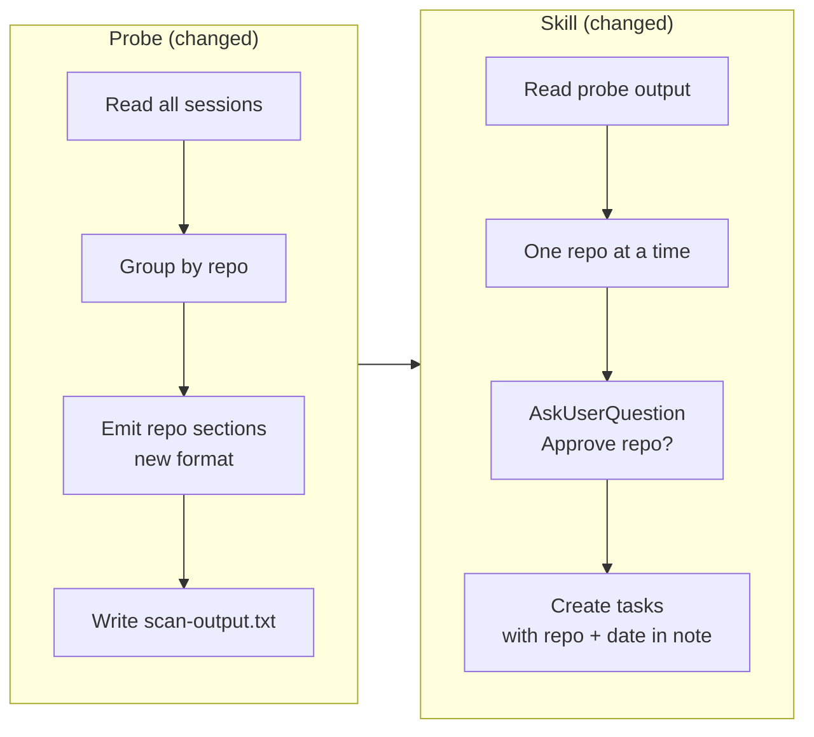
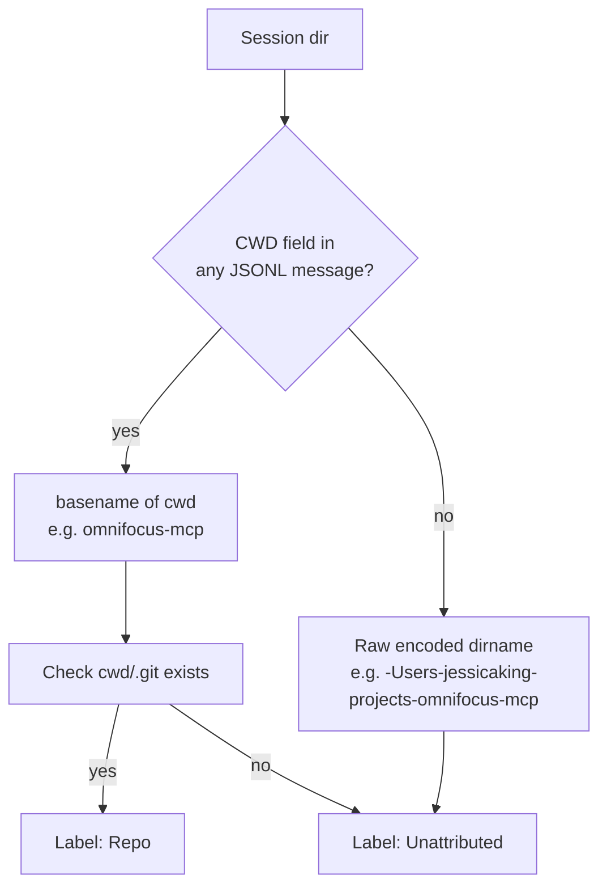
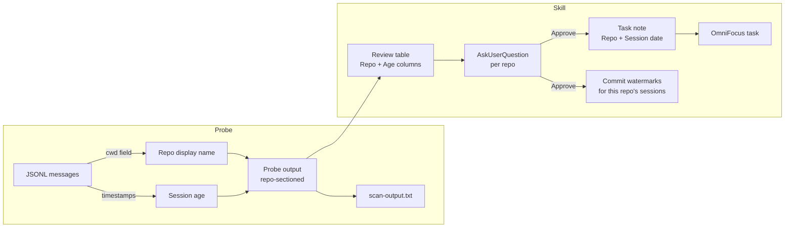

# Design: Archaeology Repo-Grouped Batching + Session Metadata

**Date:** 2026-06-18 **Status:** Approved

## TL;DR



The probe groups output by repo instead of flat session order. The skill gates once per repo instead of once per 5
sessions. Repo name and session age flow into the review table and into every created task's note.

---

## Context

The session-archaeology skill currently batches sessions in groups of 5 (newest-first, cross-repo). This was a heuristic
to keep reviews manageable. Two problems surfaced during UAT:

1. A loop from 7 days ago and a loop from the same repo today appear in different batches with no visible connection.
2. The "5" number is arbitrary — some batches are all noise, others are dense with real loops.

Repo is the natural unit of context. Reviewing all open loops from `omnifocus-mcp` together is more cognitively
efficient than reviewing a mixed slice of 5 sessions from different projects.

---

## Design Decisions

| Decision                     | Choice                                                           | Rationale                                                                                             |
| ---------------------------- | ---------------------------------------------------------------- | ----------------------------------------------------------------------------------------------------- |
| Where does grouping happen?  | Probe                                                            | Probe already knows `sessionDirs`; skill instructions become simpler                                  |
| Batch unit                   | One repo                                                         | Natural context unit; self-sizing (no arbitrary number)                                               |
| Repo ordering                | Newest-repo-first                                                | Most recent work surfaces first                                                                       |
| Session ordering within repo | Newest-first                                                     | Unchanged from current behavior                                                                       |
| Repo display name            | `path.basename(cwd)` from JSONL, fallback to raw encoded dirname | CWD is reliable when available; encoded dirname is always present                                     |
| Date in task note            | Append below context, above lineage block                        | Actionable content first; metadata second                                                             |
| Defer/due date               | None                                                             | Session date is always past; staleness is informational, not a schedule                               |
| Unattributed sessions        | Group under raw encoded dirname                                  | Consistent, unambiguous; avoids silently dropping sessions                                            |
| JSON vs database for state   | Keep JSON                                                        | Data is tiny (UUID → ISO timestamp), single writer, current pending-file pattern handles crash safety |

---

## Probe Changes

### New output format

Grouped by repo, repo newest-first, sessions newest-first within each repo:

```
=== Repo: omnifocus-mcp ===

  --- Session: <uuid> | 2026-06-18 (today) ---
  [2026-06-18T22:10:00Z] user: ...
  [2026-06-18T22:10:05Z] assistant: ...

  --- Session: <uuid> | 2026-06-16 (2 days ago) ---
  ...

=== Repo: k8s-infrastructure-charts ===

  --- Session: <uuid> | 2026-06-15 (3 days ago) ---
  ...

=== Unattributed: -Users-jessicaking-home ===
  ...

--- 411 new records across 23 session(s) in 3 repo(s) from 4 project dir(s) ---
```

### Repo name derivation



The probe reads the `cwd` field from JSONL messages (present on certain Claude Code message types). `path.basename(cwd)`
is the display name. If `cwd/.git` exists, it's labeled `Repo:`; otherwise `Unattributed:`. If no `cwd` is available,
the raw encoded dirname is used under `Unattributed:`.

### Session header format

Each session header includes the UUID and a human-readable date + age derived from the session's most recent message
timestamp:

```
--- Session: <uuid> | 2026-06-16 (2 days ago) ---
```

Age buckets: `today`, `yesterday`, `N days ago`.

### scan-output.txt

The `~/.claude/session-archaeology/scan-output.txt` fallback file receives the same grouped output. The skill reads from
this file when the Bash tool result is truncated.

### Summary line

Updated to include repo count:

```
--- N records across S session(s) in R repo(s) from D project dir(s) ---
```

---

## Skill Changes

### Step 1 (probe output description)

Update to describe the new repo-sectioned format.

### Step 5 (gate)

**Before:** batches of 5 sessions, one `AskUserQuestion` per batch.

**After:** one repo per gate. For each repo section in the probe output, in order:

1. Read the active project list once (reuse for all repos — no re-read per repo).
2. For each session in this repo, detect loops (Step 3) and compute placement (Step 4 ladder).
3. Show the merged table for this repo (session rows + per-loop rows). Include repo name, session age, per-placement
   count, and total task count for the repo.
4. Present `AskUserQuestion`: "Approve all loops from **\<repo\>**?" — Approve / Abort / Other (edits).
5. On Approve: create tasks (Pass 2), then commit this repo's sessions' watermarks.
6. Continue to the next repo.

### Review table (new columns)

Session rows:

| Session  | Repo            | Age        | What it was about   | Open loops? | Count |
| -------- | --------------- | ---------- | ------------------- | ----------- | ----- |
| `abc123` | `omnifocus-mcp` | 2 days ago | Phase 05 UAT fixes  | yes         | 3     |
| `def456` | `omnifocus-mcp` | 5 days ago | HTTP port debugging | yes         | 1     |

Per-loop rows unchanged.

### Pass 2: task note format

Repo name and session date append after the existing context, above the lineage block:

```
<context: what was left unresolved, relevant detail>

Repo: omnifocus-mcp
Session: 2026-06-11 (7 days ago)

<!-- of-mcp:lineage ... -->
```

No defer or due date is set. Staleness is informational — the reviewer decides priority after seeing the loop and its
project placement.

---

## Data Flow



---

## Out of Scope

- **Per-loop dedup (D-08):** remains session-level; per-loop key is deferred.
- **Git branch or commit metadata:** repo name only; no branch detection.
- **Auto-priority from age:** staleness is shown, not acted on automatically.
- **Database for state:** JSON stays; revisit if state schema grows significantly.
- **n8n polling (TRIG-02):** on-demand only.
